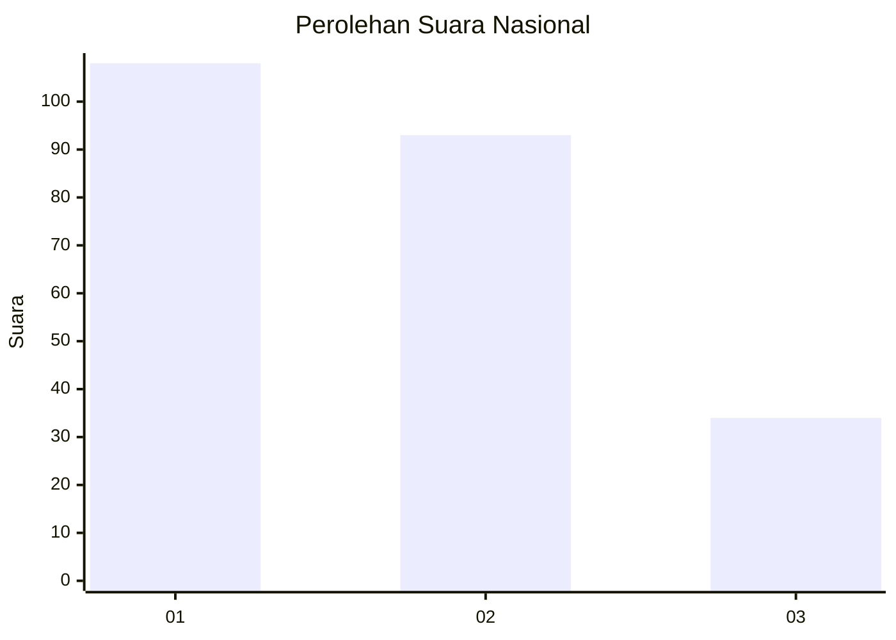
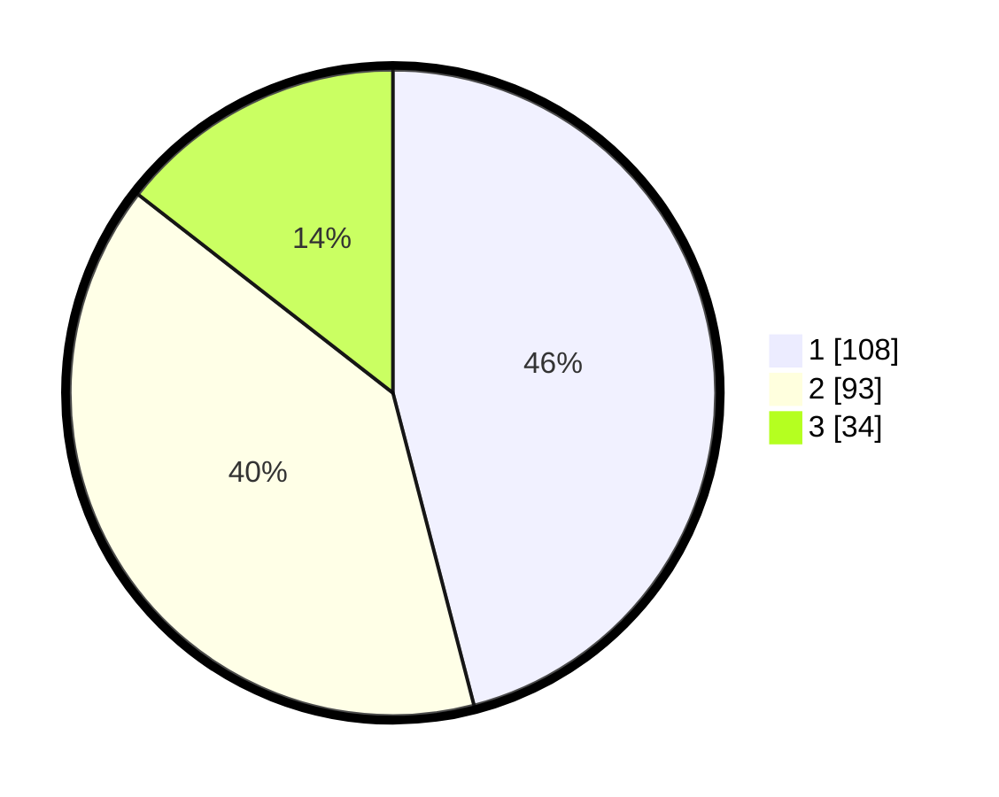

# Hasil

## Grafik

## Tabel

| No.    | Nama Paslon    | Suara | Suara (raw) | Persentase |
|:------ |:-------------- | -----:| -----------:| ----------:|
| 100025 | ANIES MUHAIMIN | 108   | [108][p-1]  | 45,96      |
| 100026 | PRABOWO GIBRAN | 93    | [93][p-2]   | 39,57      |
| 100027 | GANJAR MAHFUD  | 34    | [34][p-3]   | 14,47      |

[p-1]: https://github.com/gigit-pemilu/pemilu-2024/blob/main/pilpres/hitung-suara/sub/31-dki-jakarta/sub/75-jakarta-timur/sub/02-pulogadung/sub/1002-pisangan-timur/sub/007-tps/sub/paslon-1.txt
[p-2]: https://github.com/gigit-pemilu/pemilu-2024/blob/main/pilpres/hitung-suara/sub/31-dki-jakarta/sub/75-jakarta-timur/sub/02-pulogadung/sub/1002-pisangan-timur/sub/007-tps/sub/paslon-2.txt
[p-3]: https://github.com/gigit-pemilu/pemilu-2024/blob/main/pilpres/hitung-suara/sub/31-dki-jakarta/sub/75-jakarta-timur/sub/02-pulogadung/sub/1002-pisangan-timur/sub/007-tps/sub/paslon-3.txt

## Foto C Plano

https://sirekap-obj-formc.kpu.go.id/7e0a/pemilu/ppwp/31/75/02/10/02/3175021002007-20240222-112850--5bde0995-232d-4935-a619-685cfe166c2a.jpg

https://sirekap-obj-formc.kpu.go.id/7e0a/pemilu/ppwp/31/75/02/10/02/3175021002007-20240215-022433--ebafe69c-47a4-4377-ac75-0af913135cde.jpg

https://sirekap-obj-formc.kpu.go.id/7e0a/pemilu/ppwp/31/75/02/10/02/3175021002007-20240215-022615--423b4de5-c662-4008-bba4-8ca3b685e4d2.jpg

## Metadata

| Key        | Value               |
| ---------- | ------------------- |
| Time Stamp | 2024-02-22 12:00:00 |

