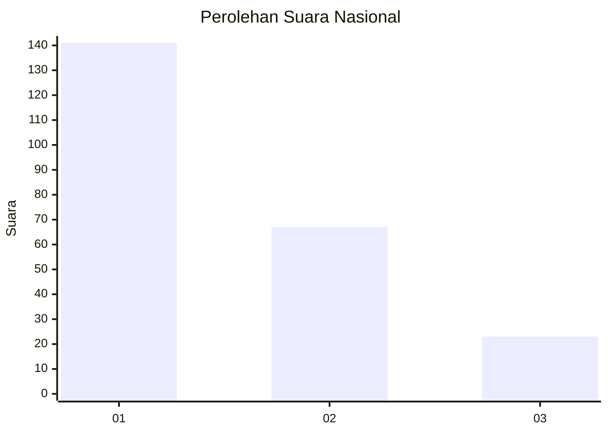
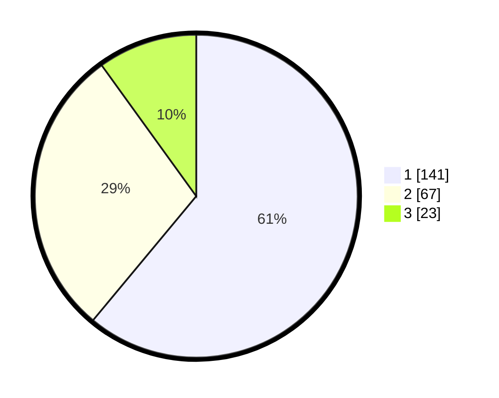

# Hasil

## Grafik

## Tabel

| No.    | Nama Paslon    | Suara | Suara (raw) | Persentase |
|:------ |:-------------- | -----:| -----------:| ----------:|
| 100025 | ANIES MUHAIMIN | 141   | [141][p-1]  | 61,04      |
| 100026 | PRABOWO GIBRAN | 67    | [67][p-2]   | 29,00      |
| 100027 | GANJAR MAHFUD  | 23    | [23][p-3]   | 9,96       |

[p-1]: https://github.com/gigit-pemilu/pemilu-2024/blob/main/pilpres/hitung-suara/sub/31-dki-jakarta/sub/75-jakarta-timur/sub/02-pulogadung/sub/1002-pisangan-timur/sub/020-tps/sub/paslon-1.txt
[p-2]: https://github.com/gigit-pemilu/pemilu-2024/blob/main/pilpres/hitung-suara/sub/31-dki-jakarta/sub/75-jakarta-timur/sub/02-pulogadung/sub/1002-pisangan-timur/sub/020-tps/sub/paslon-2.txt
[p-3]: https://github.com/gigit-pemilu/pemilu-2024/blob/main/pilpres/hitung-suara/sub/31-dki-jakarta/sub/75-jakarta-timur/sub/02-pulogadung/sub/1002-pisangan-timur/sub/020-tps/sub/paslon-3.txt

## Foto C Plano

https://sirekap-obj-formc.kpu.go.id/c9d0/pemilu/ppwp/31/75/02/10/02/3175021002020-20240222-105910--b262c9a8-5478-4b19-b171-3e01426abde7.jpg

https://sirekap-obj-formc.kpu.go.id/c9d0/pemilu/ppwp/31/75/02/10/02/3175021002020-20240214-204121--62a1c352-04c4-4693-8938-544b7c5accc8.jpg

https://sirekap-obj-formc.kpu.go.id/c9d0/pemilu/ppwp/31/75/02/10/02/3175021002020-20240215-012837--6f6a6bf8-8718-439f-9368-13ec3b94435f.jpg

## Metadata

| Key        | Value               |
| ---------- | ------------------- |
| Time Stamp | 2024-02-22 11:00:00 |

