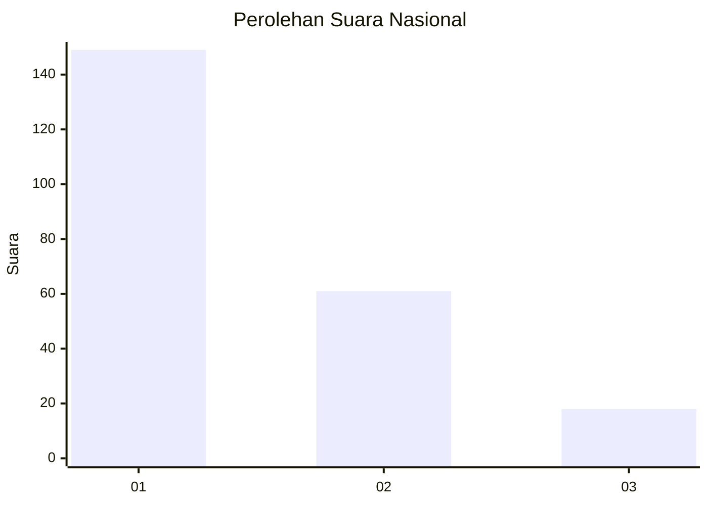
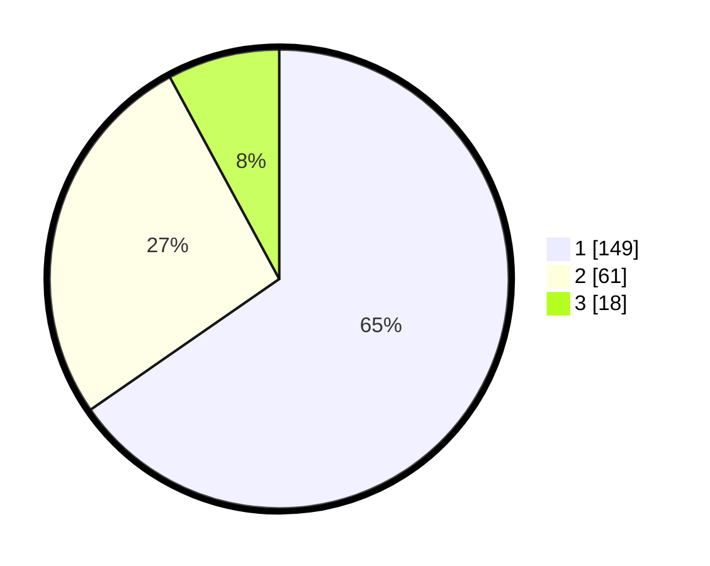

# Hasil

## Grafik

## Tabel

| No.    | Nama Paslon    | Suara | Suara (raw) | Persentase |
|:------ |:-------------- | -----:| -----------:| ----------:|
| 100025 | ANIES MUHAIMIN | 149   | [149][p-1]  | 65,35      |
| 100026 | PRABOWO GIBRAN | 61    | [61][p-2]   | 26,75      |
| 100027 | GANJAR MAHFUD  | 18    | [18][p-3]   | 7,89       |

[p-1]: https://github.com/gigit-pemilu/pemilu-2024/blob/main/pilpres/hitung-suara/sub/31-dki-jakarta/sub/75-jakarta-timur/sub/02-pulogadung/sub/1002-pisangan-timur/sub/027-tps/sub/paslon-1.txt
[p-2]: https://github.com/gigit-pemilu/pemilu-2024/blob/main/pilpres/hitung-suara/sub/31-dki-jakarta/sub/75-jakarta-timur/sub/02-pulogadung/sub/1002-pisangan-timur/sub/027-tps/sub/paslon-2.txt
[p-3]: https://github.com/gigit-pemilu/pemilu-2024/blob/main/pilpres/hitung-suara/sub/31-dki-jakarta/sub/75-jakarta-timur/sub/02-pulogadung/sub/1002-pisangan-timur/sub/027-tps/sub/paslon-3.txt

## Foto C Plano

https://sirekap-obj-formc.kpu.go.id/f3c3/pemilu/ppwp/31/75/02/10/02/3175021002027-20240214-212630--d9dbfb8f-a6a1-4a93-ac85-eb4c2d9bc88a.jpg

https://sirekap-obj-formc.kpu.go.id/f3c3/pemilu/ppwp/31/75/02/10/02/3175021002027-20240214-212831--9819e94d-8180-4d7a-993f-b8c2d893fc15.jpg

https://sirekap-obj-formc.kpu.go.id/f3c3/pemilu/ppwp/31/75/02/10/02/3175021002027-20240215-012644--0894165d-49f6-4de9-9b60-215c70885708.jpg

## Metadata

| Key        | Value               |
| ---------- | ------------------- |
| Time Stamp | 2024-02-16 21:01:00 |

