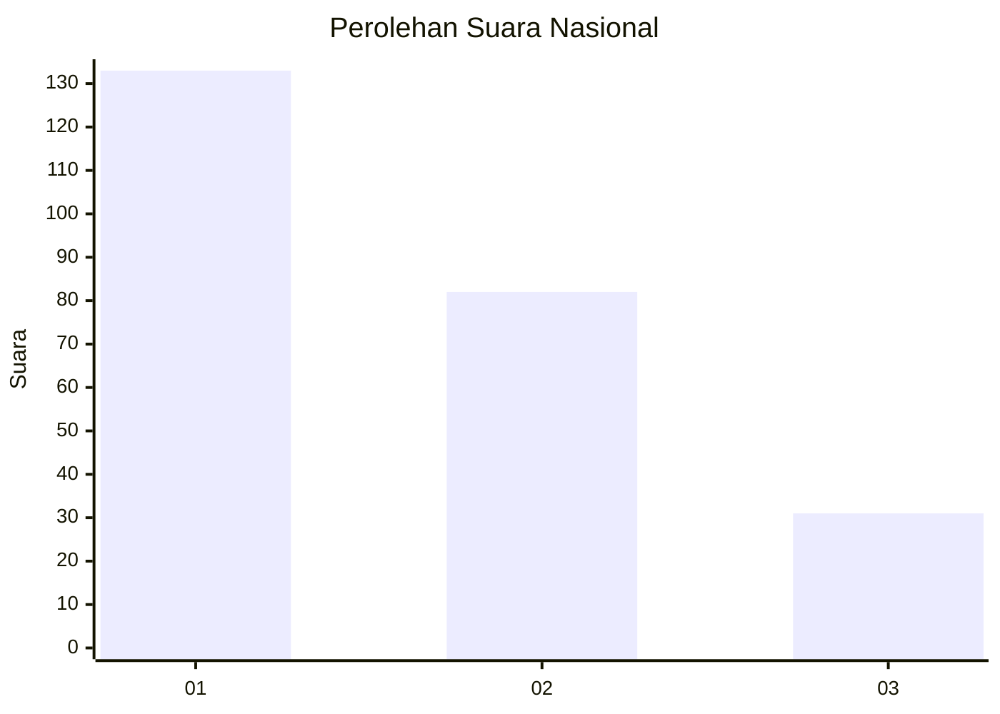
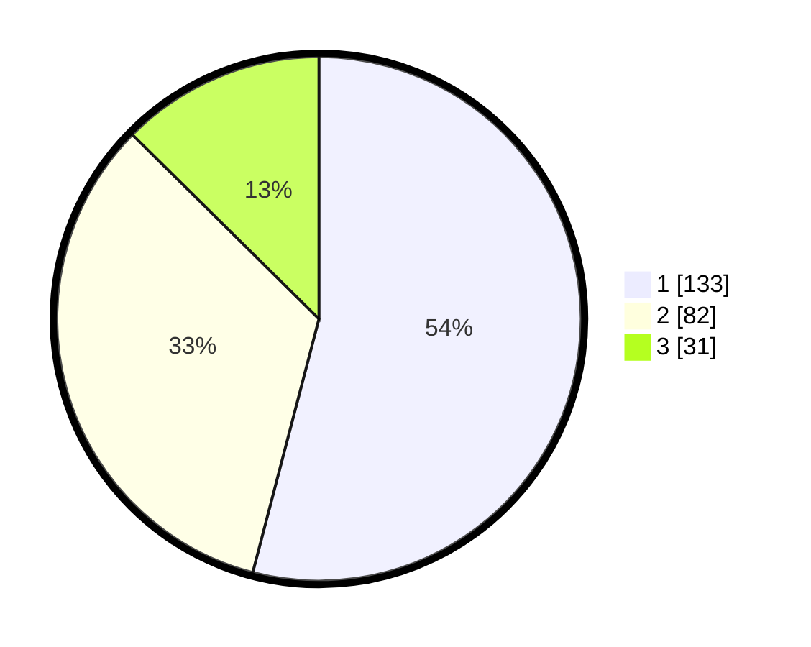

# Hasil

## Grafik

## Tabel

| No.    | Nama Paslon    | Suara | Suara (raw) | Persentase |
|:------ |:-------------- | -----:| -----------:| ----------:|
| 100025 | ANIES MUHAIMIN | 133   | [133][p-1]  | 54,07      |
| 100026 | PRABOWO GIBRAN | 82    | [82][p-2]   | 33,33      |
| 100027 | GANJAR MAHFUD  | 31    | [31][p-3]   | 12,60      |

[p-1]: https://github.com/gigit-pemilu/pemilu-2024/blob/main/pilpres/hitung-suara/sub/31-dki-jakarta/sub/75-jakarta-timur/sub/02-pulogadung/sub/1002-pisangan-timur/sub/044-tps/sub/paslon-1.txt
[p-2]: https://github.com/gigit-pemilu/pemilu-2024/blob/main/pilpres/hitung-suara/sub/31-dki-jakarta/sub/75-jakarta-timur/sub/02-pulogadung/sub/1002-pisangan-timur/sub/044-tps/sub/paslon-2.txt
[p-3]: https://github.com/gigit-pemilu/pemilu-2024/blob/main/pilpres/hitung-suara/sub/31-dki-jakarta/sub/75-jakarta-timur/sub/02-pulogadung/sub/1002-pisangan-timur/sub/044-tps/sub/paslon-3.txt

## Foto C Plano

https://sirekap-obj-formc.kpu.go.id/d58d/pemilu/ppwp/31/75/02/10/02/3175021002044-20240214-215039--39ff9adf-c133-4408-8345-db6983be46df.jpg

https://sirekap-obj-formc.kpu.go.id/d58d/pemilu/ppwp/31/75/02/10/02/3175021002044-20240214-205923--3cb7492a-a67c-4455-aa3e-f2329c89f570.jpg

https://sirekap-obj-formc.kpu.go.id/d58d/pemilu/ppwp/31/75/02/10/02/3175021002044-20240214-210040--c9bde4e3-65a2-4a04-94ea-953a17e70bf1.jpg

## Metadata

| Key        | Value               |
| ---------- | ------------------- |
| Time Stamp | 2024-02-16 02:00:27 |

