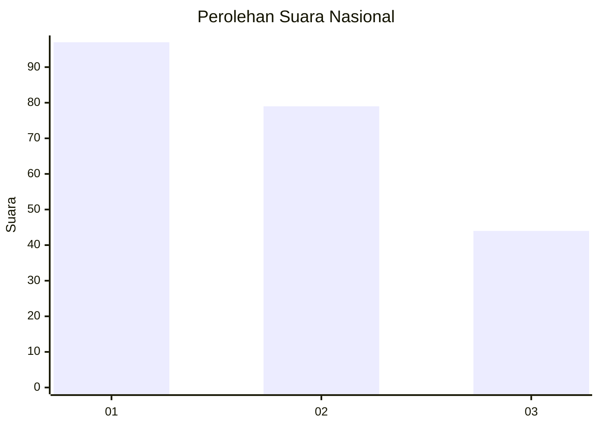
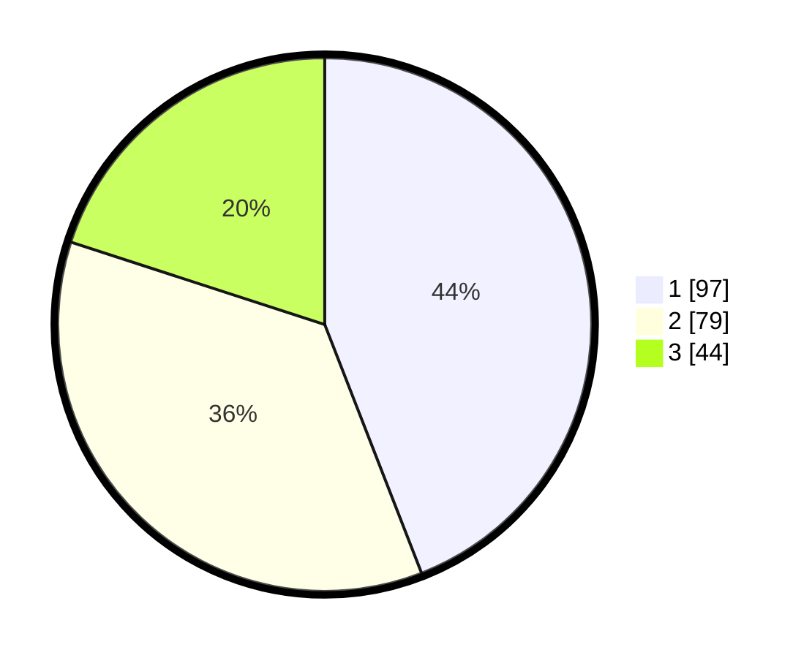

# Hasil

## Grafik

## Tabel

| No.    | Nama Paslon    | Suara | Suara (raw) | Persentase |
|:------ |:-------------- | -----:| -----------:| ----------:|
| 100025 | ANIES MUHAIMIN | 97    | [97][p-1]   | 44,09      |
| 100026 | PRABOWO GIBRAN | 79    | [79][p-2]   | 35,91      |
| 100027 | GANJAR MAHFUD  | 44    | [44][p-3]   | 20,00      |

[p-1]: https://github.com/gigit-pemilu/pemilu-2024/blob/main/pilpres/hitung-suara/sub/31-dki-jakarta/sub/75-jakarta-timur/sub/02-pulogadung/sub/1002-pisangan-timur/sub/074-tps/sub/paslon-1.txt
[p-2]: https://github.com/gigit-pemilu/pemilu-2024/blob/main/pilpres/hitung-suara/sub/31-dki-jakarta/sub/75-jakarta-timur/sub/02-pulogadung/sub/1002-pisangan-timur/sub/074-tps/sub/paslon-2.txt
[p-3]: https://github.com/gigit-pemilu/pemilu-2024/blob/main/pilpres/hitung-suara/sub/31-dki-jakarta/sub/75-jakarta-timur/sub/02-pulogadung/sub/1002-pisangan-timur/sub/074-tps/sub/paslon-3.txt

## Foto C Plano

https://sirekap-obj-formc.kpu.go.id/7a3b/pemilu/ppwp/31/75/02/10/02/3175021002074-20240214-214206--e1925646-5603-4886-aac1-43241d83c49a.jpg

https://sirekap-obj-formc.kpu.go.id/7a3b/pemilu/ppwp/31/75/02/10/02/3175021002074-20240214-214439--cfa523fa-4a2b-445e-8da9-75b9952de38d.jpg

https://sirekap-obj-formc.kpu.go.id/7a3b/pemilu/ppwp/31/75/02/10/02/3175021002074-20240224-112518--a5cd2121-9834-4c92-9987-f86e35a4ceb1.jpg

## Metadata

| Key        | Value               |
| ---------- | ------------------- |
| Time Stamp | 2024-02-24 22:31:28 |

