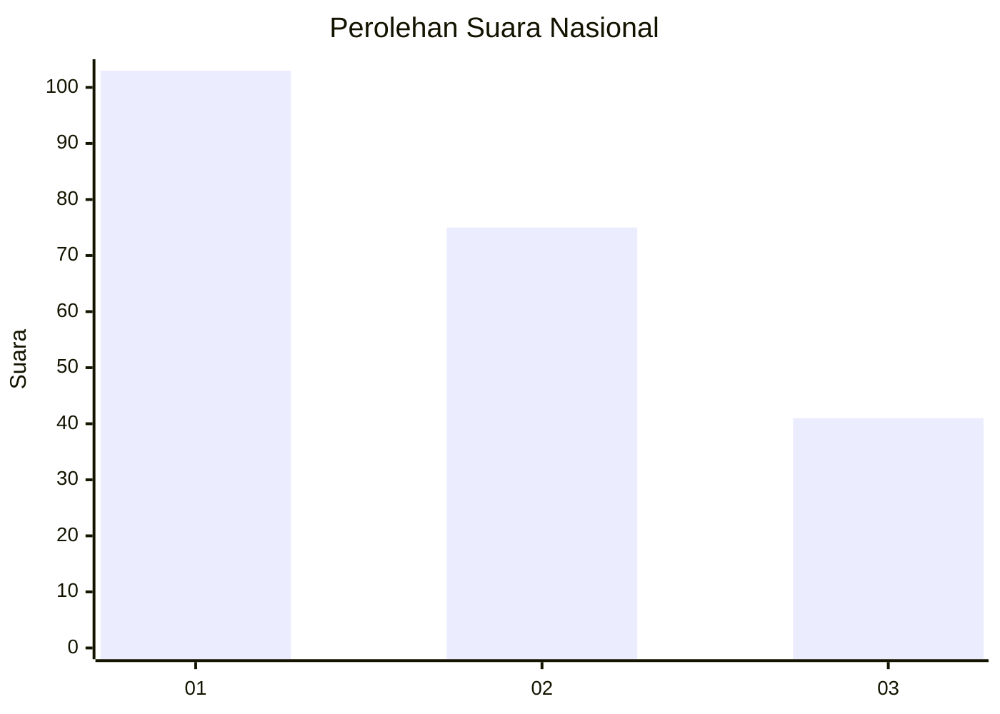
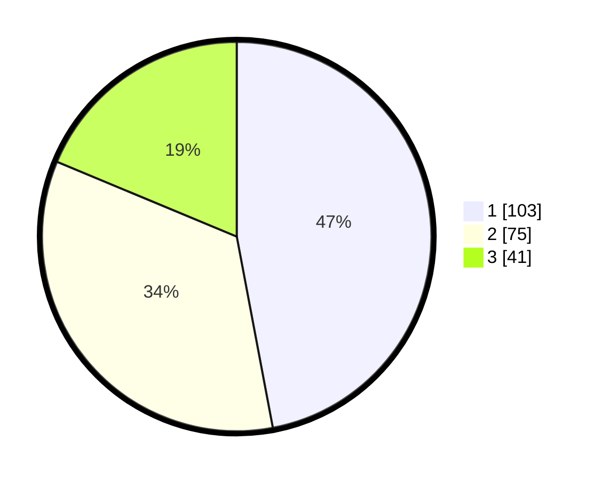

# Hasil

## Grafik

## Tabel

| No.    | Nama Paslon    | Suara | Suara (raw) | Persentase |
|:------ |:-------------- | -----:| -----------:| ----------:|
| 100025 | ANIES MUHAIMIN | 103   | [103][p-1]  | 47,03      |
| 100026 | PRABOWO GIBRAN | 75    | [75][p-2]   | 34,25      |
| 100027 | GANJAR MAHFUD  | 41    | [41][p-3]   | 18,72      |

[p-1]: https://github.com/gigit-pemilu/pemilu-2024/blob/main/pilpres/hitung-suara/sub/31-dki-jakarta/sub/75-jakarta-timur/sub/02-pulogadung/sub/1002-pisangan-timur/sub/078-tps/sub/paslon-1.txt
[p-2]: https://github.com/gigit-pemilu/pemilu-2024/blob/main/pilpres/hitung-suara/sub/31-dki-jakarta/sub/75-jakarta-timur/sub/02-pulogadung/sub/1002-pisangan-timur/sub/078-tps/sub/paslon-2.txt
[p-3]: https://github.com/gigit-pemilu/pemilu-2024/blob/main/pilpres/hitung-suara/sub/31-dki-jakarta/sub/75-jakarta-timur/sub/02-pulogadung/sub/1002-pisangan-timur/sub/078-tps/sub/paslon-3.txt

## Foto C Plano

https://sirekap-obj-formc.kpu.go.id/e5d7/pemilu/ppwp/31/75/02/10/02/3175021002078-20240224-112604--43e64430-3340-42cd-b1d4-0a0de7e4d59d.jpg

https://sirekap-obj-formc.kpu.go.id/e5d7/pemilu/ppwp/31/75/02/10/02/3175021002078-20240224-112613--5664a4b8-008d-4563-9b38-142f2e3df745.jpg

https://sirekap-obj-formc.kpu.go.id/e5d7/pemilu/ppwp/31/75/02/10/02/3175021002078-20240224-112622--f4710173-216d-44b4-aa53-71d2c72d887b.jpg

## Metadata

| Key        | Value               |
| ---------- | ------------------- |
| Time Stamp | 2024-02-24 22:31:28 |

