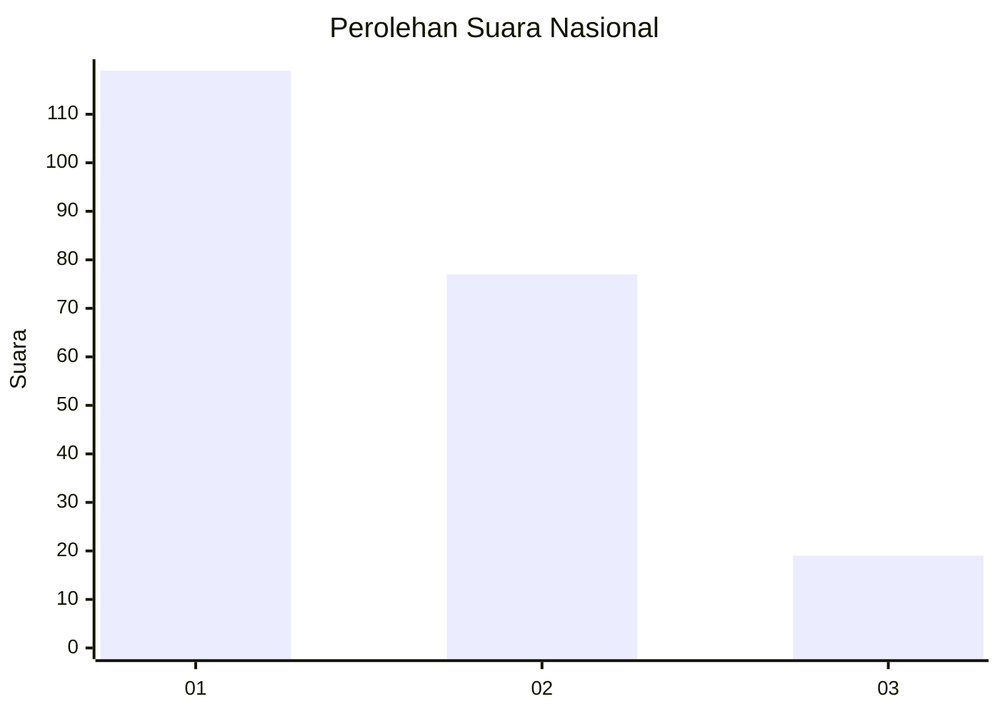
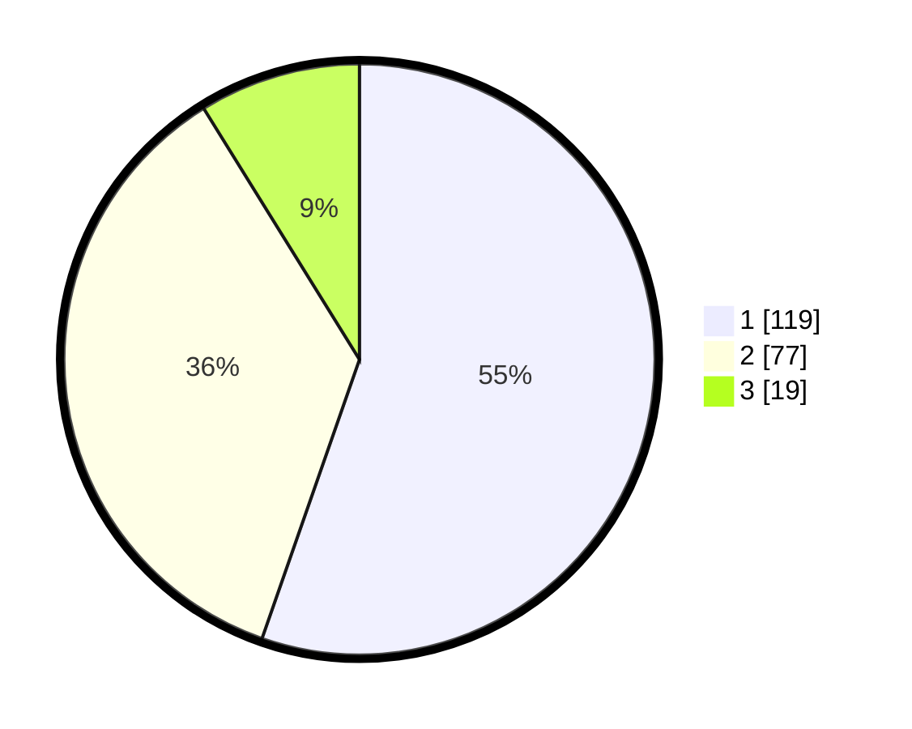

# Hasil

## Grafik

## Tabel

| No.    | Nama Paslon    | Suara | Suara (raw) | Persentase |
|:------ |:-------------- | -----:| -----------:| ----------:|
| 100025 | ANIES MUHAIMIN | 119   | [119][p-1]  | 55,35      |
| 100026 | PRABOWO GIBRAN | 77    | [77][p-2]   | 35,81      |
| 100027 | GANJAR MAHFUD  | 19    | [19][p-3]   | 8,84       |

[p-1]: https://github.com/gigit-pemilu/pemilu-2024/blob/main/pilpres/hitung-suara/sub/31-dki-jakarta/sub/75-jakarta-timur/sub/02-pulogadung/sub/1002-pisangan-timur/sub/082-tps/sub/paslon-1.txt
[p-2]: https://github.com/gigit-pemilu/pemilu-2024/blob/main/pilpres/hitung-suara/sub/31-dki-jakarta/sub/75-jakarta-timur/sub/02-pulogadung/sub/1002-pisangan-timur/sub/082-tps/sub/paslon-2.txt
[p-3]: https://github.com/gigit-pemilu/pemilu-2024/blob/main/pilpres/hitung-suara/sub/31-dki-jakarta/sub/75-jakarta-timur/sub/02-pulogadung/sub/1002-pisangan-timur/sub/082-tps/sub/paslon-3.txt

## Foto C Plano

https://sirekap-obj-formc.kpu.go.id/291d/pemilu/ppwp/31/75/02/10/02/3175021002082-20240215-014649--fc4aa7aa-b309-483d-b8de-70b11b1cc751.jpg

https://sirekap-obj-formc.kpu.go.id/291d/pemilu/ppwp/31/75/02/10/02/3175021002082-20240214-214625--ad17f835-91b5-46d9-86d5-6024e6b6556c.jpg

https://sirekap-obj-formc.kpu.go.id/291d/pemilu/ppwp/31/75/02/10/02/3175021002082-20240214-214716--b01f29ac-4e73-4537-8c8e-481122ae7857.jpg

## Metadata

| Key        | Value               |
| ---------- | ------------------- |
| Time Stamp | 2024-02-15 15:00:29 |

