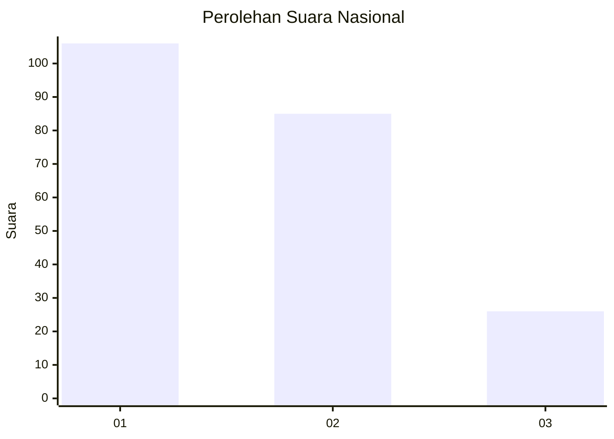
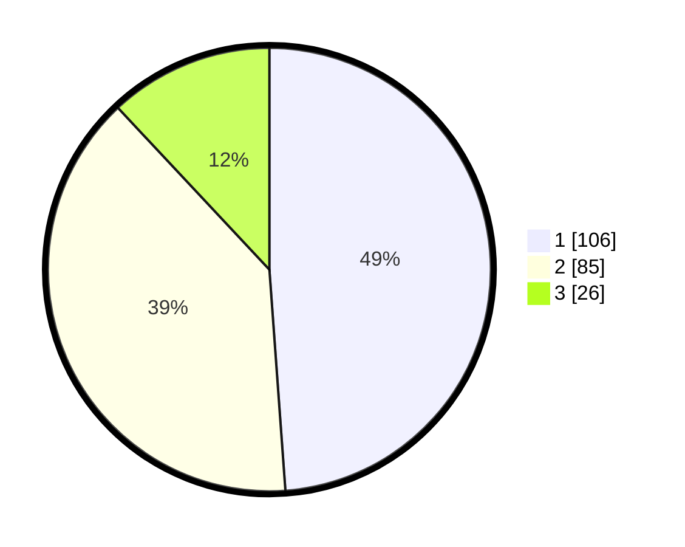

# Hasil

## Grafik

## Tabel

| No.    | Nama Paslon    | Suara | Suara (raw) | Persentase |
|:------ |:-------------- | -----:| -----------:| ----------:|
| 100025 | ANIES MUHAIMIN | 106   | [106][p-1]  | 48,85      |
| 100026 | PRABOWO GIBRAN | 85    | [85][p-2]   | 39,17      |
| 100027 | GANJAR MAHFUD  | 26    | [26][p-3]   | 11,98      |

[p-1]: https://github.com/gigit-pemilu/pemilu-2024/blob/main/pilpres/hitung-suara/sub/31-dki-jakarta/sub/75-jakarta-timur/sub/02-pulogadung/sub/1002-pisangan-timur/sub/104-tps/sub/paslon-1.txt
[p-2]: https://github.com/gigit-pemilu/pemilu-2024/blob/main/pilpres/hitung-suara/sub/31-dki-jakarta/sub/75-jakarta-timur/sub/02-pulogadung/sub/1002-pisangan-timur/sub/104-tps/sub/paslon-2.txt
[p-3]: https://github.com/gigit-pemilu/pemilu-2024/blob/main/pilpres/hitung-suara/sub/31-dki-jakarta/sub/75-jakarta-timur/sub/02-pulogadung/sub/1002-pisangan-timur/sub/104-tps/sub/paslon-3.txt

## Foto C Plano

https://sirekap-obj-formc.kpu.go.id/366f/pemilu/ppwp/31/75/02/10/02/3175021002104-20240222-205515--d10c2858-0227-4cc0-abbf-5791cf852e2d.jpg

https://sirekap-obj-formc.kpu.go.id/366f/pemilu/ppwp/31/75/02/10/02/3175021002104-20240215-000125--4285b207-e260-4623-83fc-cf71cbfee485.jpg

https://sirekap-obj-formc.kpu.go.id/366f/pemilu/ppwp/31/75/02/10/02/3175021002104-20240215-000535--17f3ec0e-219d-43a1-a75c-e56cc534ff99.jpg

## Metadata

| Key        | Value               |
| ---------- | ------------------- |
| Time Stamp | 2024-02-22 21:00:00 |

