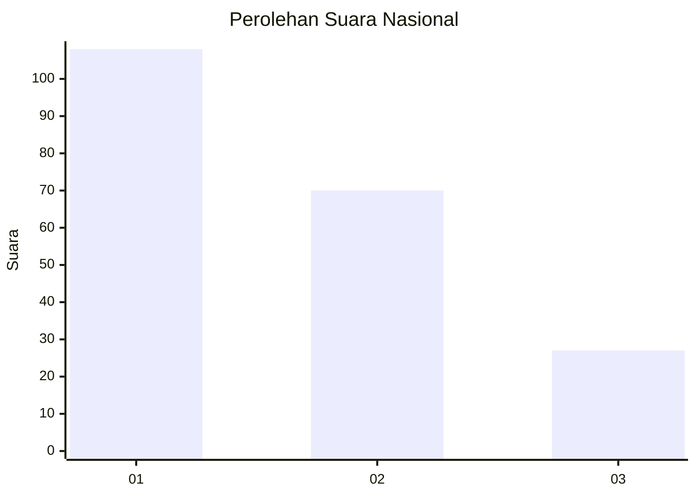
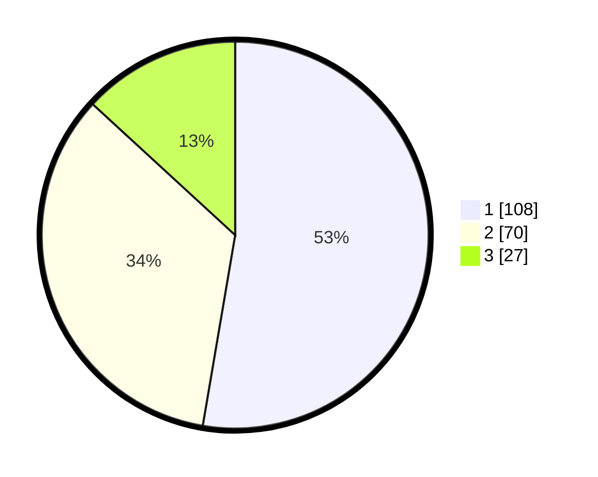

# Hasil

## Grafik

## Tabel

| No.    | Nama Paslon    | Suara | Suara (raw) | Persentase |
|:------ |:-------------- | -----:| -----------:| ----------:|
| 100025 | ANIES MUHAIMIN | 108   | [108][p-1]  | 52,68      |
| 100026 | PRABOWO GIBRAN | 70    | [70][p-2]   | 34,15      |
| 100027 | GANJAR MAHFUD  | 27    | [27][p-3]   | 13,17      |

[p-1]: https://github.com/gigit-pemilu/pemilu-2024/blob/main/pilpres/hitung-suara/sub/31-dki-jakarta/sub/75-jakarta-timur/sub/02-pulogadung/sub/1002-pisangan-timur/sub/112-tps/sub/paslon-1.txt
[p-2]: https://github.com/gigit-pemilu/pemilu-2024/blob/main/pilpres/hitung-suara/sub/31-dki-jakarta/sub/75-jakarta-timur/sub/02-pulogadung/sub/1002-pisangan-timur/sub/112-tps/sub/paslon-2.txt
[p-3]: https://github.com/gigit-pemilu/pemilu-2024/blob/main/pilpres/hitung-suara/sub/31-dki-jakarta/sub/75-jakarta-timur/sub/02-pulogadung/sub/1002-pisangan-timur/sub/112-tps/sub/paslon-3.txt

## Foto C Plano

https://sirekap-obj-formc.kpu.go.id/b5c2/pemilu/ppwp/31/75/02/10/02/3175021002112-20240214-234643--7f492d59-2595-4e15-bd62-6041a42a9b65.jpg

https://sirekap-obj-formc.kpu.go.id/b5c2/pemilu/ppwp/31/75/02/10/02/3175021002112-20240214-234820--2abe32fa-c7e3-4d8d-9780-f8bc75aea060.jpg

https://sirekap-obj-formc.kpu.go.id/b5c2/pemilu/ppwp/31/75/02/10/02/3175021002112-20240214-234959--325aad9f-a13c-4da7-b58a-3cfe549badaa.jpg

## Metadata

| Key        | Value               |
| ---------- | ------------------- |
| Time Stamp | 2024-02-15 12:00:28 |

