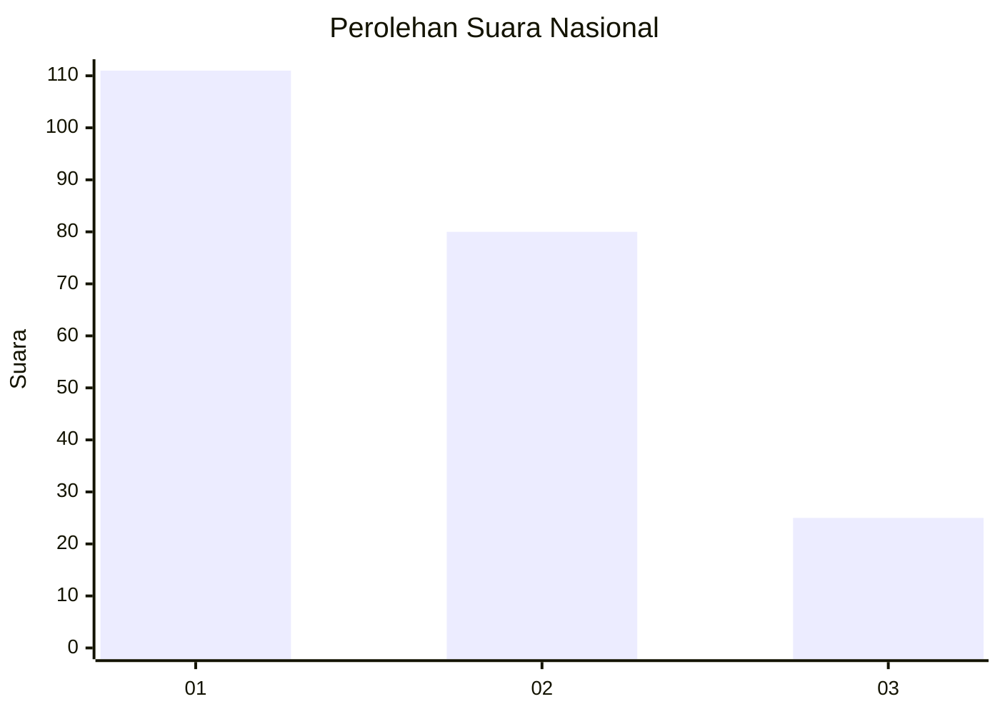
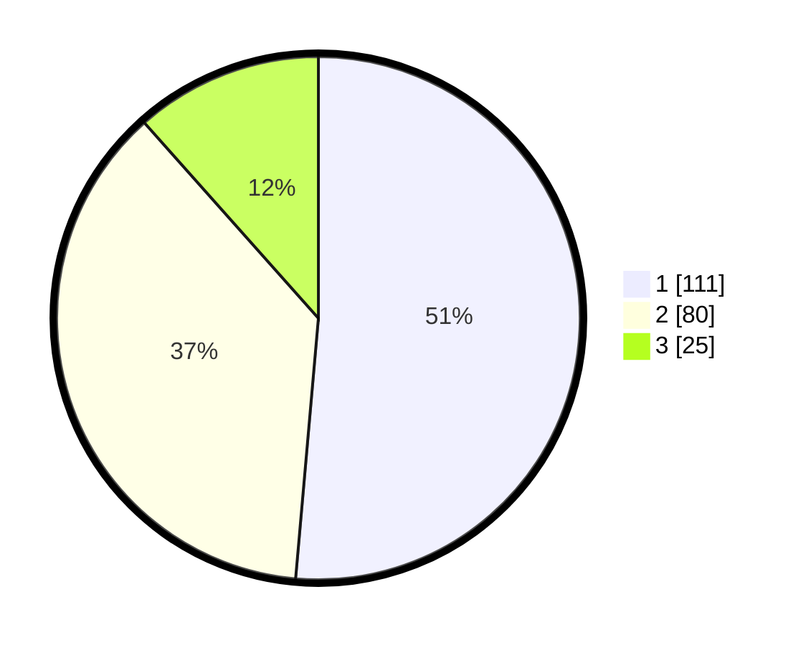

# Hasil

## Grafik

## Tabel

| No.    | Nama Paslon    | Suara | Suara (raw) | Persentase |
|:------ |:-------------- | -----:| -----------:| ----------:|
| 100025 | ANIES MUHAIMIN | 111   | [111][p-1]  | 51,39      |
| 100026 | PRABOWO GIBRAN | 80    | [80][p-2]   | 37,04      |
| 100027 | GANJAR MAHFUD  | 25    | [25][p-3]   | 11,57      |

[p-1]: https://github.com/gigit-pemilu/pemilu-2024/blob/main/pilpres/hitung-suara/sub/31-dki-jakarta/sub/75-jakarta-timur/sub/02-pulogadung/sub/1002-pisangan-timur/sub/123-tps/sub/paslon-1.txt
[p-2]: https://github.com/gigit-pemilu/pemilu-2024/blob/main/pilpres/hitung-suara/sub/31-dki-jakarta/sub/75-jakarta-timur/sub/02-pulogadung/sub/1002-pisangan-timur/sub/123-tps/sub/paslon-2.txt
[p-3]: https://github.com/gigit-pemilu/pemilu-2024/blob/main/pilpres/hitung-suara/sub/31-dki-jakarta/sub/75-jakarta-timur/sub/02-pulogadung/sub/1002-pisangan-timur/sub/123-tps/sub/paslon-3.txt

## Foto C Plano

https://sirekap-obj-formc.kpu.go.id/2bd3/pemilu/ppwp/31/75/02/10/02/3175021002123-20240215-013416--f3af9ed7-7958-48ed-995c-5c830d0cd933.jpg

https://sirekap-obj-formc.kpu.go.id/2bd3/pemilu/ppwp/31/75/02/10/02/3175021002123-20240215-014023--f0850260-7d9c-4b5e-b822-34ab077fd5e1.jpg

https://sirekap-obj-formc.kpu.go.id/2bd3/pemilu/ppwp/31/75/02/10/02/3175021002123-20240215-014210--ebfa09c8-b542-49a4-baf5-bfedeb72fc90.jpg

## Metadata

| Key        | Value               |
| ---------- | ------------------- |
| Time Stamp | 2024-02-24 22:31:28 |

