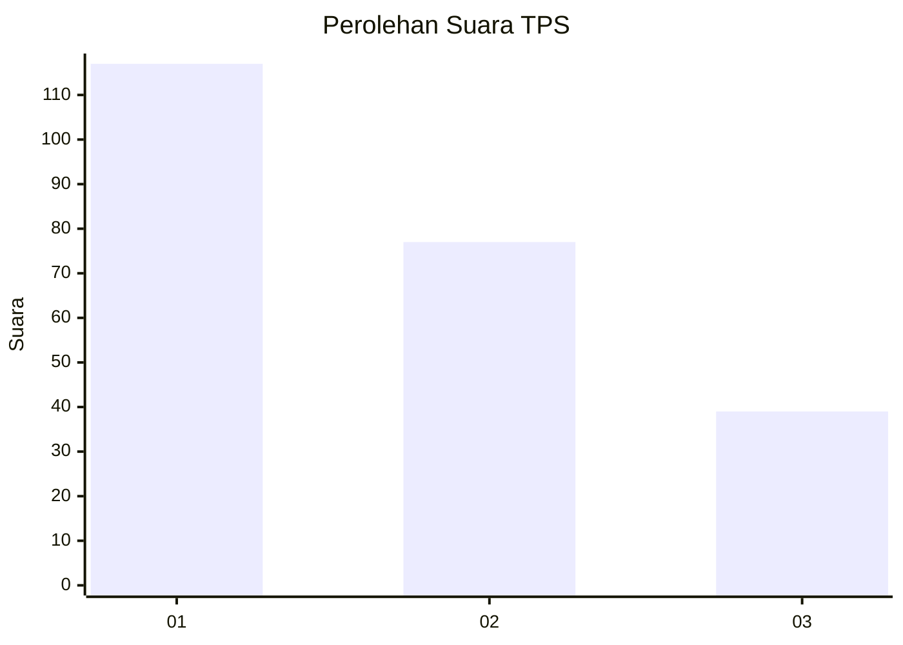
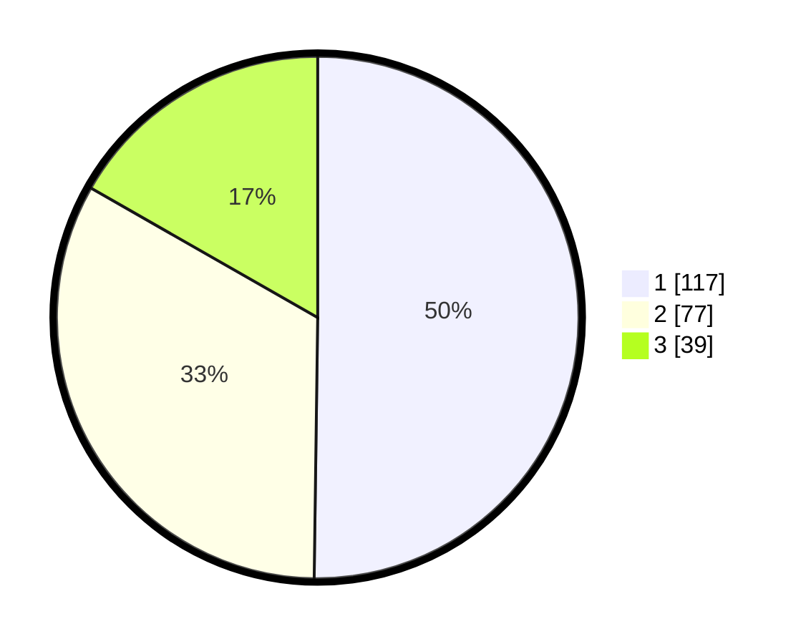

# Hasil

## Grafik

## Tabel

| No. | Nama Paslon    | Suara | Suara (raw) | Persentase |
|:--- |:-------------- | -----:| -----------:| ----------:|
| 1   | ANIES MUHAIMIN | 117   | [117][p-1]  | 50,21      |
| 2   | PRABOWO GIBRAN | 77    | [77][p-2]   | 33,05      |
| 3   | GANJAR MAHFUD  | 39    | [39][p-3]   | 16,74      |

[p-1]: https://github.com/gigit-pemilu/pemilu-2024-31-dki-jakarta/blob/main/pilpres/hitung-suara/sub/31-dki-jakarta/sub/75-jakarta-timur/sub/02-pulogadung/sub/1002-pisangan-timur/sub/130-tps/sub/paslon-1.txt
[p-2]: https://github.com/gigit-pemilu/pemilu-2024-31-dki-jakarta/blob/main/pilpres/hitung-suara/sub/31-dki-jakarta/sub/75-jakarta-timur/sub/02-pulogadung/sub/1002-pisangan-timur/sub/130-tps/sub/paslon-2.txt
[p-3]: https://github.com/gigit-pemilu/pemilu-2024-31-dki-jakarta/blob/main/pilpres/hitung-suara/sub/31-dki-jakarta/sub/75-jakarta-timur/sub/02-pulogadung/sub/1002-pisangan-timur/sub/130-tps/sub/paslon-3.txt

## Foto C Plano

https://sirekap-obj-formc.kpu.go.id/29e1/pemilu/ppwp/31/75/02/10/02/3175021002130-20240214-155209--d3d4aa4e-bcc0-4cc8-bb1c-1ac64e90dc3e.jpg

https://sirekap-obj-formc.kpu.go.id/29e1/pemilu/ppwp/31/75/02/10/02/3175021002130-20240214-155044--9a280ecb-bcad-4ba8-bf46-ecb0b625e760.jpg

https://sirekap-obj-formc.kpu.go.id/29e1/pemilu/ppwp/31/75/02/10/02/3175021002130-20240214-155122--159c35cc-07af-4c1c-8e82-43964c3aeb2f.jpg

## Metadata

| Key        | Value               |
| ---------- | ------------------- |
| Time Stamp | 2024-02-15 15:00:29 |

## DATA PEMILIH TETAP

Jumlah pemilih dalam DPT: **507**.
 * L: **0**.
 * P: **557**.

## DATA PENGGUNA HAK PILIH

Jumlah pengguna hak pilih dalam DPT: **1**.
 * L: **7**.
 * P: **5**.

Jumlah pengguna hak pilih dalam DPTb: **574**.
 * L: **774**.
 * P: **555**.

Jumlah pengguna hak pilih dalam DPK: **10**.
 * L: **757**.
 * P: **556**.

Jumlah pengguna hak pilih: **781**.
 * L: **777**.
 * P: **275**.

## JUMLAH SUARA SAH DAN TIDAK SAH

JUMLAH SELURUH SUARA SAH: **233**.

JUMLAH SUARA TIDAK SAH: **5**.

JUMLAH SELURUH SUARA SAH DAN SUARA TIDAK SAH: **238**.

