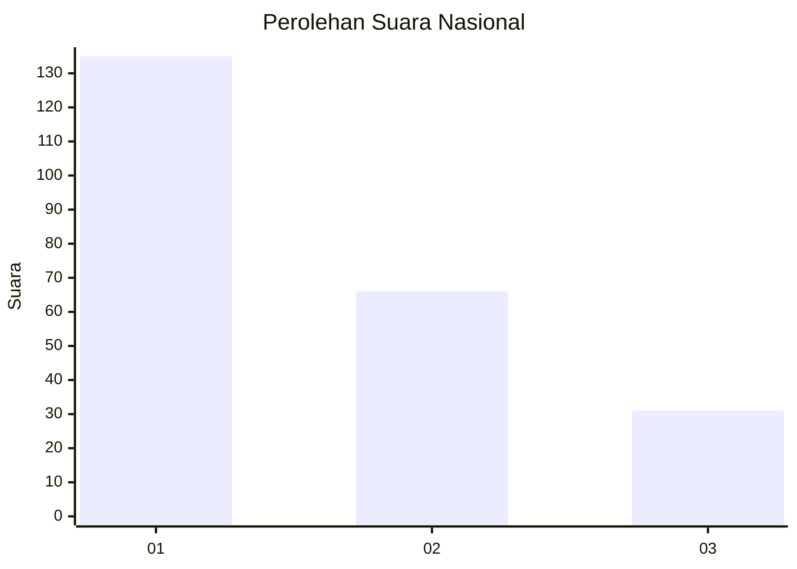
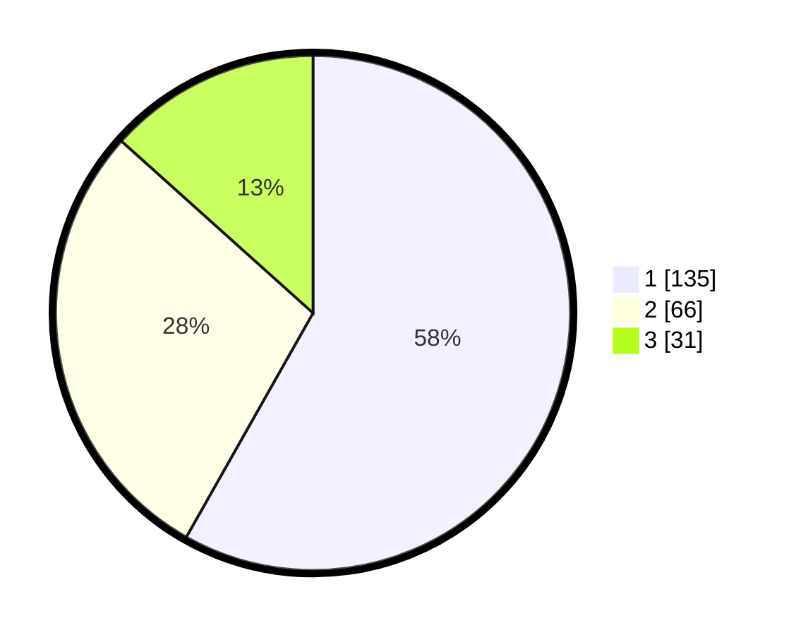

# Hasil

## Grafik

## Tabel

| No.    | Nama Paslon    | Suara | Suara (raw) | Persentase |
|:------ |:-------------- | -----:| -----------:| ----------:|
| 100025 | ANIES MUHAIMIN | 135   | [135][p-1]  | 58,19      |
| 100026 | PRABOWO GIBRAN | 66    | [66][p-2]   | 28,45      |
| 100027 | GANJAR MAHFUD  | 31    | [31][p-3]   | 13,36      |

[p-1]: https://github.com/gigit-pemilu/pemilu-2024/blob/main/pilpres/hitung-suara/sub/31-dki-jakarta/sub/75-jakarta-timur/sub/02-pulogadung/sub/1003-cipinang/sub/008-tps/sub/paslon-1.txt
[p-2]: https://github.com/gigit-pemilu/pemilu-2024/blob/main/pilpres/hitung-suara/sub/31-dki-jakarta/sub/75-jakarta-timur/sub/02-pulogadung/sub/1003-cipinang/sub/008-tps/sub/paslon-2.txt
[p-3]: https://github.com/gigit-pemilu/pemilu-2024/blob/main/pilpres/hitung-suara/sub/31-dki-jakarta/sub/75-jakarta-timur/sub/02-pulogadung/sub/1003-cipinang/sub/008-tps/sub/paslon-3.txt

## Foto C Plano

https://sirekap-obj-formc.kpu.go.id/2c67/pemilu/ppwp/31/75/02/10/03/3175021003008-20240214-225412--61bdf22b-e1be-4a96-b359-f8094113a942.jpg

https://sirekap-obj-formc.kpu.go.id/2c67/pemilu/ppwp/31/75/02/10/03/3175021003008-20240214-225515--26edd14b-b19b-454e-8883-f6154a095e03.jpg

https://sirekap-obj-formc.kpu.go.id/2c67/pemilu/ppwp/31/75/02/10/03/3175021003008-20240214-225611--c92199f8-1c2b-4759-87b6-b628b0f5e696.jpg

## Metadata

| Key        | Value               |
| ---------- | ------------------- |
| Time Stamp | 2024-02-15 19:30:26 |

