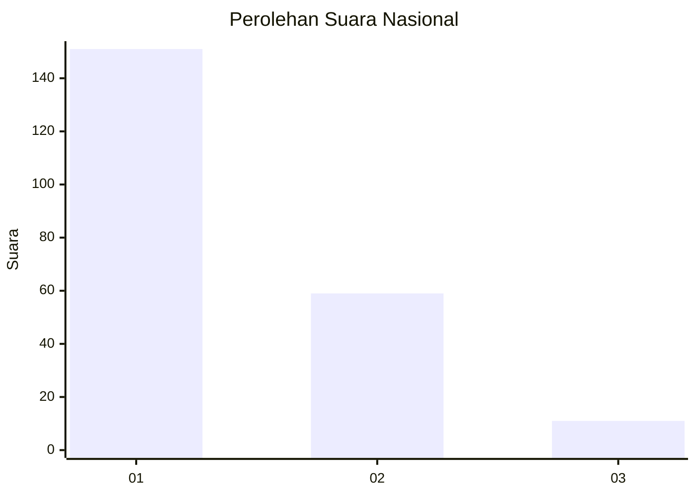
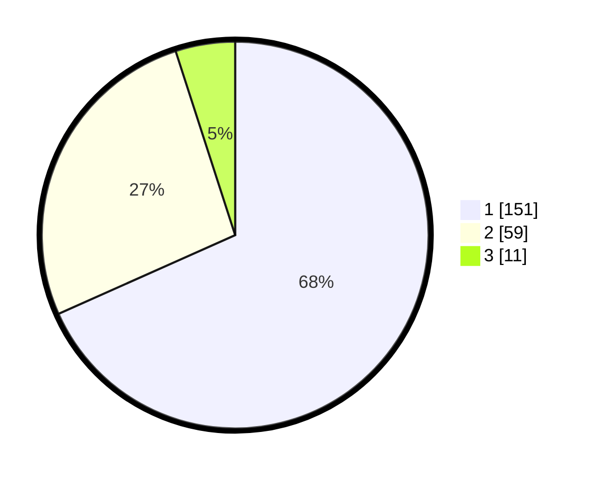

# Hasil

## Grafik

## Tabel

| No.    | Nama Paslon    | Suara | Suara (raw) | Persentase |
|:------ |:-------------- | -----:| -----------:| ----------:|
| 100025 | ANIES MUHAIMIN | 151   | [151][p-1]  | 68,33      |
| 100026 | PRABOWO GIBRAN | 59    | [59][p-2]   | 26,70      |
| 100027 | GANJAR MAHFUD  | 11    | [11][p-3]   | 4,98       |

[p-1]: https://github.com/gigit-pemilu/pemilu-2024/blob/main/pilpres/hitung-suara/sub/31-dki-jakarta/sub/75-jakarta-timur/sub/02-pulogadung/sub/1003-cipinang/sub/020-tps/sub/paslon-1.txt
[p-2]: https://github.com/gigit-pemilu/pemilu-2024/blob/main/pilpres/hitung-suara/sub/31-dki-jakarta/sub/75-jakarta-timur/sub/02-pulogadung/sub/1003-cipinang/sub/020-tps/sub/paslon-2.txt
[p-3]: https://github.com/gigit-pemilu/pemilu-2024/blob/main/pilpres/hitung-suara/sub/31-dki-jakarta/sub/75-jakarta-timur/sub/02-pulogadung/sub/1003-cipinang/sub/020-tps/sub/paslon-3.txt

## Foto C Plano

https://sirekap-obj-formc.kpu.go.id/6780/pemilu/ppwp/31/75/02/10/03/3175021003020-20240215-003413--8a91f010-271d-4d55-99ef-fcc2216243b4.jpg

https://sirekap-obj-formc.kpu.go.id/6780/pemilu/ppwp/31/75/02/10/03/3175021003020-20240215-003655--dca16846-cc4b-42a3-a4bf-665fc053ff2b.jpg

https://sirekap-obj-formc.kpu.go.id/6780/pemilu/ppwp/31/75/02/10/03/3175021003020-20240215-003914--fff97ac1-a293-4382-b03a-ef3ef4c04e9d.jpg

## Metadata

| Key        | Value               |
| ---------- | ------------------- |
| Time Stamp | 2024-02-15 20:30:46 |

