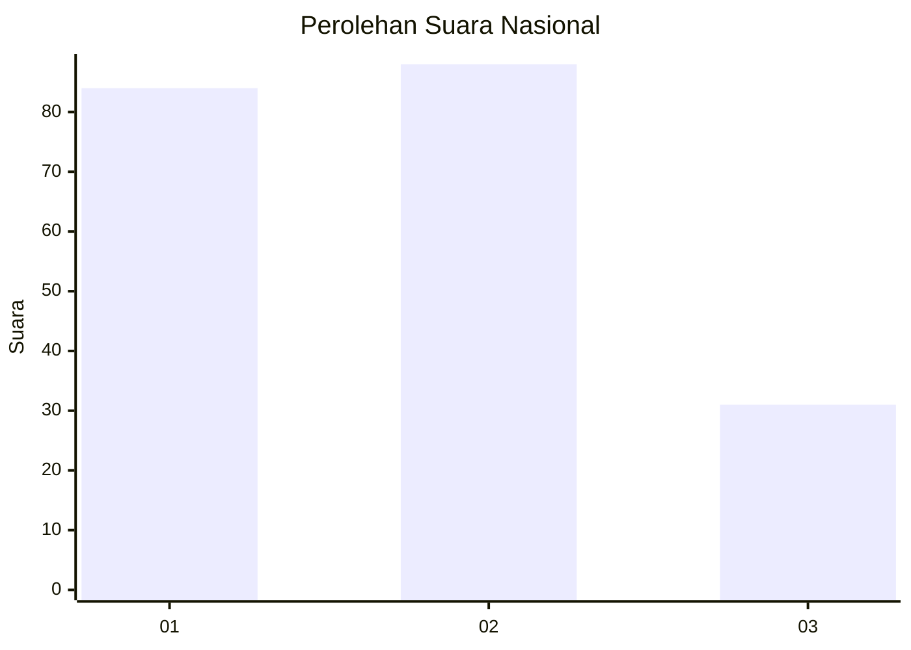
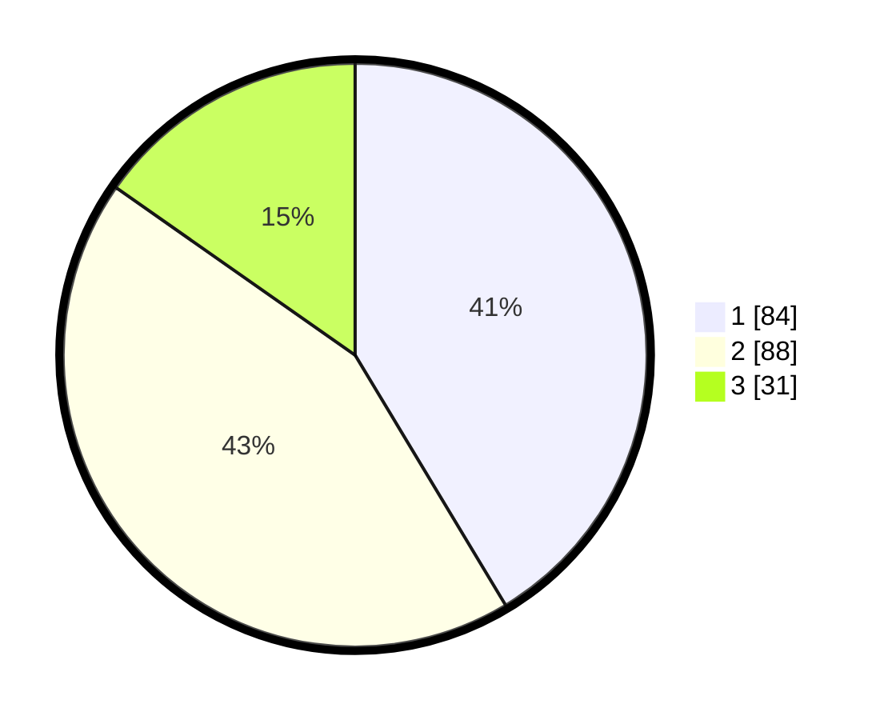

# Hasil

## Grafik

## Tabel

| No.    | Nama Paslon    | Suara | Suara (raw) | Persentase |
|:------ |:-------------- | -----:| -----------:| ----------:|
| 100025 | ANIES MUHAIMIN | 84    | [84][p-1]   | 41,38      |
| 100026 | PRABOWO GIBRAN | 88    | [88][p-2]   | 43,35      |
| 100027 | GANJAR MAHFUD  | 31    | [31][p-3]   | 15,27      |

[p-1]: https://github.com/gigit-pemilu/pemilu-2024/blob/main/pilpres/hitung-suara/sub/31-dki-jakarta/sub/75-jakarta-timur/sub/02-pulogadung/sub/1003-cipinang/sub/031-tps/sub/paslon-1.txt
[p-2]: https://github.com/gigit-pemilu/pemilu-2024/blob/main/pilpres/hitung-suara/sub/31-dki-jakarta/sub/75-jakarta-timur/sub/02-pulogadung/sub/1003-cipinang/sub/031-tps/sub/paslon-2.txt
[p-3]: https://github.com/gigit-pemilu/pemilu-2024/blob/main/pilpres/hitung-suara/sub/31-dki-jakarta/sub/75-jakarta-timur/sub/02-pulogadung/sub/1003-cipinang/sub/031-tps/sub/paslon-3.txt

## Foto C Plano

https://sirekap-obj-formc.kpu.go.id/007d/pemilu/ppwp/31/75/02/10/03/3175021003031-20240215-024954--4dc360cc-b8b7-4e8a-9acc-ab2330e2422f.jpg

https://sirekap-obj-formc.kpu.go.id/007d/pemilu/ppwp/31/75/02/10/03/3175021003031-20240215-004949--49d3e3e2-dc27-4a5f-8bc8-0bef4cc0270f.jpg

https://sirekap-obj-formc.kpu.go.id/007d/pemilu/ppwp/31/75/02/10/03/3175021003031-20240215-005016--4b508d55-cd63-492e-a27b-73956d1202e5.jpg

## Metadata

| Key        | Value               |
| ---------- | ------------------- |
| Time Stamp | 2024-02-15 09:00:24 |

