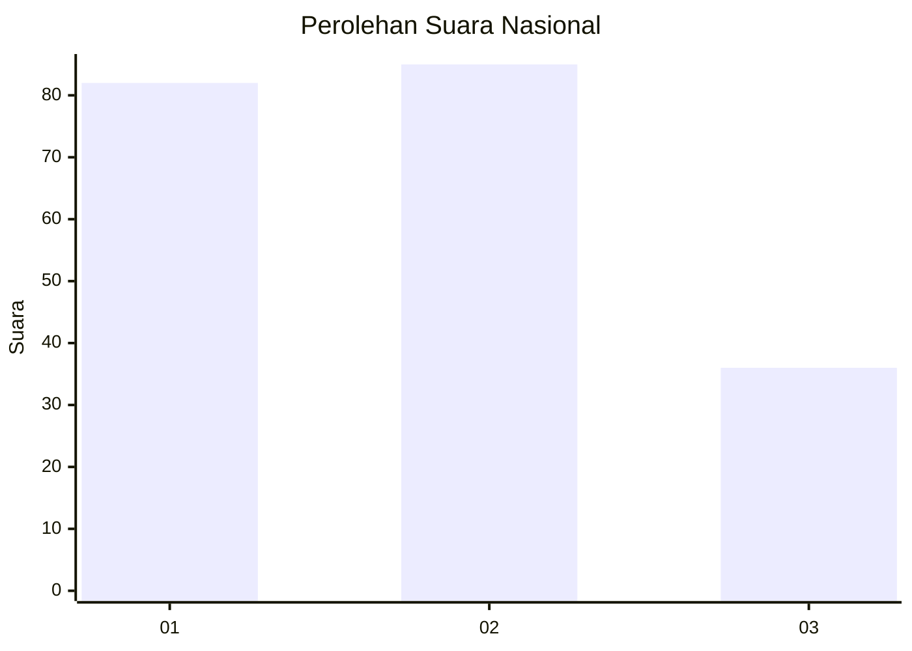
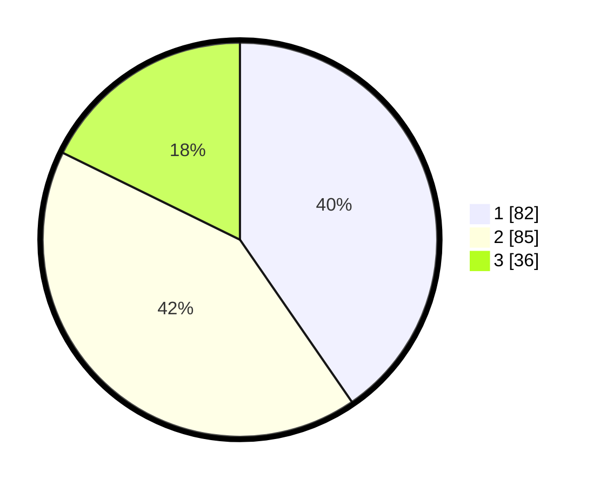

# Hasil

## Grafik

## Tabel

| No.    | Nama Paslon    | Suara | Suara (raw) | Persentase |
|:------ |:-------------- | -----:| -----------:| ----------:|
| 100025 | ANIES MUHAIMIN | 82    | [82][p-1]   | 40,39      |
| 100026 | PRABOWO GIBRAN | 85    | [85][p-2]   | 41,87      |
| 100027 | GANJAR MAHFUD  | 36    | [36][p-3]   | 17,73      |

[p-1]: https://github.com/gigit-pemilu/pemilu-2024/blob/main/pilpres/hitung-suara/sub/31-dki-jakarta/sub/75-jakarta-timur/sub/02-pulogadung/sub/1003-cipinang/sub/033-tps/sub/paslon-1.txt
[p-2]: https://github.com/gigit-pemilu/pemilu-2024/blob/main/pilpres/hitung-suara/sub/31-dki-jakarta/sub/75-jakarta-timur/sub/02-pulogadung/sub/1003-cipinang/sub/033-tps/sub/paslon-2.txt
[p-3]: https://github.com/gigit-pemilu/pemilu-2024/blob/main/pilpres/hitung-suara/sub/31-dki-jakarta/sub/75-jakarta-timur/sub/02-pulogadung/sub/1003-cipinang/sub/033-tps/sub/paslon-3.txt

## Foto C Plano

https://sirekap-obj-formc.kpu.go.id/3fff/pemilu/ppwp/31/75/02/10/03/3175021003033-20240215-170333--2b980e83-08c4-4eab-837d-d3f10eb2bf08.jpg

https://sirekap-obj-formc.kpu.go.id/3fff/pemilu/ppwp/31/75/02/10/03/3175021003033-20240215-170337--9eb7e26b-a897-4b8b-a69f-ddefd94f9aca.jpg

https://sirekap-obj-formc.kpu.go.id/3fff/pemilu/ppwp/31/75/02/10/03/3175021003033-20240215-170341--96c73004-03f9-413f-bfe3-a4d4730e9268.jpg

## Metadata

| Key        | Value               |
| ---------- | ------------------- |
| Time Stamp | 2024-02-15 20:30:46 |

