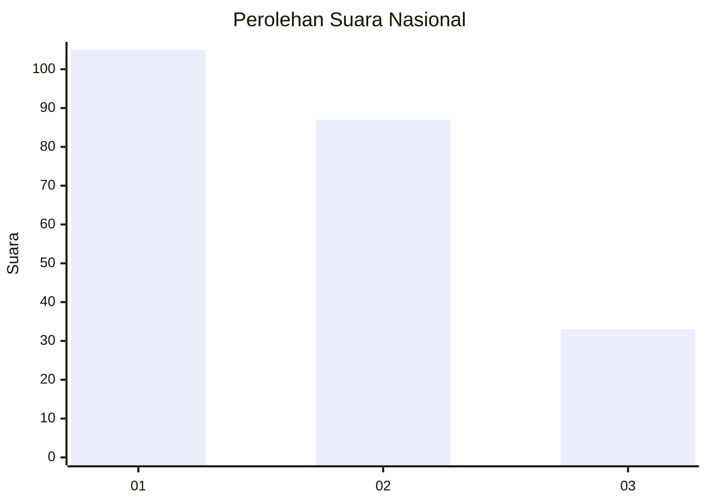
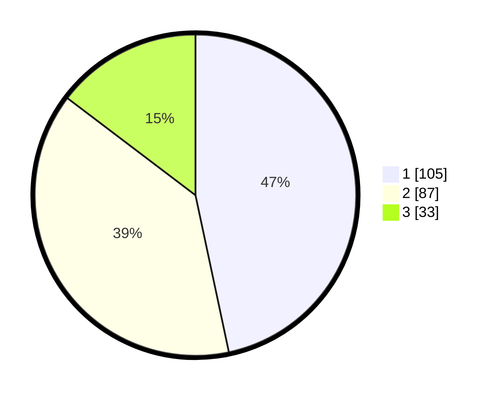

# Hasil

## Grafik

## Tabel

| No.    | Nama Paslon    | Suara | Suara (raw) | Persentase |
|:------ |:-------------- | -----:| -----------:| ----------:|
| 100025 | ANIES MUHAIMIN | 105   | [105][p-1]  | 46,67      |
| 100026 | PRABOWO GIBRAN | 87    | [87][p-2]   | 38,67      |
| 100027 | GANJAR MAHFUD  | 33    | [33][p-3]   | 14,67      |

[p-1]: https://github.com/gigit-pemilu/pemilu-2024/blob/main/pilpres/hitung-suara/sub/31-dki-jakarta/sub/75-jakarta-timur/sub/02-pulogadung/sub/1003-cipinang/sub/060-tps/sub/paslon-1.txt
[p-2]: https://github.com/gigit-pemilu/pemilu-2024/blob/main/pilpres/hitung-suara/sub/31-dki-jakarta/sub/75-jakarta-timur/sub/02-pulogadung/sub/1003-cipinang/sub/060-tps/sub/paslon-2.txt
[p-3]: https://github.com/gigit-pemilu/pemilu-2024/blob/main/pilpres/hitung-suara/sub/31-dki-jakarta/sub/75-jakarta-timur/sub/02-pulogadung/sub/1003-cipinang/sub/060-tps/sub/paslon-3.txt

## Foto C Plano

https://sirekap-obj-formc.kpu.go.id/bf8f/pemilu/ppwp/31/75/02/10/03/3175021003060-20240214-203922--a33f61b0-b34c-443e-aa2b-29aaf1f28fc6.jpg

https://sirekap-obj-formc.kpu.go.id/bf8f/pemilu/ppwp/31/75/02/10/03/3175021003060-20240215-000628--a4099d54-a8a2-4fc1-97bd-d997b7d1eb63.jpg

https://sirekap-obj-formc.kpu.go.id/bf8f/pemilu/ppwp/31/75/02/10/03/3175021003060-20240214-204354--ea450bee-33f5-45a7-8add-d3f9f9fb32dc.jpg

## Metadata

| Key        | Value               |
| ---------- | ------------------- |
| Time Stamp | 2024-02-15 12:00:28 |

