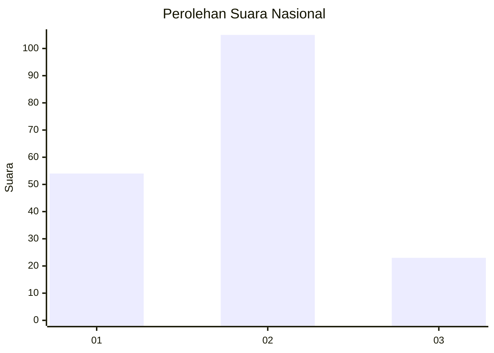
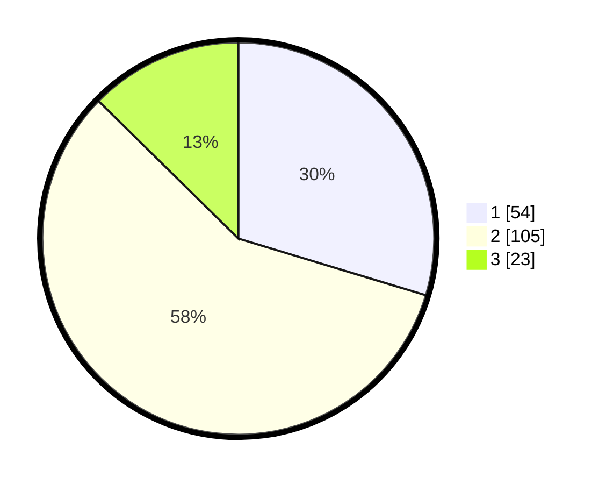

# Hasil

## Grafik

## Tabel

| No.    | Nama Paslon    | Suara | Suara (raw) | Persentase |
|:------ |:-------------- | -----:| -----------:| ----------:|
| 100025 | ANIES MUHAIMIN | 54    | [54][p-1]   | 29,67      |
| 100026 | PRABOWO GIBRAN | 105   | [105][p-2]  | 57,69      |
| 100027 | GANJAR MAHFUD  | 23    | [23][p-3]   | 12,64      |

[p-1]: https://github.com/gigit-pemilu/pemilu-2024/blob/main/pilpres/hitung-suara/sub/31-dki-jakarta/sub/75-jakarta-timur/sub/02-pulogadung/sub/1003-cipinang/sub/068-tps/sub/paslon-1.txt
[p-2]: https://github.com/gigit-pemilu/pemilu-2024/blob/main/pilpres/hitung-suara/sub/31-dki-jakarta/sub/75-jakarta-timur/sub/02-pulogadung/sub/1003-cipinang/sub/068-tps/sub/paslon-2.txt
[p-3]: https://github.com/gigit-pemilu/pemilu-2024/blob/main/pilpres/hitung-suara/sub/31-dki-jakarta/sub/75-jakarta-timur/sub/02-pulogadung/sub/1003-cipinang/sub/068-tps/sub/paslon-3.txt

## Foto C Plano

https://sirekap-obj-formc.kpu.go.id/3065/pemilu/ppwp/31/75/02/10/03/3175021003068-20240214-230344--9a5a4249-38c4-48fb-b4e1-7b6d5b80d2d7.jpg

https://sirekap-obj-formc.kpu.go.id/3065/pemilu/ppwp/31/75/02/10/03/3175021003068-20240214-230518--f5ab153b-80e7-436d-b027-081bf0ed346e.jpg

https://sirekap-obj-formc.kpu.go.id/3065/pemilu/ppwp/31/75/02/10/03/3175021003068-20240214-230801--fb154067-6938-43de-80a6-bf26d68e4342.jpg

## Metadata

| Key        | Value               |
| ---------- | ------------------- |
| Time Stamp | 2024-02-15 16:30:25 |

