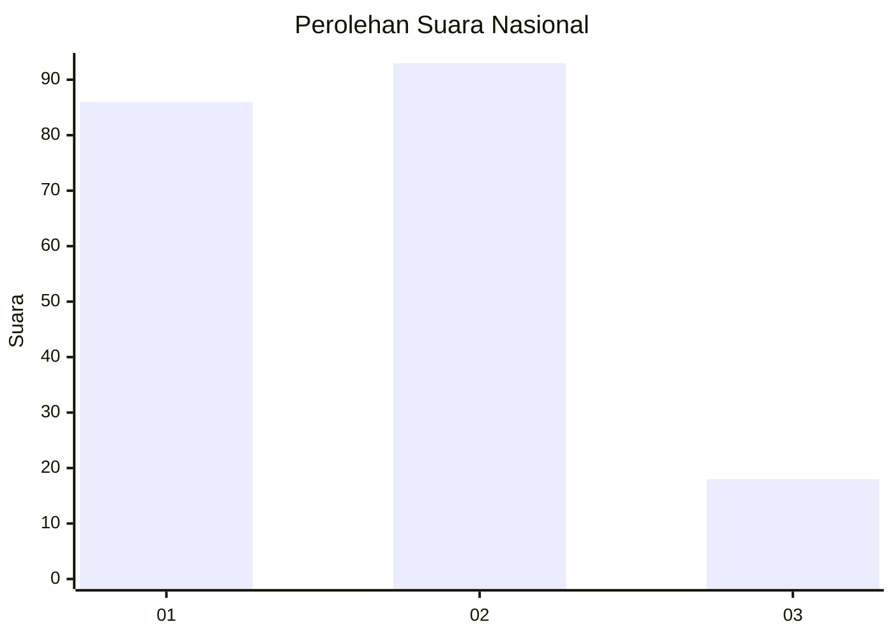
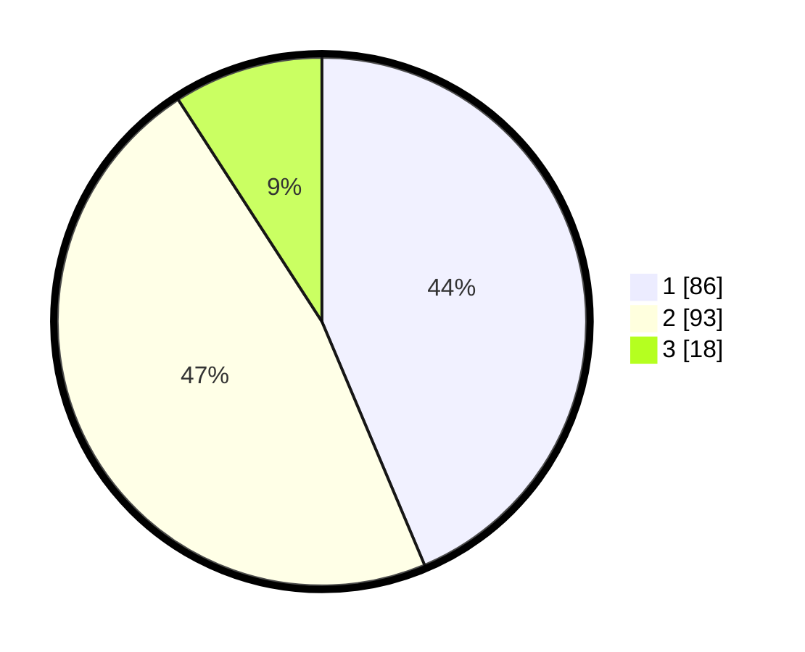

# Hasil

## Grafik

## Tabel

| No.    | Nama Paslon    | Suara | Suara (raw) | Persentase |
|:------ |:-------------- | -----:| -----------:| ----------:|
| 100025 | ANIES MUHAIMIN | 86    | [86][p-1]   | 43,65      |
| 100026 | PRABOWO GIBRAN | 93    | [93][p-2]   | 47,21      |
| 100027 | GANJAR MAHFUD  | 18    | [18][p-3]   | 9,14       |

[p-1]: https://github.com/gigit-pemilu/pemilu-2024/blob/main/pilpres/hitung-suara/sub/31-dki-jakarta/sub/75-jakarta-timur/sub/02-pulogadung/sub/1003-cipinang/sub/070-tps/sub/paslon-1.txt
[p-2]: https://github.com/gigit-pemilu/pemilu-2024/blob/main/pilpres/hitung-suara/sub/31-dki-jakarta/sub/75-jakarta-timur/sub/02-pulogadung/sub/1003-cipinang/sub/070-tps/sub/paslon-2.txt
[p-3]: https://github.com/gigit-pemilu/pemilu-2024/blob/main/pilpres/hitung-suara/sub/31-dki-jakarta/sub/75-jakarta-timur/sub/02-pulogadung/sub/1003-cipinang/sub/070-tps/sub/paslon-3.txt

## Foto C Plano

https://sirekap-obj-formc.kpu.go.id/6f50/pemilu/ppwp/31/75/02/10/03/3175021003070-20240217-210959--a4486213-eece-4280-8e41-b792018e9bae.jpg

https://sirekap-obj-formc.kpu.go.id/6f50/pemilu/ppwp/31/75/02/10/03/3175021003070-20240218-145615--33d94f99-2d06-462f-8c64-aec8e38c246a.jpg

https://sirekap-obj-formc.kpu.go.id/6f50/pemilu/ppwp/31/75/02/10/03/3175021003070-20240218-150640--4bc401ef-c5d7-472c-9c30-e33213ebe98f.jpg

## Metadata

| Key        | Value               |
| ---------- | ------------------- |
| Time Stamp | 2024-02-24 22:31:28 |

