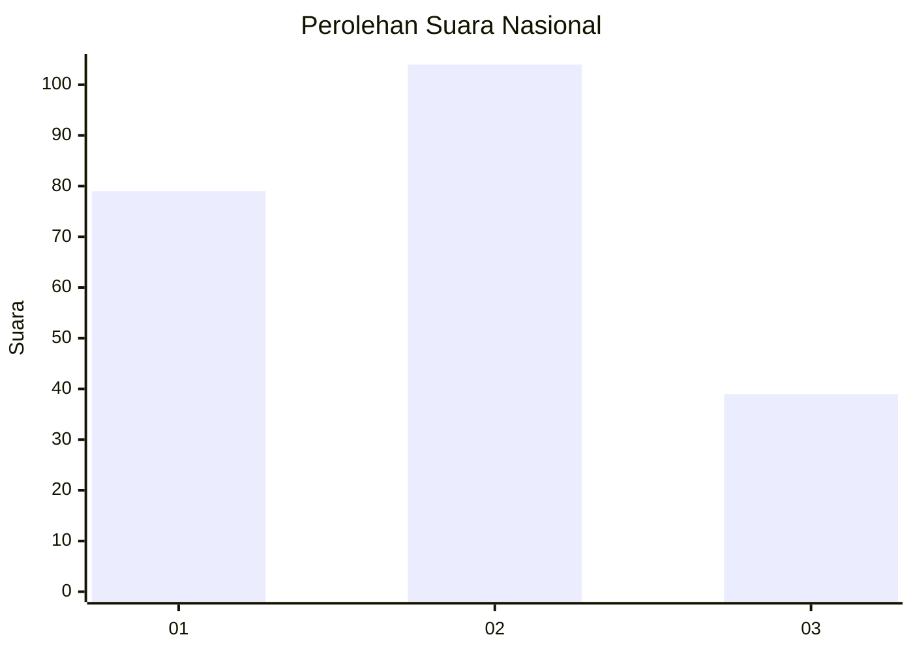
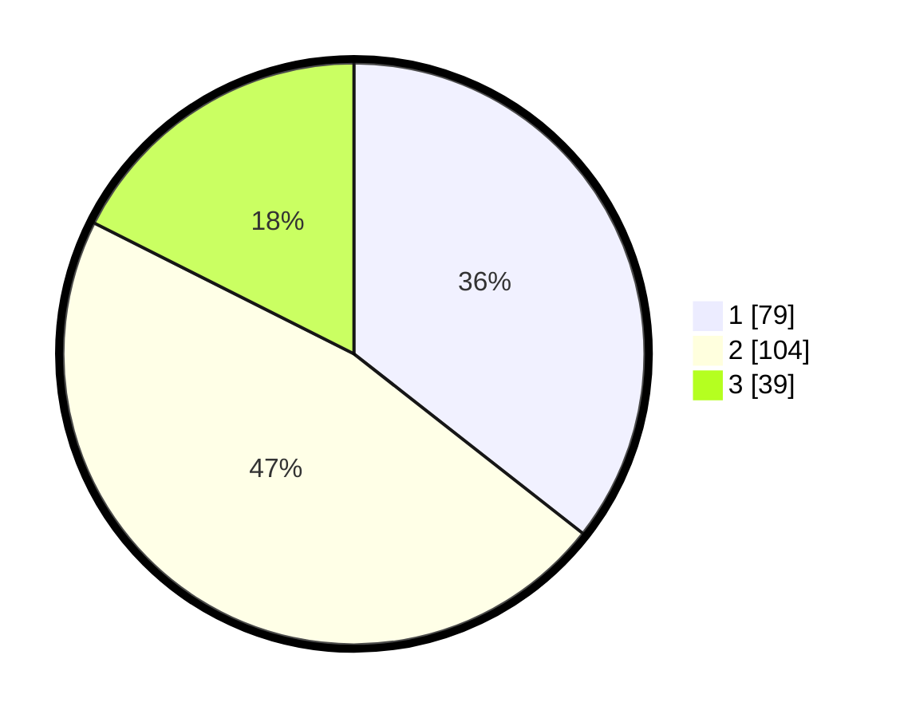

# Hasil

## Grafik

## Tabel

| No.    | Nama Paslon    | Suara | Suara (raw) | Persentase |
|:------ |:-------------- | -----:| -----------:| ----------:|
| 100025 | ANIES MUHAIMIN | 79    | [79][p-1]   | 35,59      |
| 100026 | PRABOWO GIBRAN | 104   | [104][p-2]  | 46,85      |
| 100027 | GANJAR MAHFUD  | 39    | [39][p-3]   | 17,57      |

[p-1]: https://github.com/gigit-pemilu/pemilu-2024/blob/main/pilpres/hitung-suara/sub/31-dki-jakarta/sub/75-jakarta-timur/sub/02-pulogadung/sub/1003-cipinang/sub/087-tps/sub/paslon-1.txt
[p-2]: https://github.com/gigit-pemilu/pemilu-2024/blob/main/pilpres/hitung-suara/sub/31-dki-jakarta/sub/75-jakarta-timur/sub/02-pulogadung/sub/1003-cipinang/sub/087-tps/sub/paslon-2.txt
[p-3]: https://github.com/gigit-pemilu/pemilu-2024/blob/main/pilpres/hitung-suara/sub/31-dki-jakarta/sub/75-jakarta-timur/sub/02-pulogadung/sub/1003-cipinang/sub/087-tps/sub/paslon-3.txt

## Foto C Plano

https://sirekap-obj-formc.kpu.go.id/6ab5/pemilu/ppwp/31/75/02/10/03/3175021003087-20240214-234832--d1b5b3fa-0d36-4037-9ac6-b04e0fa72b76.jpg

https://sirekap-obj-formc.kpu.go.id/6ab5/pemilu/ppwp/31/75/02/10/03/3175021003087-20240214-234906--38c3fe87-d0b0-4858-ad2e-b1c1f4ec2491.jpg

https://sirekap-obj-formc.kpu.go.id/6ab5/pemilu/ppwp/31/75/02/10/03/3175021003087-20240214-235005--185eb025-1e55-45b1-bb32-545c3a239b4f.jpg

## Metadata

| Key        | Value               |
| ---------- | ------------------- |
| Time Stamp | 2024-02-15 17:00:25 |

