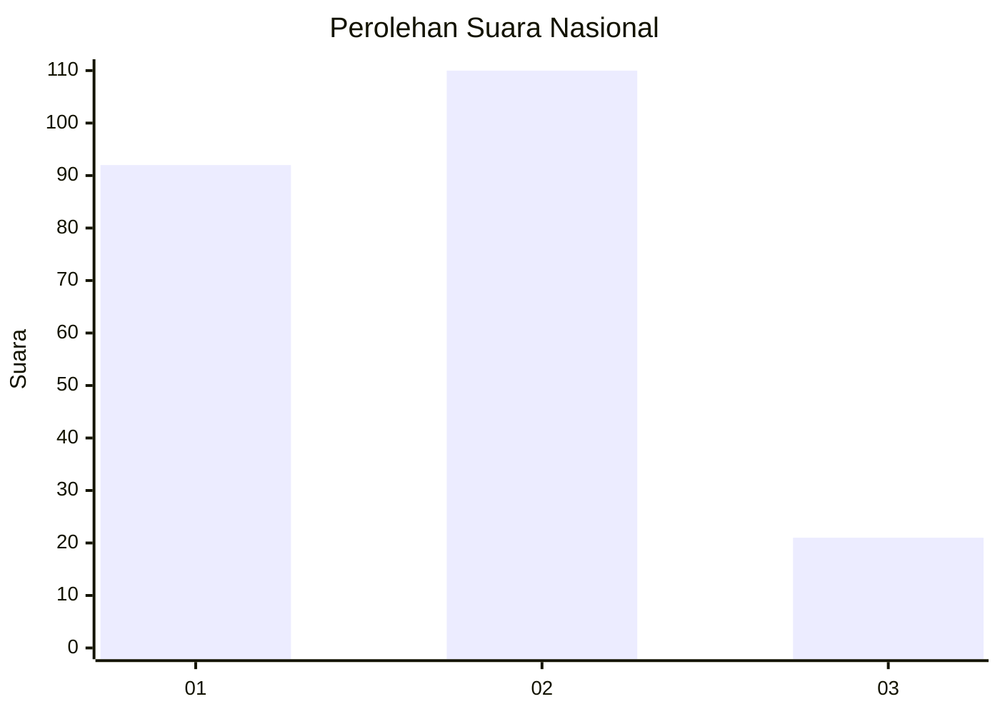
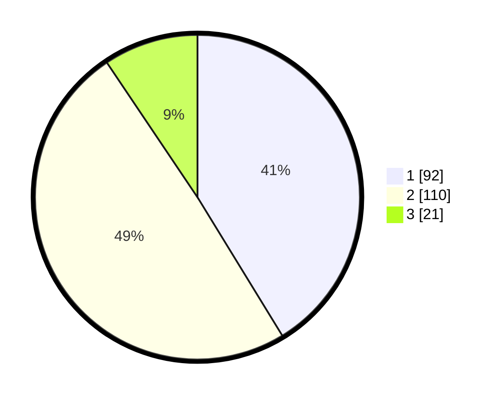

# Hasil

## Grafik

## Tabel

| No.    | Nama Paslon    | Suara | Suara (raw) | Persentase |
|:------ |:-------------- | -----:| -----------:| ----------:|
| 100025 | ANIES MUHAIMIN | 92    | [92][p-1]   | 41,26      |
| 100026 | PRABOWO GIBRAN | 110   | [110][p-2]  | 49,33      |
| 100027 | GANJAR MAHFUD  | 21    | [21][p-3]   | 9,42       |

[p-1]: https://github.com/gigit-pemilu/pemilu-2024/blob/main/pilpres/hitung-suara/sub/31-dki-jakarta/sub/75-jakarta-timur/sub/02-pulogadung/sub/1003-cipinang/sub/105-tps/sub/paslon-1.txt
[p-2]: https://github.com/gigit-pemilu/pemilu-2024/blob/main/pilpres/hitung-suara/sub/31-dki-jakarta/sub/75-jakarta-timur/sub/02-pulogadung/sub/1003-cipinang/sub/105-tps/sub/paslon-2.txt
[p-3]: https://github.com/gigit-pemilu/pemilu-2024/blob/main/pilpres/hitung-suara/sub/31-dki-jakarta/sub/75-jakarta-timur/sub/02-pulogadung/sub/1003-cipinang/sub/105-tps/sub/paslon-3.txt

## Foto C Plano

https://sirekap-obj-formc.kpu.go.id/b256/pemilu/ppwp/31/75/02/10/03/3175021003105-20240215-034204--477ef9ee-d106-4188-ada1-8f146920fa06.jpg

https://sirekap-obj-formc.kpu.go.id/b256/pemilu/ppwp/31/75/02/10/03/3175021003105-20240215-034310--4d42e448-1c4e-4af6-afb9-db4d38dc4e9f.jpg

https://sirekap-obj-formc.kpu.go.id/b256/pemilu/ppwp/31/75/02/10/03/3175021003105-20240215-034422--3f9c140e-45fa-47b3-921a-3c1ec73bfce0.jpg

## Metadata

| Key        | Value               |
| ---------- | ------------------- |
| Time Stamp | 2024-02-15 17:30:25 |

