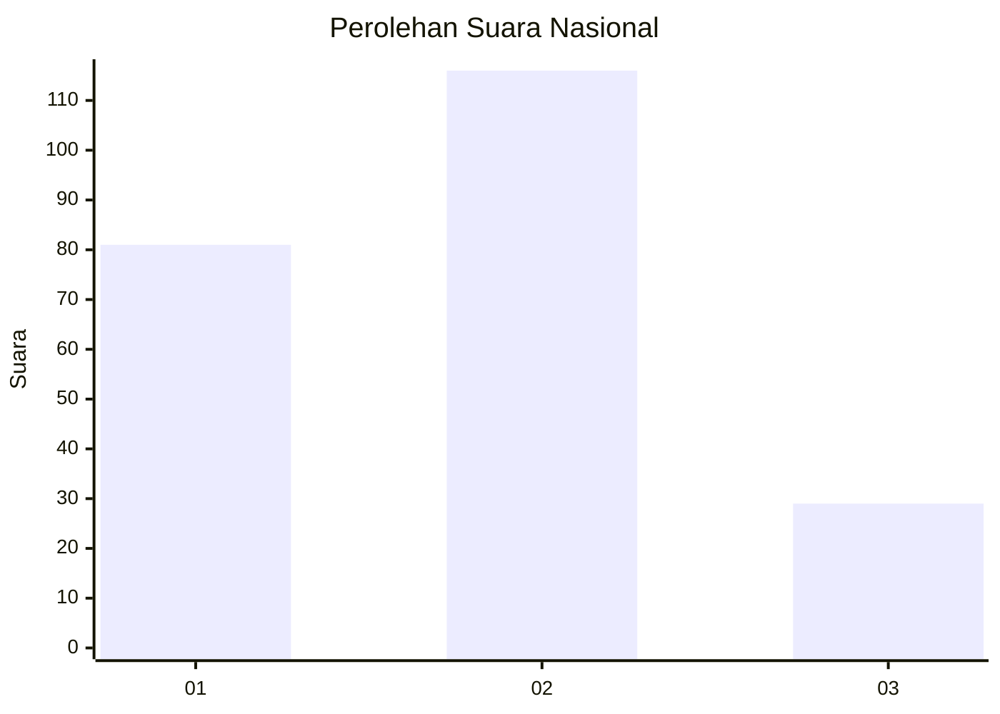
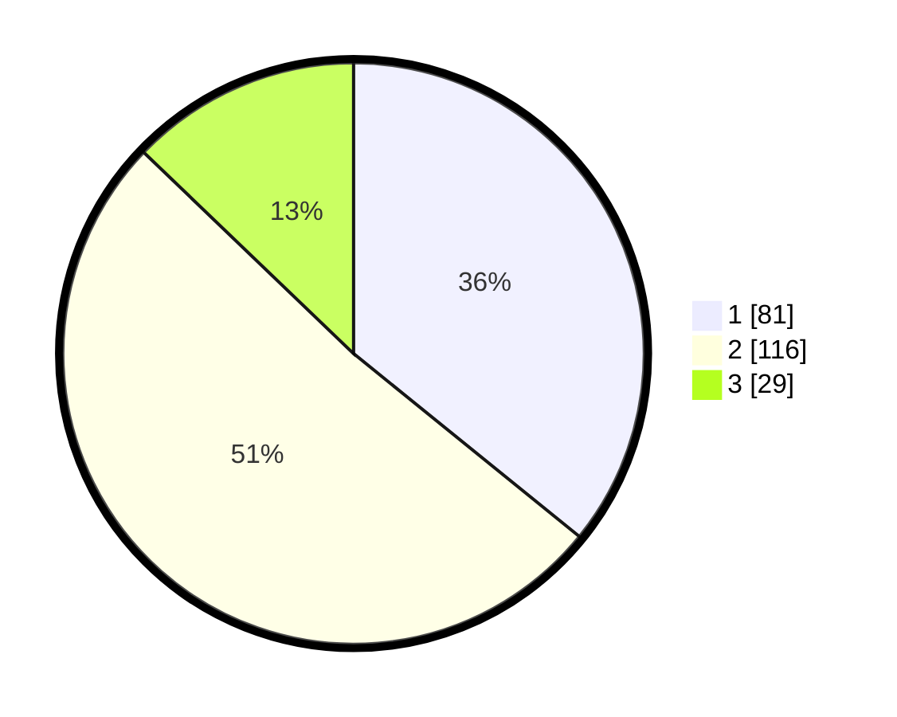

# Hasil

## Grafik

## Tabel

| No.    | Nama Paslon    | Suara | Suara (raw) | Persentase |
|:------ |:-------------- | -----:| -----------:| ----------:|
| 100025 | ANIES MUHAIMIN | 81    | [81][p-1]   | 35,84      |
| 100026 | PRABOWO GIBRAN | 116   | [116][p-2]  | 51,33      |
| 100027 | GANJAR MAHFUD  | 29    | [29][p-3]   | 12,83      |

[p-1]: https://github.com/gigit-pemilu/pemilu-2024/blob/main/pilpres/hitung-suara/sub/31-dki-jakarta/sub/75-jakarta-timur/sub/02-pulogadung/sub/1003-cipinang/sub/108-tps/sub/paslon-1.txt
[p-2]: https://github.com/gigit-pemilu/pemilu-2024/blob/main/pilpres/hitung-suara/sub/31-dki-jakarta/sub/75-jakarta-timur/sub/02-pulogadung/sub/1003-cipinang/sub/108-tps/sub/paslon-2.txt
[p-3]: https://github.com/gigit-pemilu/pemilu-2024/blob/main/pilpres/hitung-suara/sub/31-dki-jakarta/sub/75-jakarta-timur/sub/02-pulogadung/sub/1003-cipinang/sub/108-tps/sub/paslon-3.txt

## Foto C Plano

https://sirekap-obj-formc.kpu.go.id/dbf6/pemilu/ppwp/31/75/02/10/03/3175021003108-20240215-023449--79735e32-4688-46eb-84d0-656366d894b1.jpg

https://sirekap-obj-formc.kpu.go.id/dbf6/pemilu/ppwp/31/75/02/10/03/3175021003108-20240215-010613--e57471da-b4e5-472b-9499-c70efc92b8d1.jpg

https://sirekap-obj-formc.kpu.go.id/dbf6/pemilu/ppwp/31/75/02/10/03/3175021003108-20240215-010416--c9b83572-c81b-442a-88ca-7471fe8c695a.jpg

## Metadata

| Key        | Value               |
| ---------- | ------------------- |
| Time Stamp | 2024-02-15 12:00:28 |

