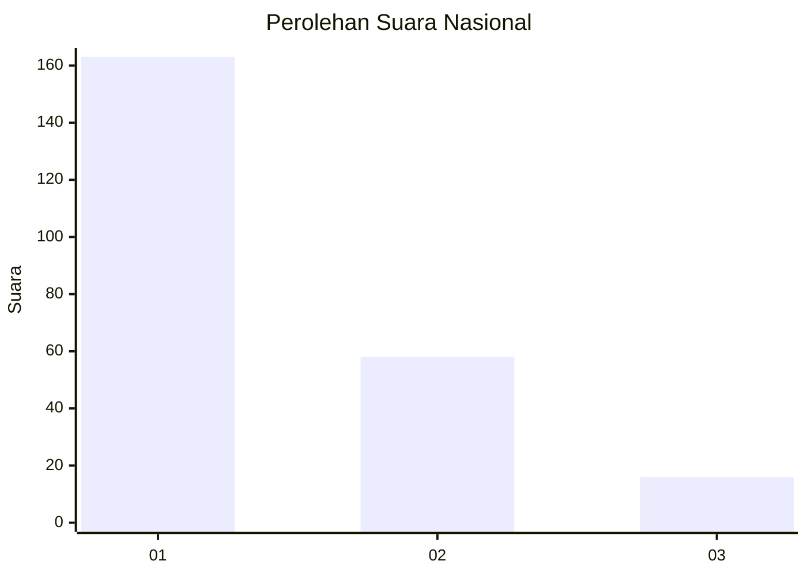
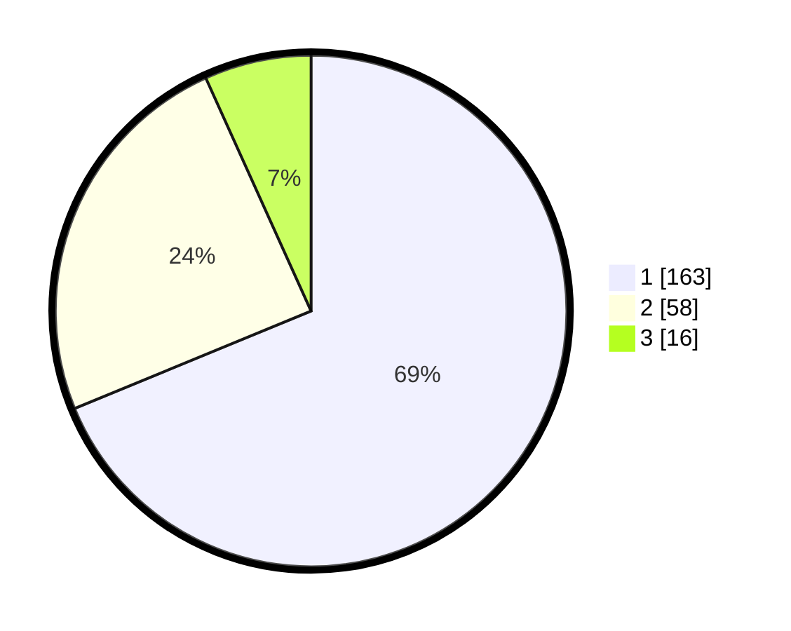

# Hasil

## Grafik

## Tabel

| No.    | Nama Paslon    | Suara | Suara (raw) | Persentase |
|:------ |:-------------- | -----:| -----------:| ----------:|
| 100025 | ANIES MUHAIMIN | 163   | [163][p-1]  | 68,78      |
| 100026 | PRABOWO GIBRAN | 58    | [58][p-2]   | 24,47      |
| 100027 | GANJAR MAHFUD  | 16    | [16][p-3]   | 6,75       |

[p-1]: https://github.com/gigit-pemilu/pemilu-2024/blob/main/pilpres/hitung-suara/sub/31-dki-jakarta/sub/75-jakarta-timur/sub/02-pulogadung/sub/1003-cipinang/sub/112-tps/sub/paslon-1.txt
[p-2]: https://github.com/gigit-pemilu/pemilu-2024/blob/main/pilpres/hitung-suara/sub/31-dki-jakarta/sub/75-jakarta-timur/sub/02-pulogadung/sub/1003-cipinang/sub/112-tps/sub/paslon-2.txt
[p-3]: https://github.com/gigit-pemilu/pemilu-2024/blob/main/pilpres/hitung-suara/sub/31-dki-jakarta/sub/75-jakarta-timur/sub/02-pulogadung/sub/1003-cipinang/sub/112-tps/sub/paslon-3.txt

## Foto C Plano

https://sirekap-obj-formc.kpu.go.id/8654/pemilu/ppwp/31/75/02/10/03/3175021003112-20240302-111232--f35a88ff-6a9f-4dff-a0a0-8d9e081b290e.jpg

https://sirekap-obj-formc.kpu.go.id/8654/pemilu/ppwp/31/75/02/10/03/3175021003112-20240215-020506--47dcdad4-f207-42b7-8f55-f07355de6f79.jpg

https://sirekap-obj-formc.kpu.go.id/8654/pemilu/ppwp/31/75/02/10/03/3175021003112-20240215-021029--81cc7eb2-de82-4301-b578-f7f336cb163b.jpg

## Metadata

| Key        | Value               |
| ---------- | ------------------- |
| Time Stamp | 2024-03-02 12:00:00 |

