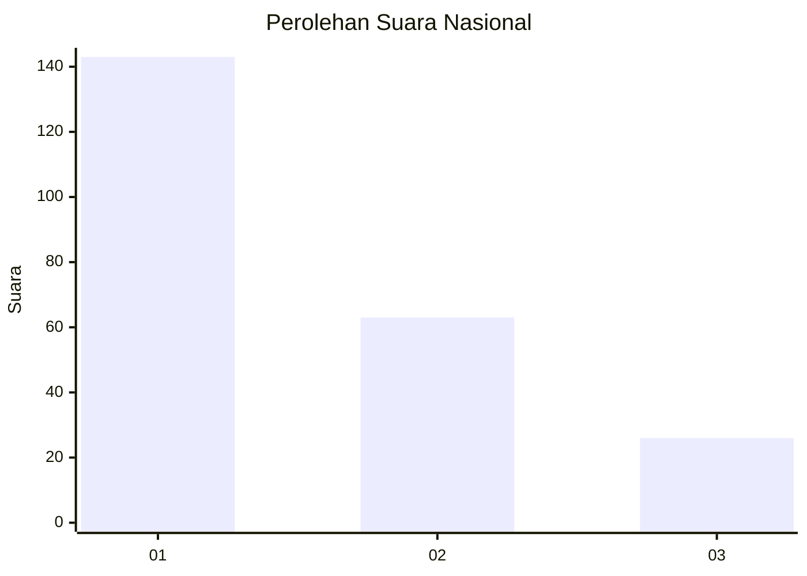
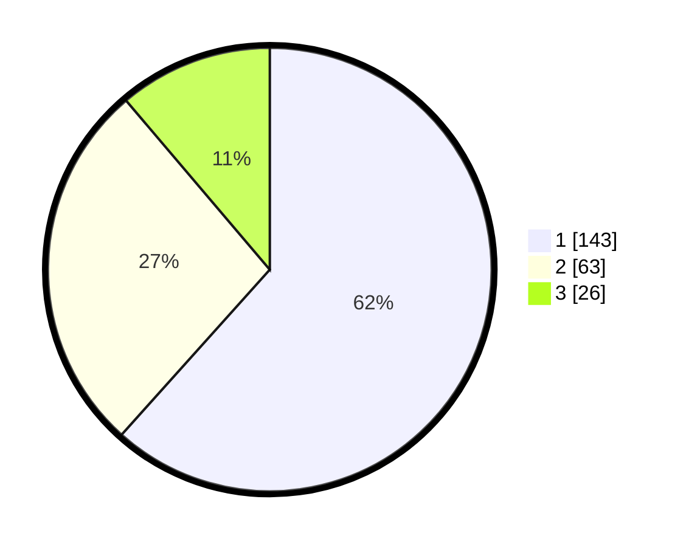

# Hasil

## Grafik

## Tabel

| No.    | Nama Paslon    | Suara | Suara (raw) | Persentase |
|:------ |:-------------- | -----:| -----------:| ----------:|
| 100025 | ANIES MUHAIMIN | 143   | [143][p-1]  | 61,64      |
| 100026 | PRABOWO GIBRAN | 63    | [63][p-2]   | 27,16      |
| 100027 | GANJAR MAHFUD  | 26    | [26][p-3]   | 11,21      |

[p-1]: https://github.com/gigit-pemilu/pemilu-2024/blob/main/pilpres/hitung-suara/sub/31-dki-jakarta/sub/75-jakarta-timur/sub/02-pulogadung/sub/1003-cipinang/sub/126-tps/sub/paslon-1.txt
[p-2]: https://github.com/gigit-pemilu/pemilu-2024/blob/main/pilpres/hitung-suara/sub/31-dki-jakarta/sub/75-jakarta-timur/sub/02-pulogadung/sub/1003-cipinang/sub/126-tps/sub/paslon-2.txt
[p-3]: https://github.com/gigit-pemilu/pemilu-2024/blob/main/pilpres/hitung-suara/sub/31-dki-jakarta/sub/75-jakarta-timur/sub/02-pulogadung/sub/1003-cipinang/sub/126-tps/sub/paslon-3.txt

## Foto C Plano

https://sirekap-obj-formc.kpu.go.id/77ec/pemilu/ppwp/31/75/02/10/03/3175021003126-20240215-004111--6c445ee9-4137-4cbc-9342-d90e3d185d07.jpg

https://sirekap-obj-formc.kpu.go.id/77ec/pemilu/ppwp/31/75/02/10/03/3175021003126-20240215-004232--ad1d0682-6a77-45b4-a22a-0ac5522fc63c.jpg

https://sirekap-obj-formc.kpu.go.id/77ec/pemilu/ppwp/31/75/02/10/03/3175021003126-20240215-004334--656f169e-0844-4cf6-af4c-ad25d56a5dcf.jpg

## Metadata

| Key        | Value               |
| ---------- | ------------------- |
| Time Stamp | 2024-02-15 18:00:26 |

