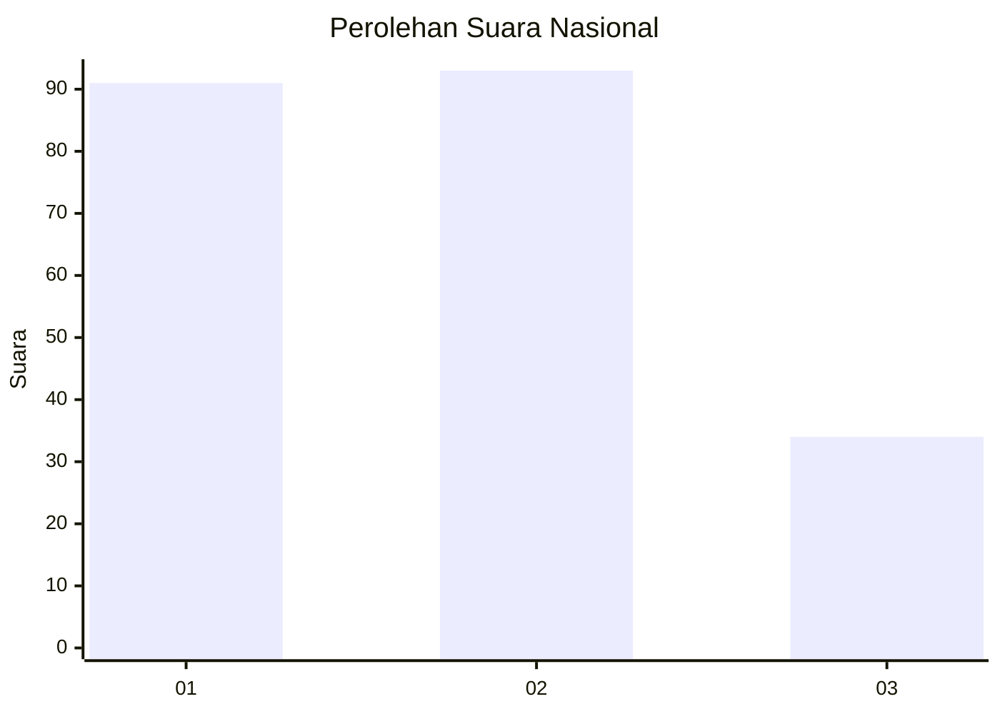
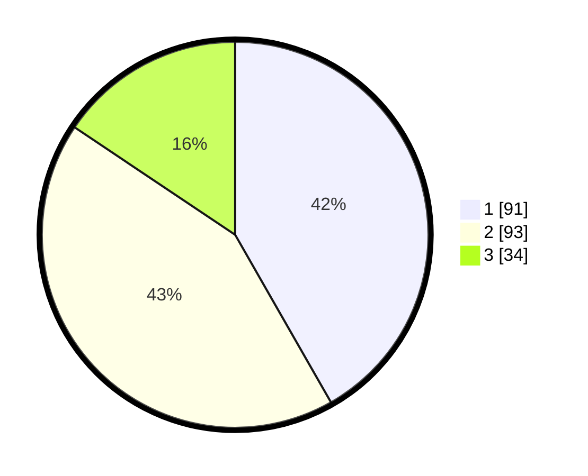

# Hasil

## Grafik

## Tabel

| No.    | Nama Paslon    | Suara | Suara (raw) | Persentase |
|:------ |:-------------- | -----:| -----------:| ----------:|
| 100025 | ANIES MUHAIMIN | 91    | [91][p-1]   | 41,74      |
| 100026 | PRABOWO GIBRAN | 93    | [93][p-2]   | 42,66      |
| 100027 | GANJAR MAHFUD  | 34    | [34][p-3]   | 15,60      |

[p-1]: https://github.com/gigit-pemilu/pemilu-2024/blob/main/pilpres/hitung-suara/sub/31-dki-jakarta/sub/75-jakarta-timur/sub/02-pulogadung/sub/1004-jatinegara-kaum/sub/059-tps/sub/paslon-1.txt
[p-2]: https://github.com/gigit-pemilu/pemilu-2024/blob/main/pilpres/hitung-suara/sub/31-dki-jakarta/sub/75-jakarta-timur/sub/02-pulogadung/sub/1004-jatinegara-kaum/sub/059-tps/sub/paslon-2.txt
[p-3]: https://github.com/gigit-pemilu/pemilu-2024/blob/main/pilpres/hitung-suara/sub/31-dki-jakarta/sub/75-jakarta-timur/sub/02-pulogadung/sub/1004-jatinegara-kaum/sub/059-tps/sub/paslon-3.txt

## Foto C Plano

https://sirekap-obj-formc.kpu.go.id/69b6/pemilu/ppwp/31/75/02/10/04/3175021004059-20240226-130813--0041bf8c-bc39-4312-8b41-36ecaf532e69.jpg

https://sirekap-obj-formc.kpu.go.id/69b6/pemilu/ppwp/31/75/02/10/04/3175021004059-20240226-130853--d546ed80-0aa1-49d0-95d4-42b248c58ec5.jpg

https://sirekap-obj-formc.kpu.go.id/69b6/pemilu/ppwp/31/75/02/10/04/3175021004059-20240226-130933--b21deba0-64f6-4bf9-a63b-6939256dd825.jpg

## Metadata

| Key        | Value               |
| ---------- | ------------------- |
| Time Stamp | 2024-02-26 19:00:00 |

