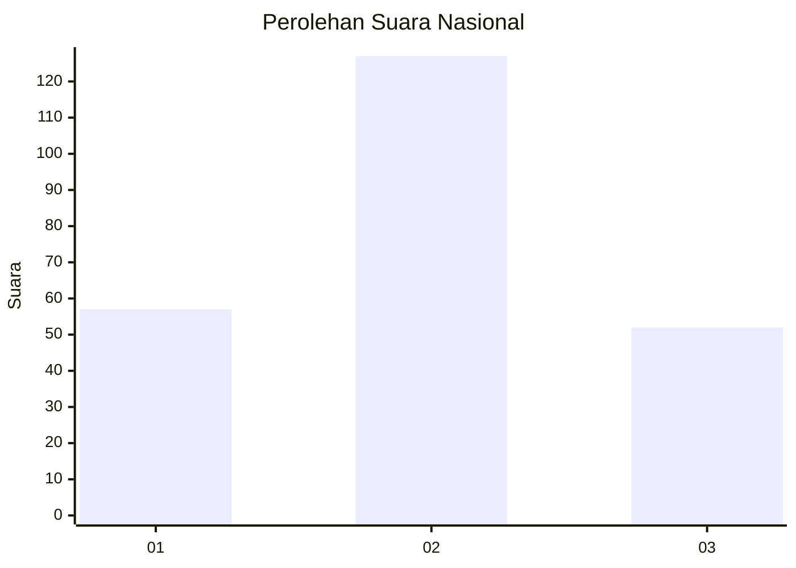
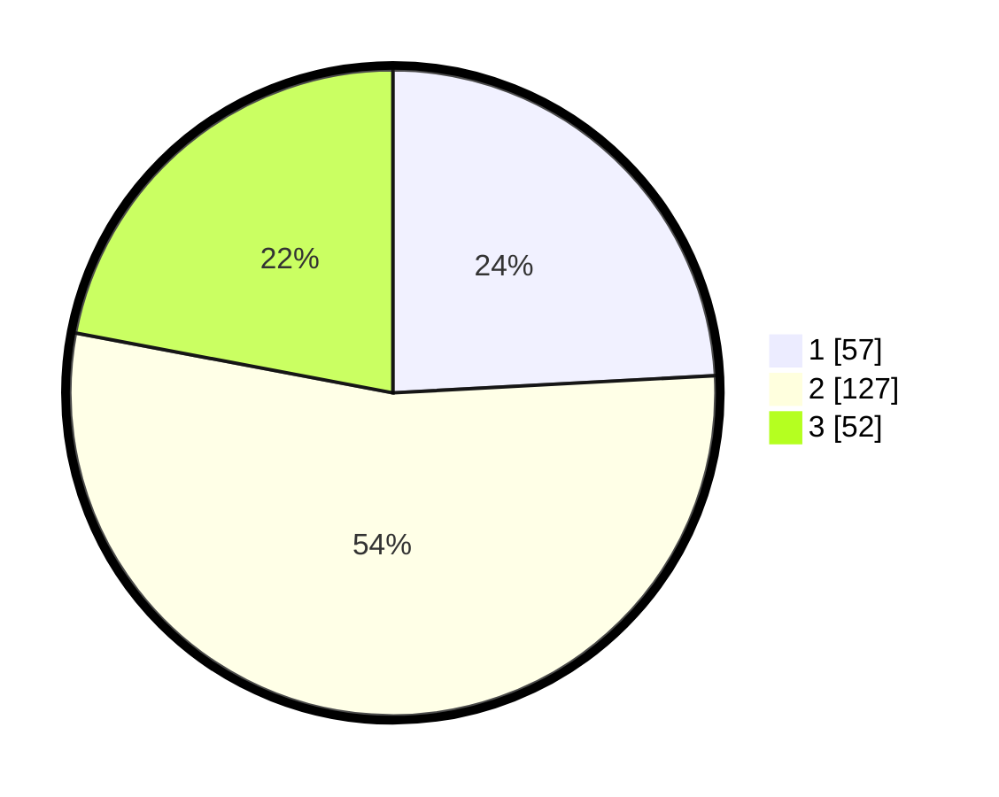

# Hasil

## Grafik

## Tabel

| No.    | Nama Paslon    | Suara | Suara (raw) | Persentase |
|:------ |:-------------- | -----:| -----------:| ----------:|
| 100025 | ANIES MUHAIMIN | 57    | [57][p-1]   | 24,15      |
| 100026 | PRABOWO GIBRAN | 127   | [127][p-2]  | 53,81      |
| 100027 | GANJAR MAHFUD  | 52    | [52][p-3]   | 22,03      |

[p-1]: https://github.com/gigit-pemilu/pemilu-2024/blob/main/pilpres/hitung-suara/sub/31-dki-jakarta/sub/75-jakarta-timur/sub/02-pulogadung/sub/1004-jatinegara-kaum/sub/082-tps/sub/paslon-1.txt
[p-2]: https://github.com/gigit-pemilu/pemilu-2024/blob/main/pilpres/hitung-suara/sub/31-dki-jakarta/sub/75-jakarta-timur/sub/02-pulogadung/sub/1004-jatinegara-kaum/sub/082-tps/sub/paslon-2.txt
[p-3]: https://github.com/gigit-pemilu/pemilu-2024/blob/main/pilpres/hitung-suara/sub/31-dki-jakarta/sub/75-jakarta-timur/sub/02-pulogadung/sub/1004-jatinegara-kaum/sub/082-tps/sub/paslon-3.txt

## Foto C Plano

https://sirekap-obj-formc.kpu.go.id/21de/pemilu/ppwp/31/75/02/10/04/3175021004082-20240215-012717--903fa2a8-8a36-4414-ad18-88140fe50e35.jpg

https://sirekap-obj-formc.kpu.go.id/21de/pemilu/ppwp/31/75/02/10/04/3175021004082-20240215-012822--93b9403b-c4a0-4e1c-849b-b6973c1660b0.jpg

https://sirekap-obj-formc.kpu.go.id/21de/pemilu/ppwp/31/75/02/10/04/3175021004082-20240215-012932--fc0b5eb1-d164-4702-a83f-21de73e029bd.jpg

## Metadata

| Key        | Value               |
| ---------- | ------------------- |
| Time Stamp | 2024-02-24 22:31:28 |

