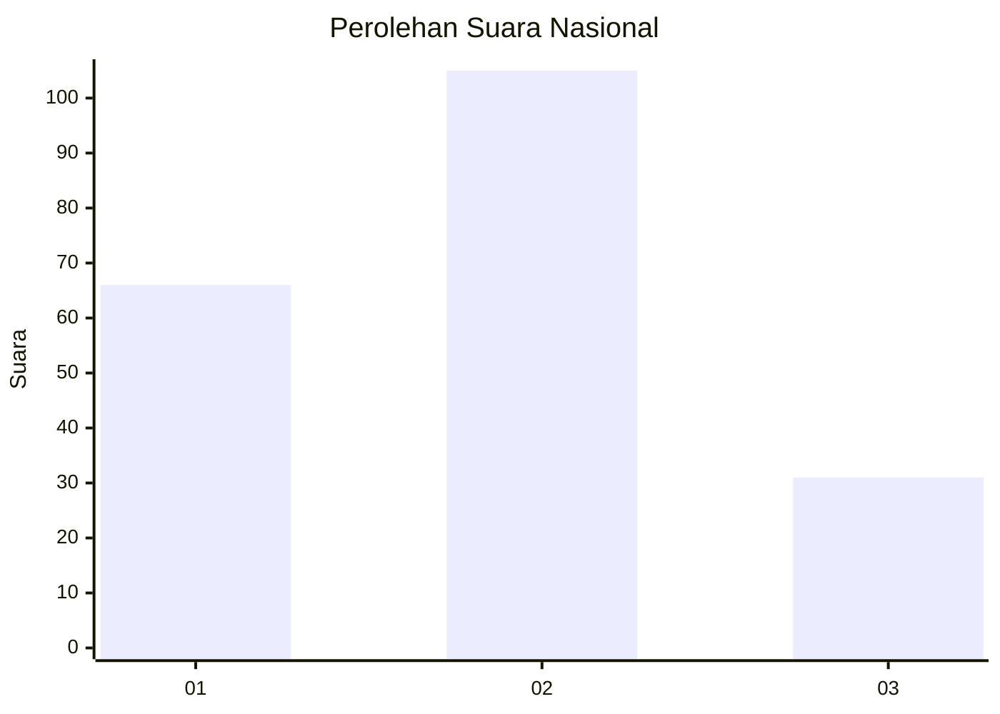
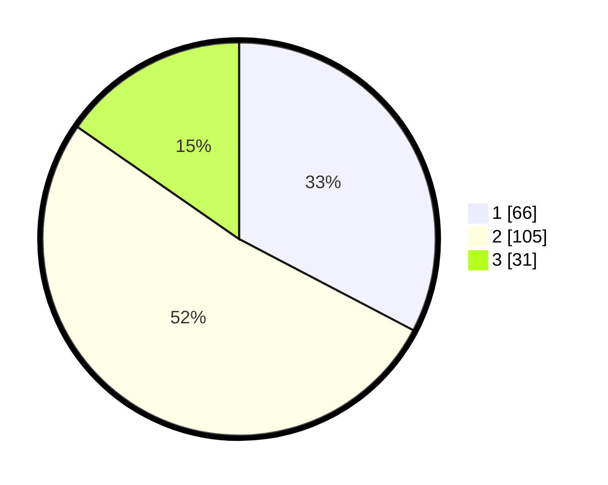

# Hasil

## Grafik

## Tabel

| No.    | Nama Paslon    | Suara | Suara (raw) | Persentase |
|:------ |:-------------- | -----:| -----------:| ----------:|
| 100025 | ANIES MUHAIMIN | 66    | [66][p-1]   | 32,67      |
| 100026 | PRABOWO GIBRAN | 105   | [105][p-2]  | 51,98      |
| 100027 | GANJAR MAHFUD  | 31    | [31][p-3]   | 15,35      |

[p-1]: https://github.com/gigit-pemilu/pemilu-2024/blob/main/pilpres/hitung-suara/sub/31-dki-jakarta/sub/75-jakarta-timur/sub/02-pulogadung/sub/1005-rawamangun/sub/016-tps/sub/paslon-1.txt
[p-2]: https://github.com/gigit-pemilu/pemilu-2024/blob/main/pilpres/hitung-suara/sub/31-dki-jakarta/sub/75-jakarta-timur/sub/02-pulogadung/sub/1005-rawamangun/sub/016-tps/sub/paslon-2.txt
[p-3]: https://github.com/gigit-pemilu/pemilu-2024/blob/main/pilpres/hitung-suara/sub/31-dki-jakarta/sub/75-jakarta-timur/sub/02-pulogadung/sub/1005-rawamangun/sub/016-tps/sub/paslon-3.txt

## Foto C Plano

https://sirekap-obj-formc.kpu.go.id/542a/pemilu/ppwp/31/75/02/10/05/3175021005016-20240214-225134--9753effd-42f7-478c-894a-537fb71c0658.jpg

https://sirekap-obj-formc.kpu.go.id/542a/pemilu/ppwp/31/75/02/10/05/3175021005016-20240226-125112--351a1ac8-4589-4602-b049-e4a45de557d9.jpg

https://sirekap-obj-formc.kpu.go.id/542a/pemilu/ppwp/31/75/02/10/05/3175021005016-20240226-125238--c4ca3e2e-7b5c-4c61-99ae-e91533306538.jpg

## Metadata

| Key        | Value               |
| ---------- | ------------------- |
| Time Stamp | 2024-02-26 21:00:00 |

