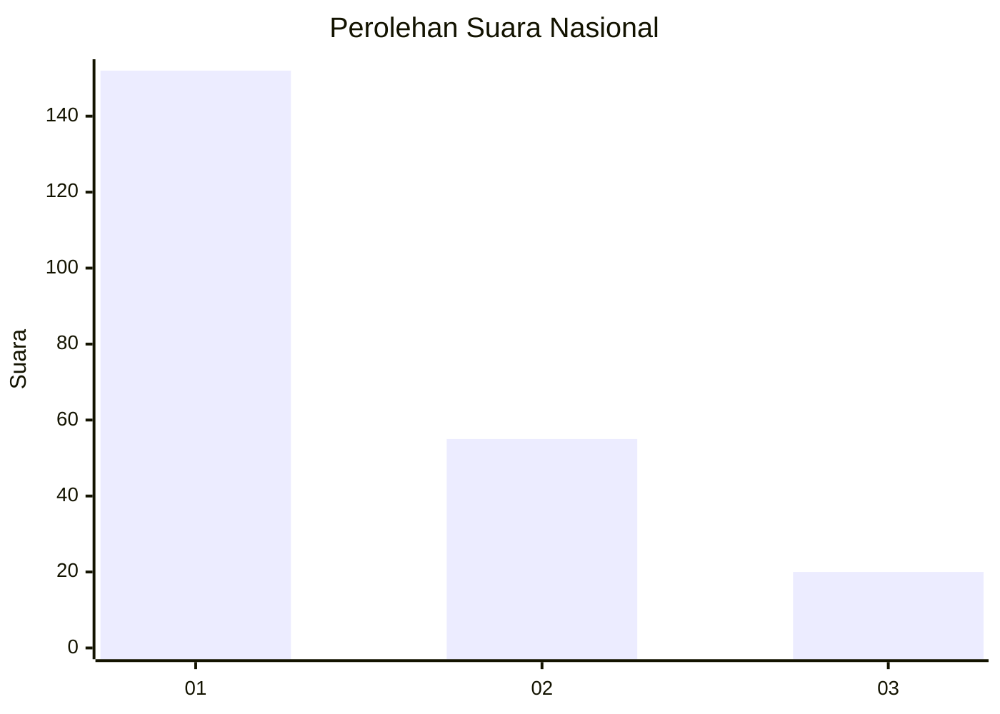
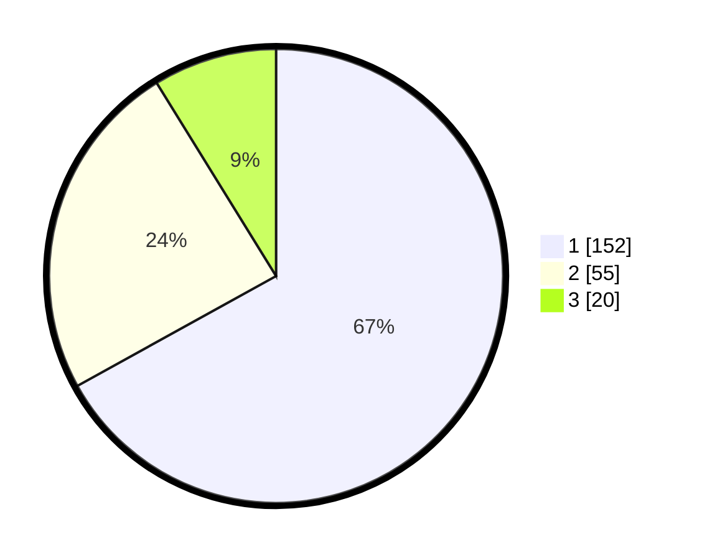

# Hasil

## Grafik

## Tabel

| No.    | Nama Paslon    | Suara | Suara (raw) | Persentase |
|:------ |:-------------- | -----:| -----------:| ----------:|
| 100025 | ANIES MUHAIMIN | 152   | [152][p-1]  | 66,96      |
| 100026 | PRABOWO GIBRAN | 55    | [55][p-2]   | 24,23      |
| 100027 | GANJAR MAHFUD  | 20    | [20][p-3]   | 8,81       |

[p-1]: https://github.com/gigit-pemilu/pemilu-2024/blob/main/pilpres/hitung-suara/sub/31-dki-jakarta/sub/75-jakarta-timur/sub/02-pulogadung/sub/1005-rawamangun/sub/031-tps/sub/paslon-1.txt
[p-2]: https://github.com/gigit-pemilu/pemilu-2024/blob/main/pilpres/hitung-suara/sub/31-dki-jakarta/sub/75-jakarta-timur/sub/02-pulogadung/sub/1005-rawamangun/sub/031-tps/sub/paslon-2.txt
[p-3]: https://github.com/gigit-pemilu/pemilu-2024/blob/main/pilpres/hitung-suara/sub/31-dki-jakarta/sub/75-jakarta-timur/sub/02-pulogadung/sub/1005-rawamangun/sub/031-tps/sub/paslon-3.txt

## Foto C Plano

https://sirekap-obj-formc.kpu.go.id/41ee/pemilu/ppwp/31/75/02/10/05/3175021005031-20240226-135458--a23b6fa9-70d7-4c5e-b6b7-7ef96ebf2e66.jpg

https://sirekap-obj-formc.kpu.go.id/41ee/pemilu/ppwp/31/75/02/10/05/3175021005031-20240214-230231--183e237e-2393-48fc-80f9-ba2bdb2a0f1a.jpg

https://sirekap-obj-formc.kpu.go.id/41ee/pemilu/ppwp/31/75/02/10/05/3175021005031-20240214-230316--de01db85-3d3e-43ec-bff8-341ebe72bb9b.jpg

## Metadata

| Key        | Value               |
| ---------- | ------------------- |
| Time Stamp | 2024-02-26 14:00:00 |

