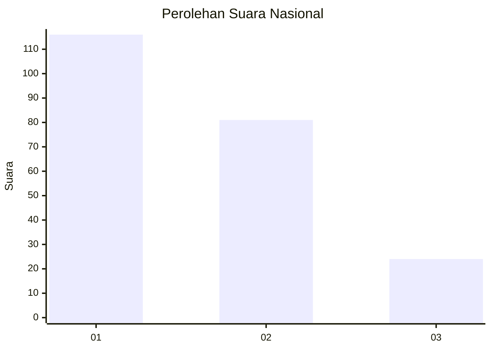
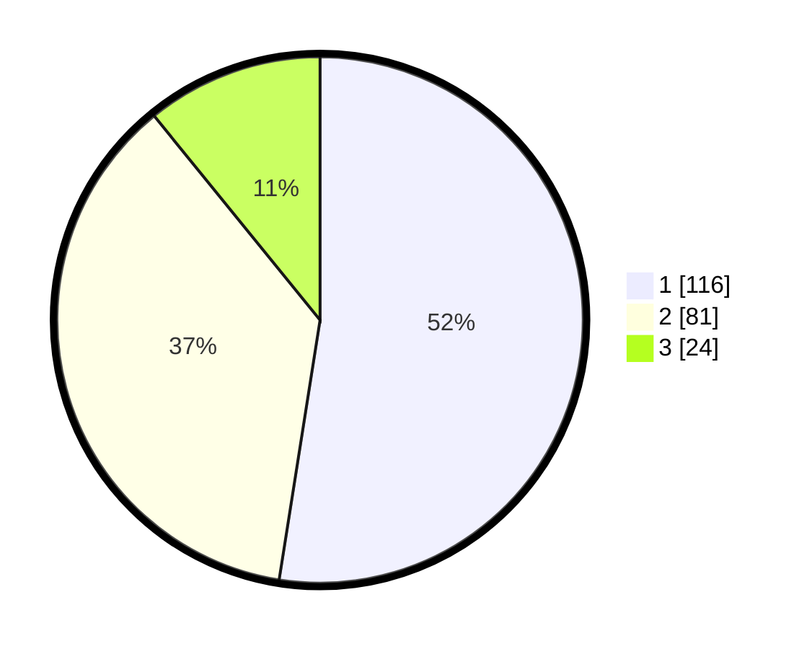

# Hasil

## Grafik

## Tabel

| No.    | Nama Paslon    | Suara | Suara (raw) | Persentase |
|:------ |:-------------- | -----:| -----------:| ----------:|
| 100025 | ANIES MUHAIMIN | 116   | [116][p-1]  | 52,49      |
| 100026 | PRABOWO GIBRAN | 81    | [81][p-2]   | 36,65      |
| 100027 | GANJAR MAHFUD  | 24    | [24][p-3]   | 10,86      |

[p-1]: https://github.com/gigit-pemilu/pemilu-2024/blob/main/pilpres/hitung-suara/sub/31-dki-jakarta/sub/75-jakarta-timur/sub/02-pulogadung/sub/1005-rawamangun/sub/113-tps/sub/paslon-1.txt
[p-2]: https://github.com/gigit-pemilu/pemilu-2024/blob/main/pilpres/hitung-suara/sub/31-dki-jakarta/sub/75-jakarta-timur/sub/02-pulogadung/sub/1005-rawamangun/sub/113-tps/sub/paslon-2.txt
[p-3]: https://github.com/gigit-pemilu/pemilu-2024/blob/main/pilpres/hitung-suara/sub/31-dki-jakarta/sub/75-jakarta-timur/sub/02-pulogadung/sub/1005-rawamangun/sub/113-tps/sub/paslon-3.txt

## Foto C Plano

https://sirekap-obj-formc.kpu.go.id/c2ae/pemilu/ppwp/31/75/02/10/05/3175021005113-20240214-221357--1df37093-8d8d-4296-b492-a6a51010d67c.jpg

https://sirekap-obj-formc.kpu.go.id/c2ae/pemilu/ppwp/31/75/02/10/05/3175021005113-20240214-221807--8bbac10d-a6e1-4a69-b199-63184c3964ee.jpg

https://sirekap-obj-formc.kpu.go.id/c2ae/pemilu/ppwp/31/75/02/10/05/3175021005113-20240214-222107--eda558e8-210f-4b03-a45c-8833d71d2e0e.jpg

## Metadata

| Key        | Value               |
| ---------- | ------------------- |
| Time Stamp | 2024-02-24 22:31:28 |

