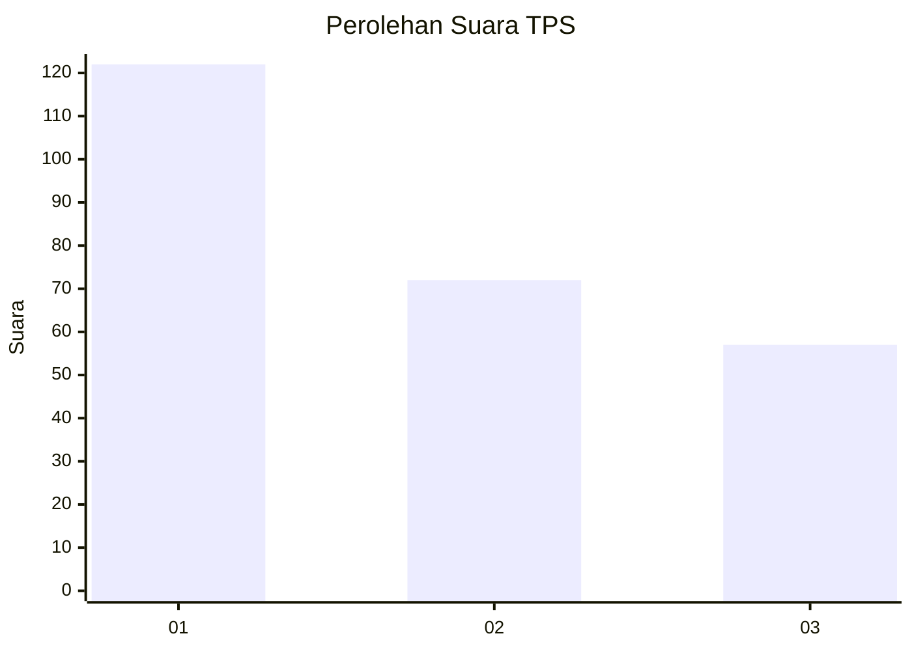
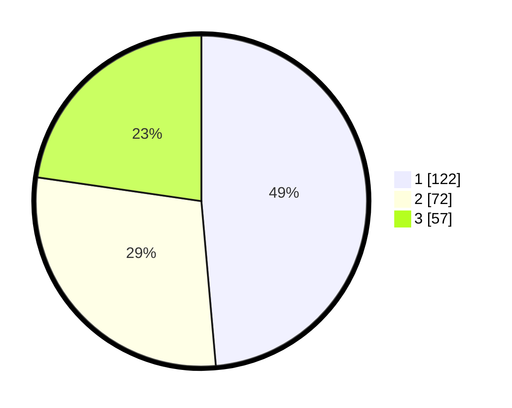

# Hasil

## Grafik

## Tabel

| No. | Nama Paslon    | Suara | Suara (raw) | Persentase |
|:--- |:-------------- | -----:| -----------:| ----------:|
| 1   | ANIES MUHAIMIN | 122   | [122][p-1]  | 48,61      |
| 2   | PRABOWO GIBRAN | 72    | [72][p-2]   | 28,69      |
| 3   | GANJAR MAHFUD  | 57    | [57][p-3]   | 22,71      |

[p-1]: https://github.com/gigit-pemilu/pemilu-2024-31-dki-jakarta/blob/main/pilpres/hitung-suara/sub/31-dki-jakarta/sub/75-jakarta-timur/sub/02-pulogadung/sub/1006-kayu-putih/sub/004-tps/sub/paslon-1.txt
[p-2]: https://github.com/gigit-pemilu/pemilu-2024-31-dki-jakarta/blob/main/pilpres/hitung-suara/sub/31-dki-jakarta/sub/75-jakarta-timur/sub/02-pulogadung/sub/1006-kayu-putih/sub/004-tps/sub/paslon-2.txt
[p-3]: https://github.com/gigit-pemilu/pemilu-2024-31-dki-jakarta/blob/main/pilpres/hitung-suara/sub/31-dki-jakarta/sub/75-jakarta-timur/sub/02-pulogadung/sub/1006-kayu-putih/sub/004-tps/sub/paslon-3.txt

## Foto C Plano

https://sirekap-obj-formc.kpu.go.id/a5eb/pemilu/ppwp/31/75/02/10/06/3175021006004-20240214-225713--299a085e-e8ab-4da7-af7c-777b2628571c.jpg

https://sirekap-obj-formc.kpu.go.id/a5eb/pemilu/ppwp/31/75/02/10/06/3175021006004-20240214-225844--f80fb5f1-13f8-40b8-a72c-23aae89df692.jpg

https://sirekap-obj-formc.kpu.go.id/a5eb/pemilu/ppwp/31/75/02/10/06/3175021006004-20240214-230001--ac847a17-4e78-41e2-bc2d-123bcdebcd7f.jpg

## Metadata

| Key        | Value               |
| ---------- | ------------------- |
| Time Stamp | 2024-02-25 11:00:00 |

