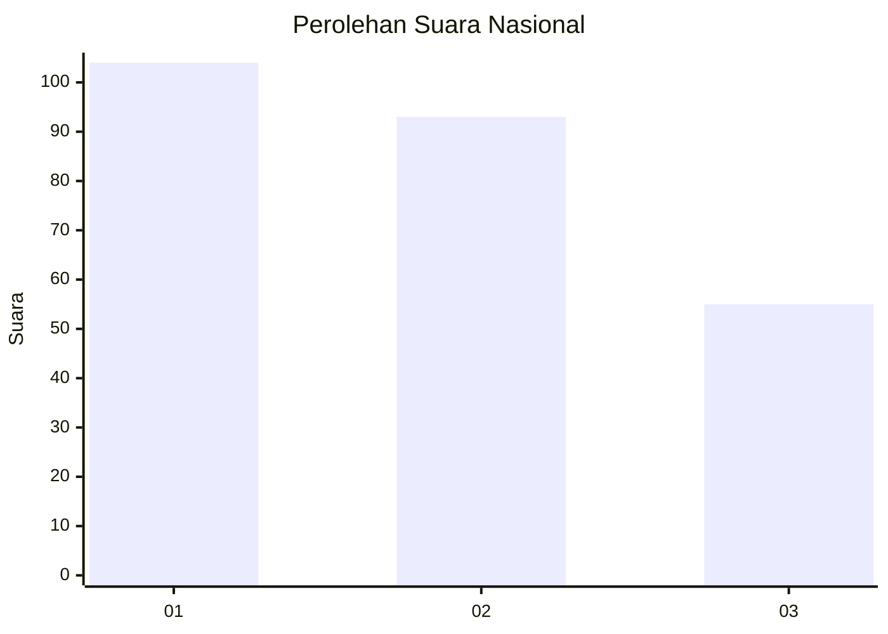
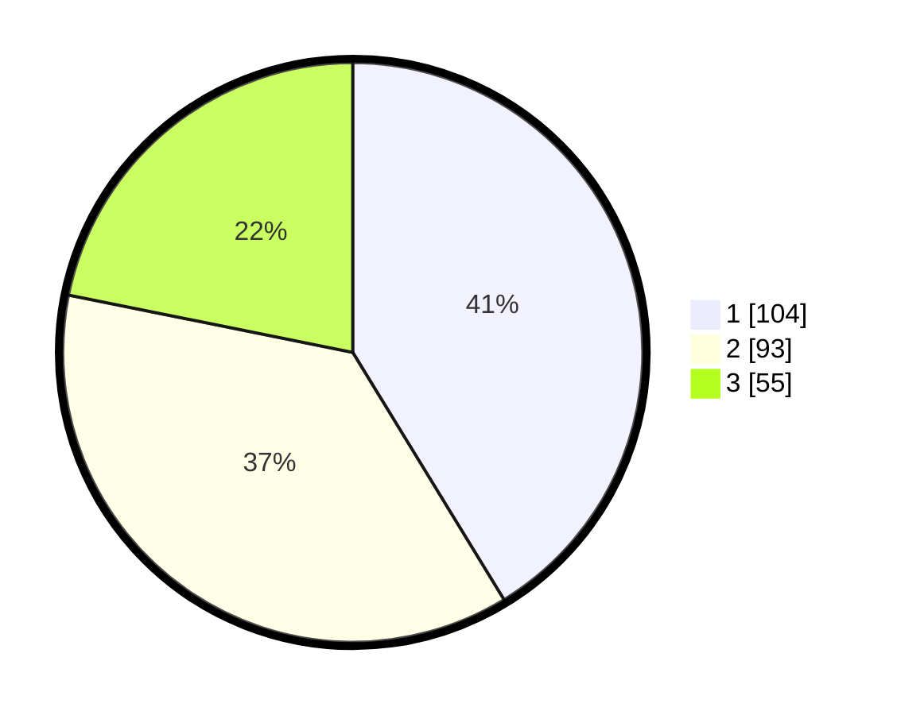

# Hasil

## Grafik

## Tabel

| No.    | Nama Paslon    | Suara | Suara (raw) | Persentase |
|:------ |:-------------- | -----:| -----------:| ----------:|
| 100025 | ANIES MUHAIMIN | 104   | [104][p-1]  | 41,27      |
| 100026 | PRABOWO GIBRAN | 93    | [93][p-2]   | 36,90      |
| 100027 | GANJAR MAHFUD  | 55    | [55][p-3]   | 21,83      |

[p-1]: https://github.com/gigit-pemilu/pemilu-2024/blob/main/pilpres/hitung-suara/sub/31-dki-jakarta/sub/75-jakarta-timur/sub/02-pulogadung/sub/1006-kayu-putih/sub/022-tps/sub/paslon-1.txt
[p-2]: https://github.com/gigit-pemilu/pemilu-2024/blob/main/pilpres/hitung-suara/sub/31-dki-jakarta/sub/75-jakarta-timur/sub/02-pulogadung/sub/1006-kayu-putih/sub/022-tps/sub/paslon-2.txt
[p-3]: https://github.com/gigit-pemilu/pemilu-2024/blob/main/pilpres/hitung-suara/sub/31-dki-jakarta/sub/75-jakarta-timur/sub/02-pulogadung/sub/1006-kayu-putih/sub/022-tps/sub/paslon-3.txt

## Foto C Plano

https://sirekap-obj-formc.kpu.go.id/194f/pemilu/ppwp/31/75/02/10/06/3175021006022-20240214-215402--ab0bfe20-465b-4aef-9c26-57f0df777980.jpg

https://sirekap-obj-formc.kpu.go.id/194f/pemilu/ppwp/31/75/02/10/06/3175021006022-20240214-215622--92fbc99c-c8da-4ddd-b63f-fcf947b1e075.jpg

https://sirekap-obj-formc.kpu.go.id/194f/pemilu/ppwp/31/75/02/10/06/3175021006022-20240214-215723--93486f76-0dcd-400c-987e-2f8ebcc57313.jpg

## Metadata

| Key        | Value               |
| ---------- | ------------------- |
| Time Stamp | 2024-02-24 22:31:28 |

