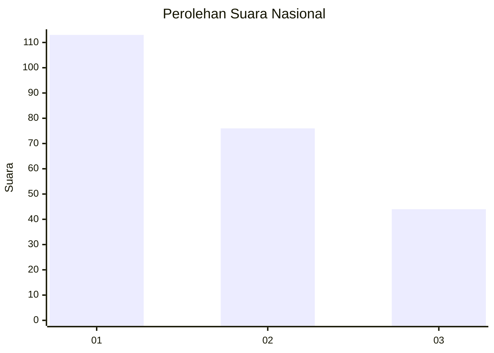
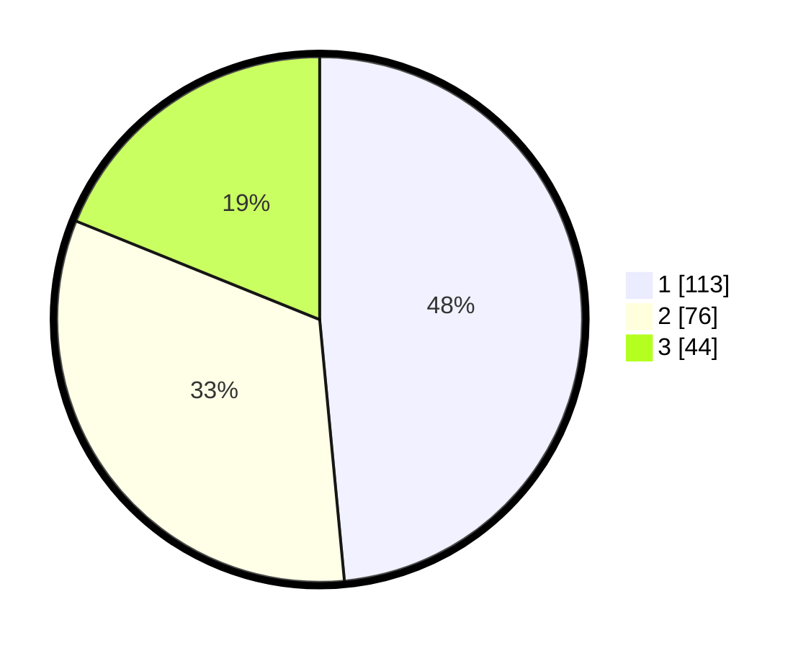

# Hasil

## Grafik

## Tabel

| No.    | Nama Paslon    | Suara | Suara (raw) | Persentase |
|:------ |:-------------- | -----:| -----------:| ----------:|
| 100025 | ANIES MUHAIMIN | 113   | [113][p-1]  | 48,50      |
| 100026 | PRABOWO GIBRAN | 76    | [76][p-2]   | 32,62      |
| 100027 | GANJAR MAHFUD  | 44    | [44][p-3]   | 18,88      |

[p-1]: https://github.com/gigit-pemilu/pemilu-2024/blob/main/pilpres/hitung-suara/sub/31-dki-jakarta/sub/75-jakarta-timur/sub/02-pulogadung/sub/1006-kayu-putih/sub/034-tps/sub/paslon-1.txt
[p-2]: https://github.com/gigit-pemilu/pemilu-2024/blob/main/pilpres/hitung-suara/sub/31-dki-jakarta/sub/75-jakarta-timur/sub/02-pulogadung/sub/1006-kayu-putih/sub/034-tps/sub/paslon-2.txt
[p-3]: https://github.com/gigit-pemilu/pemilu-2024/blob/main/pilpres/hitung-suara/sub/31-dki-jakarta/sub/75-jakarta-timur/sub/02-pulogadung/sub/1006-kayu-putih/sub/034-tps/sub/paslon-3.txt

## Foto C Plano

https://sirekap-obj-formc.kpu.go.id/265e/pemilu/ppwp/31/75/02/10/06/3175021006034-20240215-011233--d6b66c16-966e-4c76-ba71-d12a6a9d2372.jpg

https://sirekap-obj-formc.kpu.go.id/265e/pemilu/ppwp/31/75/02/10/06/3175021006034-20240215-011345--2302ac52-bf00-498c-addf-c911b52be480.jpg

https://sirekap-obj-formc.kpu.go.id/265e/pemilu/ppwp/31/75/02/10/06/3175021006034-20240215-011530--6c7e5f1b-5a3b-4ebd-a55e-6fd371e3593b.jpg

## Metadata

| Key        | Value               |
| ---------- | ------------------- |
| Time Stamp | 2024-02-17 18:00:00 |

