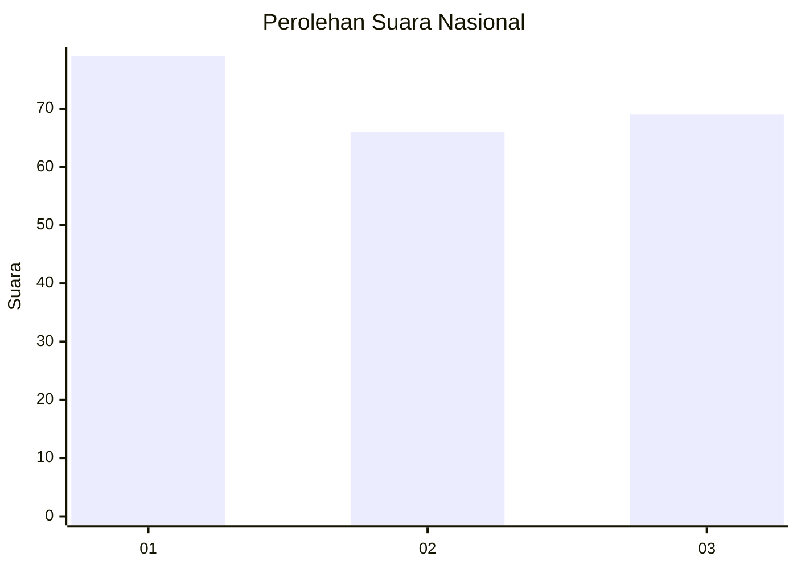
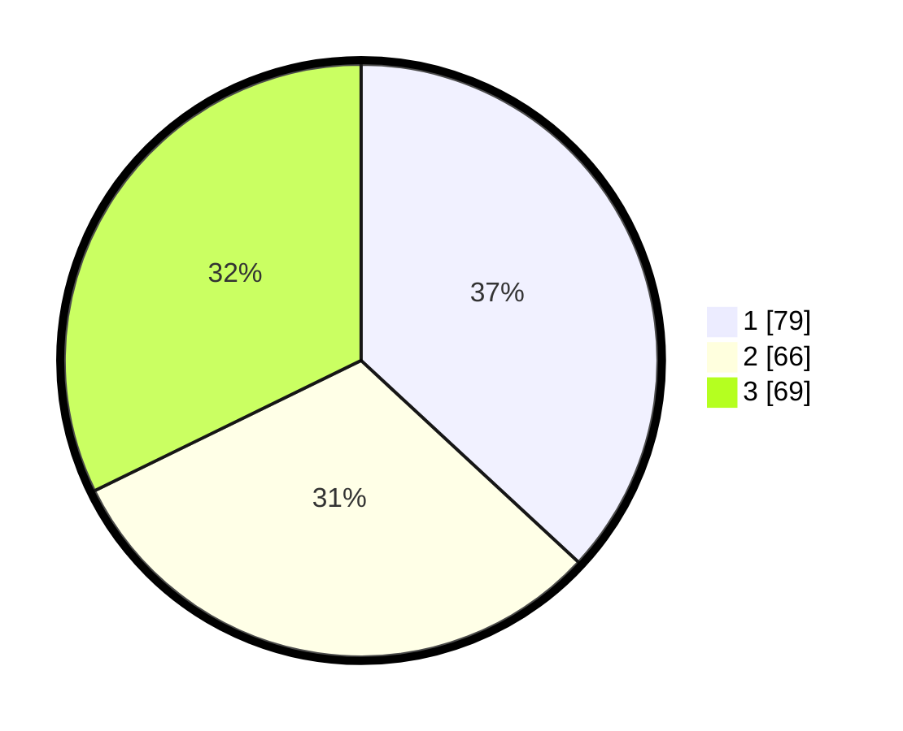

# Hasil

## Grafik

## Tabel

| No.    | Nama Paslon    | Suara | Suara (raw) | Persentase |
|:------ |:-------------- | -----:| -----------:| ----------:|
| 100025 | ANIES MUHAIMIN | 79    | [79][p-1]   | 36,92      |
| 100026 | PRABOWO GIBRAN | 66    | [66][p-2]   | 30,84      |
| 100027 | GANJAR MAHFUD  | 69    | [69][p-3]   | 32,24      |

[p-1]: https://github.com/gigit-pemilu/pemilu-2024/blob/main/pilpres/hitung-suara/sub/31-dki-jakarta/sub/75-jakarta-timur/sub/02-pulogadung/sub/1006-kayu-putih/sub/040-tps/sub/paslon-1.txt
[p-2]: https://github.com/gigit-pemilu/pemilu-2024/blob/main/pilpres/hitung-suara/sub/31-dki-jakarta/sub/75-jakarta-timur/sub/02-pulogadung/sub/1006-kayu-putih/sub/040-tps/sub/paslon-2.txt
[p-3]: https://github.com/gigit-pemilu/pemilu-2024/blob/main/pilpres/hitung-suara/sub/31-dki-jakarta/sub/75-jakarta-timur/sub/02-pulogadung/sub/1006-kayu-putih/sub/040-tps/sub/paslon-3.txt

## Foto C Plano

https://sirekap-obj-formc.kpu.go.id/f30f/pemilu/ppwp/31/75/02/10/06/3175021006040-20240215-021956--7c8d97d8-44d4-4967-bd8a-40d2dd315912.jpg

https://sirekap-obj-formc.kpu.go.id/f30f/pemilu/ppwp/31/75/02/10/06/3175021006040-20240215-022107--b11d8058-23ca-4a3e-8248-3c7f9361cd93.jpg

https://sirekap-obj-formc.kpu.go.id/f30f/pemilu/ppwp/31/75/02/10/06/3175021006040-20240215-021709--36f0660c-53af-4d57-bb8f-0de1c4d739aa.jpg

## Metadata

| Key        | Value               |
| ---------- | ------------------- |
| Time Stamp | 2024-02-17 18:00:00 |

