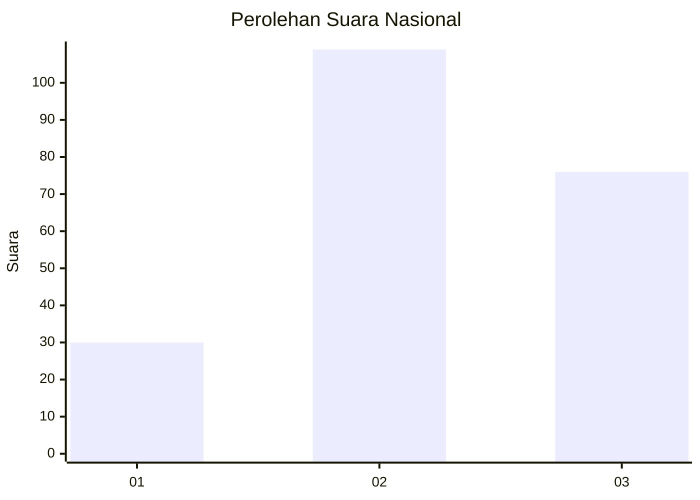
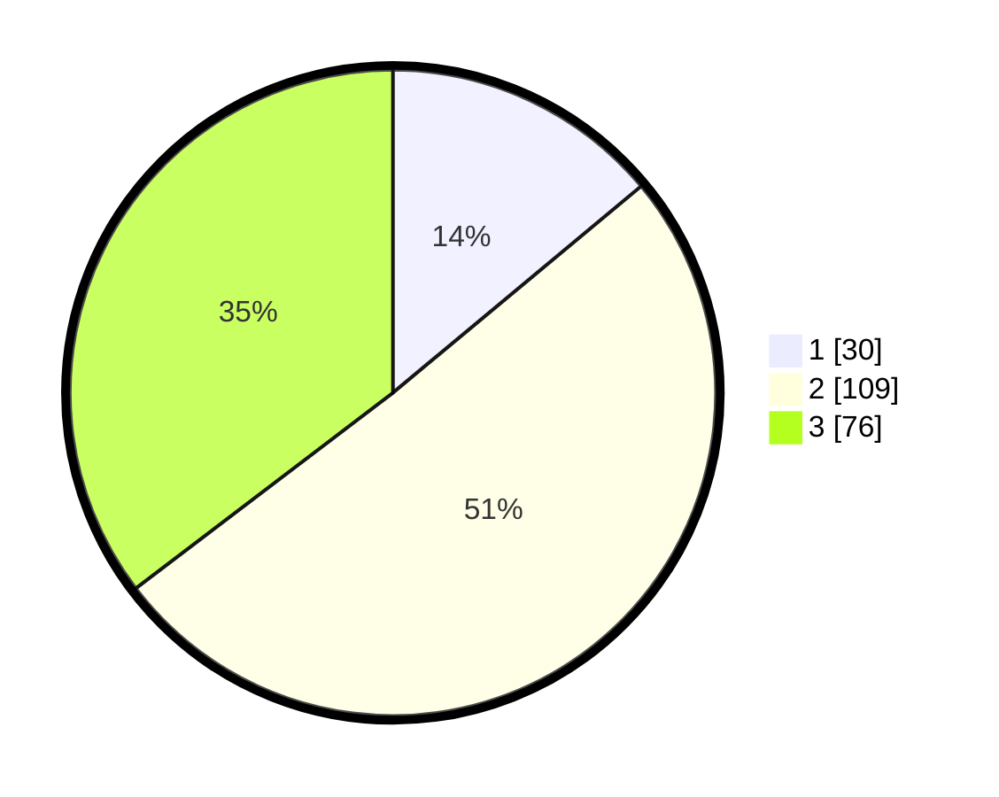

# Hasil

## Grafik

## Tabel

| No.    | Nama Paslon    | Suara | Suara (raw) | Persentase |
|:------ |:-------------- | -----:| -----------:| ----------:|
| 100025 | ANIES MUHAIMIN | 30    | [30][p-1]   | 13,95      |
| 100026 | PRABOWO GIBRAN | 109   | [109][p-2]  | 50,70      |
| 100027 | GANJAR MAHFUD  | 76    | [76][p-3]   | 35,35      |

[p-1]: https://github.com/gigit-pemilu/pemilu-2024/blob/main/pilpres/hitung-suara/sub/31-dki-jakarta/sub/75-jakarta-timur/sub/02-pulogadung/sub/1006-kayu-putih/sub/079-tps/sub/paslon-1.txt
[p-2]: https://github.com/gigit-pemilu/pemilu-2024/blob/main/pilpres/hitung-suara/sub/31-dki-jakarta/sub/75-jakarta-timur/sub/02-pulogadung/sub/1006-kayu-putih/sub/079-tps/sub/paslon-2.txt
[p-3]: https://github.com/gigit-pemilu/pemilu-2024/blob/main/pilpres/hitung-suara/sub/31-dki-jakarta/sub/75-jakarta-timur/sub/02-pulogadung/sub/1006-kayu-putih/sub/079-tps/sub/paslon-3.txt

## Foto C Plano

https://sirekap-obj-formc.kpu.go.id/43e6/pemilu/ppwp/31/75/02/10/06/3175021006079-20240214-212647--f8786563-3ceb-4e9e-ac84-7a635a474804.jpg

https://sirekap-obj-formc.kpu.go.id/43e6/pemilu/ppwp/31/75/02/10/06/3175021006079-20240214-212606--f8b51bb0-9dd8-40b1-ad4a-113a1d0154fb.jpg

https://sirekap-obj-formc.kpu.go.id/43e6/pemilu/ppwp/31/75/02/10/06/3175021006079-20240214-212445--a037e0b7-453a-467b-afce-6edf1c672de0.jpg

## Metadata

| Key        | Value               |
| ---------- | ------------------- |
| Time Stamp | 2024-02-24 22:31:28 |

