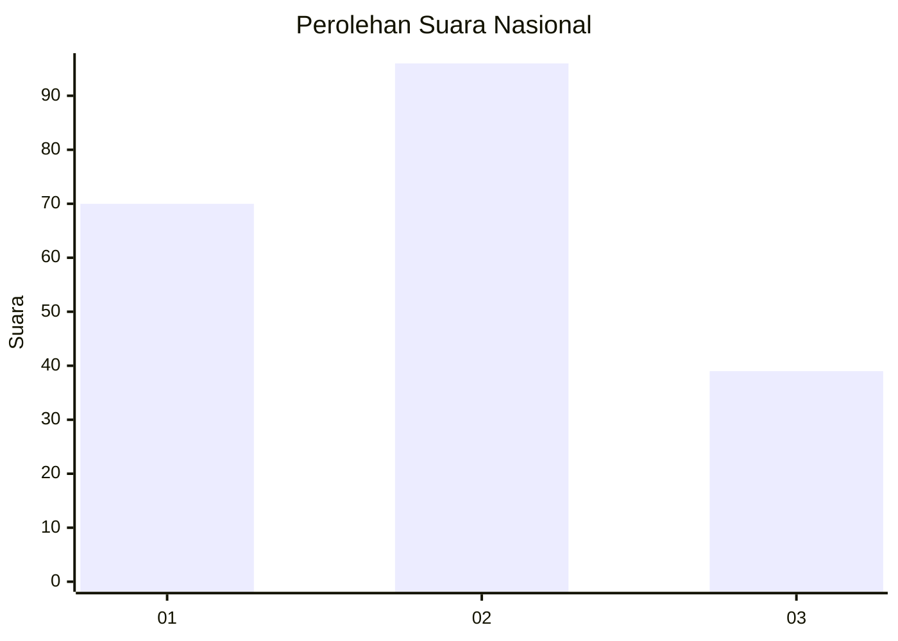
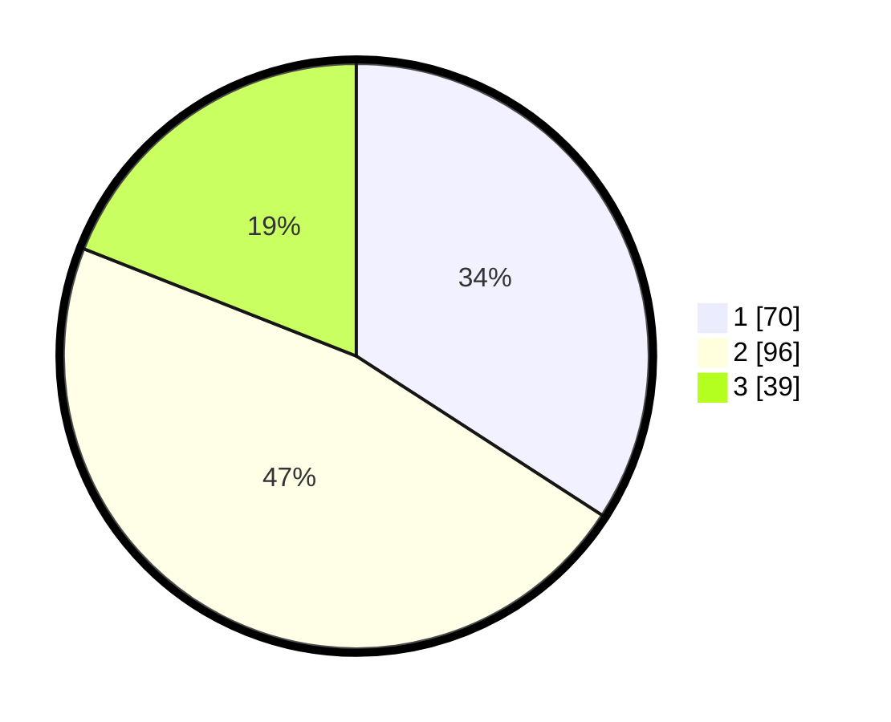

# Hasil

## Grafik

## Tabel

| No.    | Nama Paslon    | Suara | Suara (raw) | Persentase |
|:------ |:-------------- | -----:| -----------:| ----------:|
| 100025 | ANIES MUHAIMIN | 70    | [70][p-1]   | 34,15      |
| 100026 | PRABOWO GIBRAN | 96    | [96][p-2]   | 46,83      |
| 100027 | GANJAR MAHFUD  | 39    | [39][p-3]   | 19,02      |

[p-1]: https://github.com/gigit-pemilu/pemilu-2024/blob/main/pilpres/hitung-suara/sub/31-dki-jakarta/sub/75-jakarta-timur/sub/02-pulogadung/sub/1006-kayu-putih/sub/117-tps/sub/paslon-1.txt
[p-2]: https://github.com/gigit-pemilu/pemilu-2024/blob/main/pilpres/hitung-suara/sub/31-dki-jakarta/sub/75-jakarta-timur/sub/02-pulogadung/sub/1006-kayu-putih/sub/117-tps/sub/paslon-2.txt
[p-3]: https://github.com/gigit-pemilu/pemilu-2024/blob/main/pilpres/hitung-suara/sub/31-dki-jakarta/sub/75-jakarta-timur/sub/02-pulogadung/sub/1006-kayu-putih/sub/117-tps/sub/paslon-3.txt

## Foto C Plano

https://sirekap-obj-formc.kpu.go.id/65fe/pemilu/ppwp/31/75/02/10/06/3175021006117-20240215-023852--3f30d5f6-a38c-4406-ad22-c04ce629f251.jpg

https://sirekap-obj-formc.kpu.go.id/65fe/pemilu/ppwp/31/75/02/10/06/3175021006117-20240215-023946--ab742d10-1004-46f1-b49b-97c6388bc14c.jpg

https://sirekap-obj-formc.kpu.go.id/65fe/pemilu/ppwp/31/75/02/10/06/3175021006117-20240215-024014--9a74e6f7-aacf-432b-9541-daec080c18b7.jpg

## Metadata

| Key        | Value               |
| ---------- | ------------------- |
| Time Stamp | 2024-02-24 22:31:28 |

