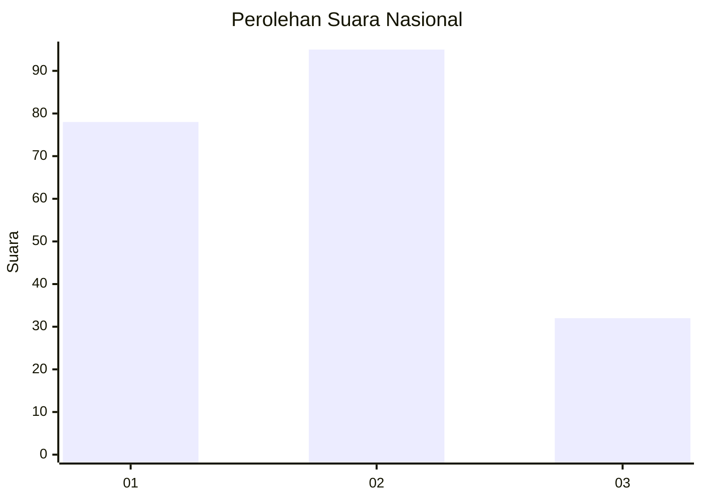
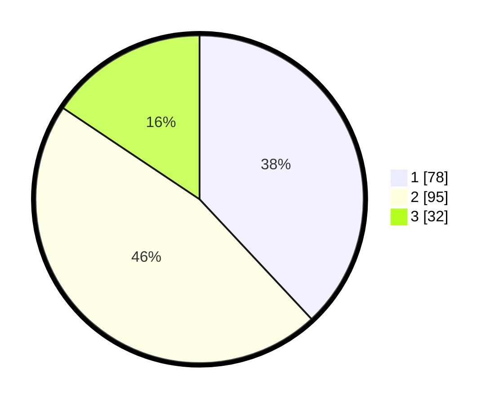

# Hasil

## Grafik

## Tabel

| No.    | Nama Paslon    | Suara | Suara (raw) | Persentase |
|:------ |:-------------- | -----:| -----------:| ----------:|
| 100025 | ANIES MUHAIMIN | 78    | [78][p-1]   | 38,05      |
| 100026 | PRABOWO GIBRAN | 95    | [95][p-2]   | 46,34      |
| 100027 | GANJAR MAHFUD  | 32    | [32][p-3]   | 15,61      |

[p-1]: https://github.com/gigit-pemilu/pemilu-2024/blob/main/pilpres/hitung-suara/sub/31-dki-jakarta/sub/75-jakarta-timur/sub/02-pulogadung/sub/1006-kayu-putih/sub/121-tps/sub/paslon-1.txt
[p-2]: https://github.com/gigit-pemilu/pemilu-2024/blob/main/pilpres/hitung-suara/sub/31-dki-jakarta/sub/75-jakarta-timur/sub/02-pulogadung/sub/1006-kayu-putih/sub/121-tps/sub/paslon-2.txt
[p-3]: https://github.com/gigit-pemilu/pemilu-2024/blob/main/pilpres/hitung-suara/sub/31-dki-jakarta/sub/75-jakarta-timur/sub/02-pulogadung/sub/1006-kayu-putih/sub/121-tps/sub/paslon-3.txt

## Foto C Plano

https://sirekap-obj-formc.kpu.go.id/e3f2/pemilu/ppwp/31/75/02/10/06/3175021006121-20240214-234814--ac647bfa-cb41-445c-812b-567ece15d001.jpg

https://sirekap-obj-formc.kpu.go.id/e3f2/pemilu/ppwp/31/75/02/10/06/3175021006121-20240214-235232--b2361412-ac63-4568-80c3-f8f8211b987b.jpg

https://sirekap-obj-formc.kpu.go.id/e3f2/pemilu/ppwp/31/75/02/10/06/3175021006121-20240214-235616--a5bc7bc0-b468-4157-82ec-9a24bcc108d4.jpg

## Metadata

| Key        | Value               |
| ---------- | ------------------- |
| Time Stamp | 2024-02-24 22:31:28 |

