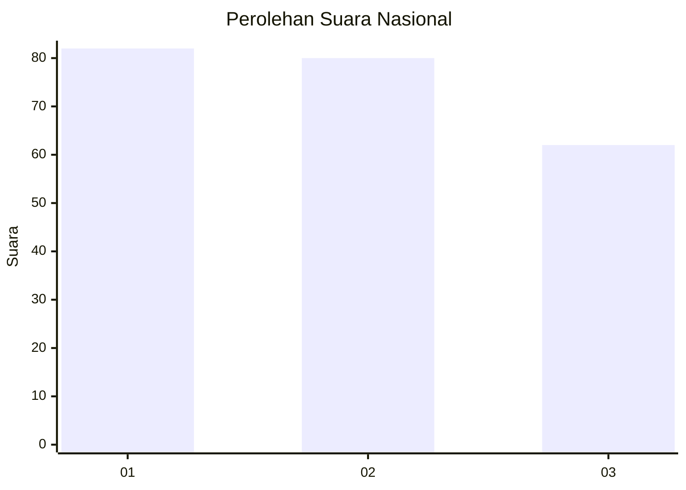
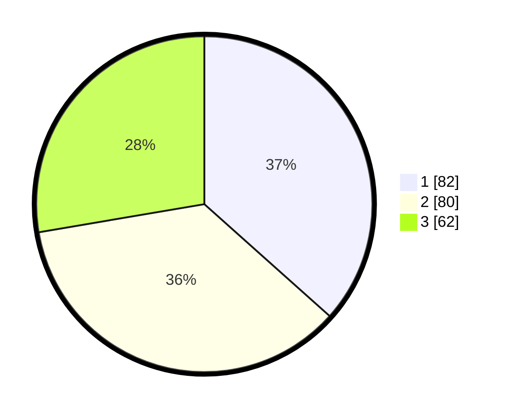

# Hasil

## Grafik

## Tabel

| No.    | Nama Paslon    | Suara | Suara (raw) | Persentase |
|:------ |:-------------- | -----:| -----------:| ----------:|
| 100025 | ANIES MUHAIMIN | 82    | [82][p-1]   | 36,61      |
| 100026 | PRABOWO GIBRAN | 80    | [80][p-2]   | 35,71      |
| 100027 | GANJAR MAHFUD  | 62    | [62][p-3]   | 27,68      |

[p-1]: https://github.com/gigit-pemilu/pemilu-2024/blob/main/pilpres/hitung-suara/sub/31-dki-jakarta/sub/75-jakarta-timur/sub/02-pulogadung/sub/1007-jati/sub/033-tps/sub/paslon-1.txt
[p-2]: https://github.com/gigit-pemilu/pemilu-2024/blob/main/pilpres/hitung-suara/sub/31-dki-jakarta/sub/75-jakarta-timur/sub/02-pulogadung/sub/1007-jati/sub/033-tps/sub/paslon-2.txt
[p-3]: https://github.com/gigit-pemilu/pemilu-2024/blob/main/pilpres/hitung-suara/sub/31-dki-jakarta/sub/75-jakarta-timur/sub/02-pulogadung/sub/1007-jati/sub/033-tps/sub/paslon-3.txt

## Foto C Plano

https://sirekap-obj-formc.kpu.go.id/4366/pemilu/ppwp/31/75/02/10/07/3175021007033-20240226-152741--22c91ecb-503a-4fc2-9b74-151597c6aec1.jpg

https://sirekap-obj-formc.kpu.go.id/4366/pemilu/ppwp/31/75/02/10/07/3175021007033-20240221-142720--02175883-3918-4cd9-bbb6-78099ee50852.jpg

https://sirekap-obj-formc.kpu.go.id/4366/pemilu/ppwp/31/75/02/10/07/3175021007033-20240221-142746--90ff5e43-302f-4c32-b2a3-91b8d36c35a2.jpg

## Metadata

| Key        | Value               |
| ---------- | ------------------- |
| Time Stamp | 2024-02-26 16:00:00 |

