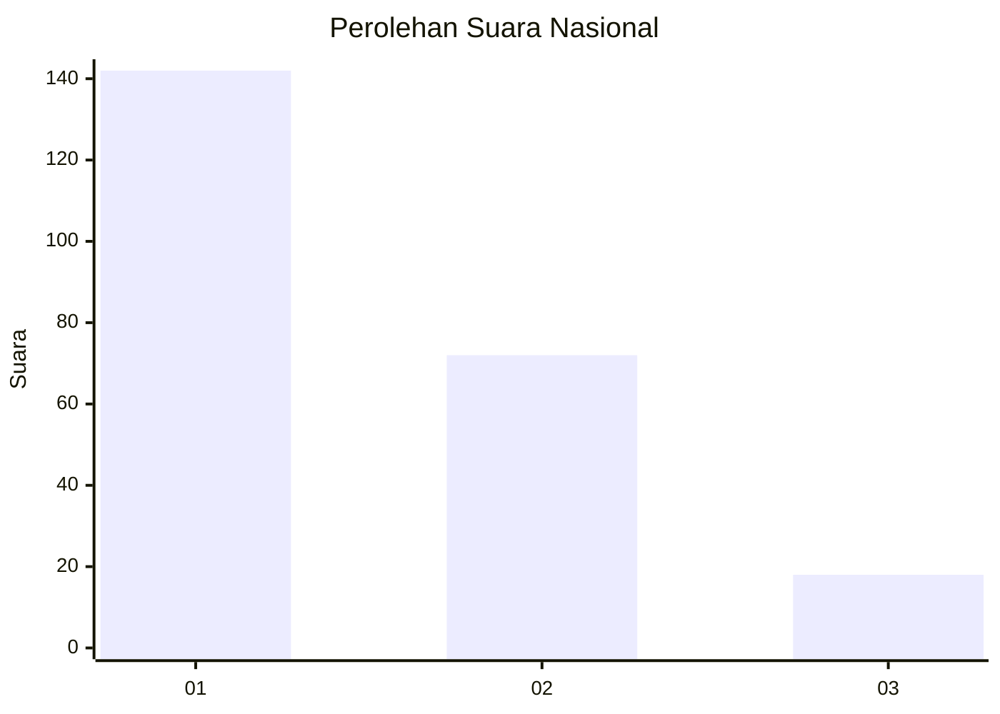
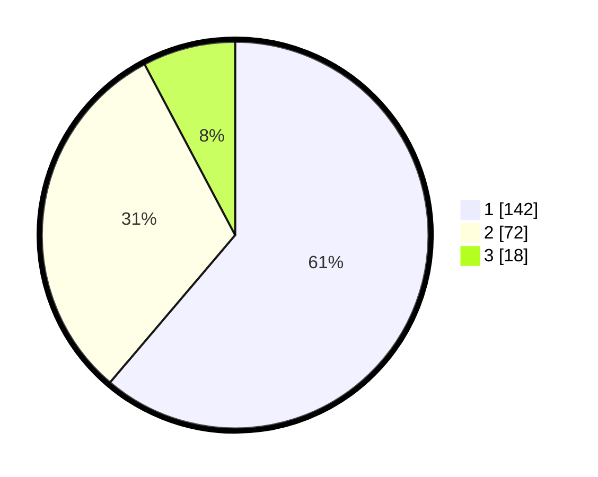

# Hasil

## Grafik

## Tabel

| No.    | Nama Paslon    | Suara | Suara (raw) | Persentase |
|:------ |:-------------- | -----:| -----------:| ----------:|
| 100025 | ANIES MUHAIMIN | 142   | [142][p-1]  | 61,21      |
| 100026 | PRABOWO GIBRAN | 72    | [72][p-2]   | 31,03      |
| 100027 | GANJAR MAHFUD  | 18    | [18][p-3]   | 7,76       |

[p-1]: https://github.com/gigit-pemilu/pemilu-2024/blob/main/pilpres/hitung-suara/sub/31-dki-jakarta/sub/75-jakarta-timur/sub/02-pulogadung/sub/1007-jati/sub/037-tps/sub/paslon-1.txt
[p-2]: https://github.com/gigit-pemilu/pemilu-2024/blob/main/pilpres/hitung-suara/sub/31-dki-jakarta/sub/75-jakarta-timur/sub/02-pulogadung/sub/1007-jati/sub/037-tps/sub/paslon-2.txt
[p-3]: https://github.com/gigit-pemilu/pemilu-2024/blob/main/pilpres/hitung-suara/sub/31-dki-jakarta/sub/75-jakarta-timur/sub/02-pulogadung/sub/1007-jati/sub/037-tps/sub/paslon-3.txt

## Foto C Plano

https://sirekap-obj-formc.kpu.go.id/fe18/pemilu/ppwp/31/75/02/10/07/3175021007037-20240214-215937--e9469a66-3352-402d-ba64-b9e328955cd8.jpg

https://sirekap-obj-formc.kpu.go.id/fe18/pemilu/ppwp/31/75/02/10/07/3175021007037-20240214-221911--6ff26e5c-8847-4f3e-ae30-ad6c2c2db160.jpg

https://sirekap-obj-formc.kpu.go.id/fe18/pemilu/ppwp/31/75/02/10/07/3175021007037-20240214-220230--6b6b69d8-c02d-4f48-91e7-e10816334152.jpg

## Metadata

| Key        | Value               |
| ---------- | ------------------- |
| Time Stamp | 2024-02-15 21:01:18 |

