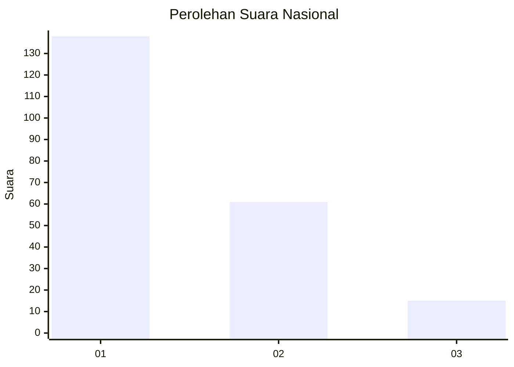
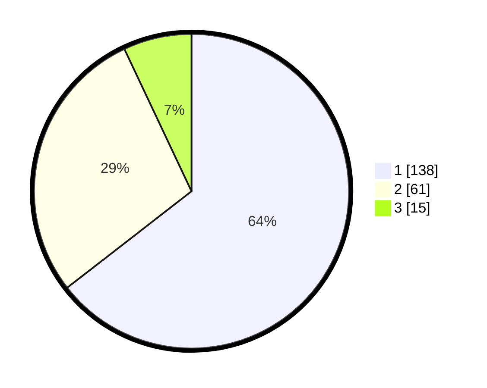

# Hasil

## Grafik

## Tabel

| No.    | Nama Paslon    | Suara | Suara (raw) | Persentase |
|:------ |:-------------- | -----:| -----------:| ----------:|
| 100025 | ANIES MUHAIMIN | 138   | [138][p-1]  | 64,49      |
| 100026 | PRABOWO GIBRAN | 61    | [61][p-2]   | 28,50      |
| 100027 | GANJAR MAHFUD  | 15    | [15][p-3]   | 7,01       |

[p-1]: https://github.com/gigit-pemilu/pemilu-2024/blob/main/pilpres/hitung-suara/sub/31-dki-jakarta/sub/75-jakarta-timur/sub/02-pulogadung/sub/1007-jati/sub/059-tps/sub/paslon-1.txt
[p-2]: https://github.com/gigit-pemilu/pemilu-2024/blob/main/pilpres/hitung-suara/sub/31-dki-jakarta/sub/75-jakarta-timur/sub/02-pulogadung/sub/1007-jati/sub/059-tps/sub/paslon-2.txt
[p-3]: https://github.com/gigit-pemilu/pemilu-2024/blob/main/pilpres/hitung-suara/sub/31-dki-jakarta/sub/75-jakarta-timur/sub/02-pulogadung/sub/1007-jati/sub/059-tps/sub/paslon-3.txt

## Foto C Plano

https://sirekap-obj-formc.kpu.go.id/9653/pemilu/ppwp/31/75/02/10/07/3175021007059-20240226-162200--b07687d9-a829-443b-91aa-913fb1d53110.jpg

https://sirekap-obj-formc.kpu.go.id/9653/pemilu/ppwp/31/75/02/10/07/3175021007059-20240226-162132--f1903f26-07dd-45b3-931f-eaa3ce5643f1.jpg

https://sirekap-obj-formc.kpu.go.id/9653/pemilu/ppwp/31/75/02/10/07/3175021007059-20240226-162148--657a8cee-e765-4c86-bc66-2fcdad844b83.jpg

## Metadata

| Key        | Value               |
| ---------- | ------------------- |
| Time Stamp | 2024-02-26 22:00:00 |

