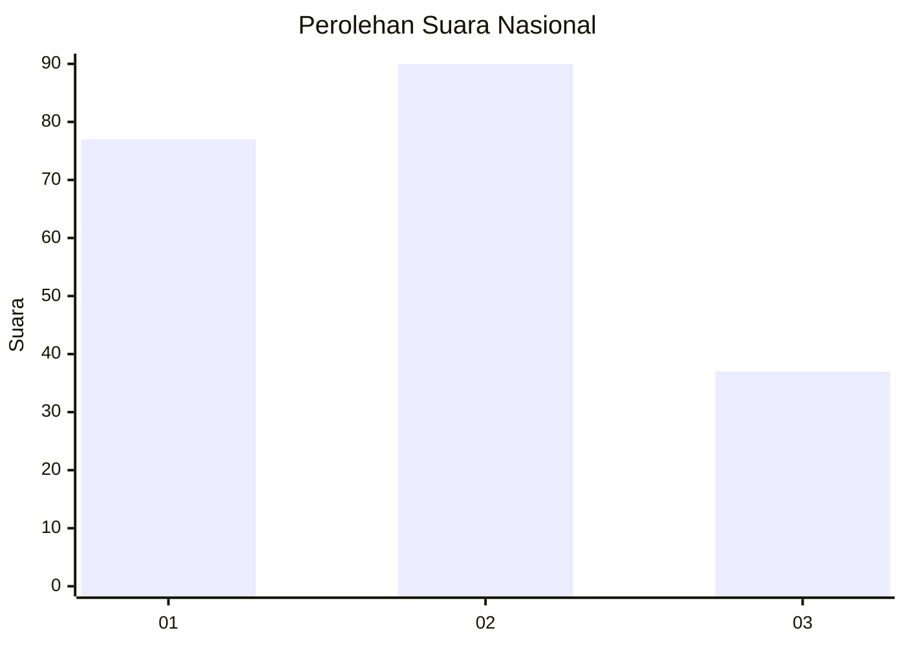
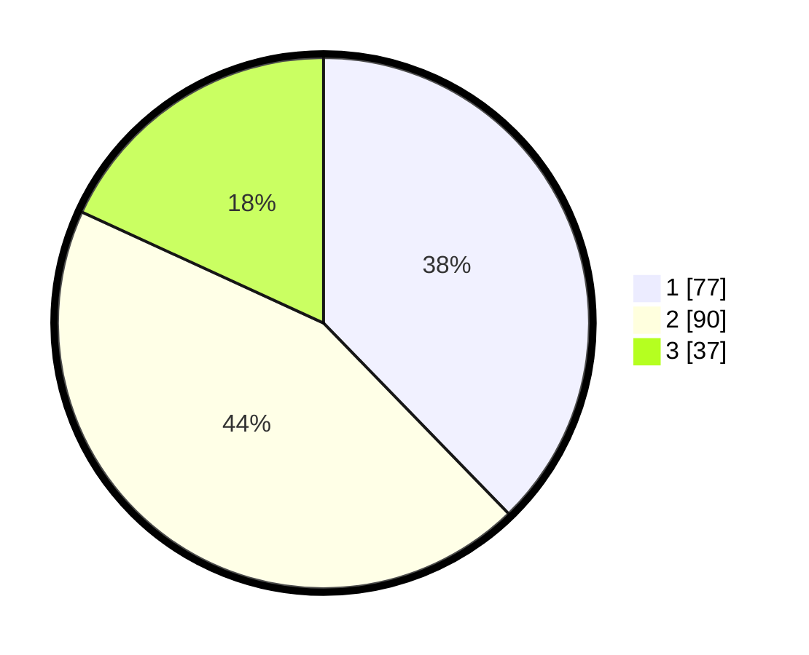

# Hasil

## Grafik

## Tabel

| No. | Nama Paslon    | Suara | Suara (raw) | Persentase |
|:--- |:-------------- | -----:| -----------:| ----------:|
| 1   | ANIES MUHAIMIN | 77    | [77][p-1]   | 37,75      |
| 2   | PRABOWO GIBRAN | 90    | [90][p-2]   | 44,12      |
| 3   | GANJAR MAHFUD  | 37    | [37][p-3]   | 18,14      |

[p-1]: https://github.com/gigit-pemilu/pemilu-2024/blob/main/pilpres/hitung-suara/sub/31-dki-jakarta/sub/75-jakarta-timur/sub/03-jatinegara/sub/1001-kampung-melayu/sub/002-tps/sub/paslon-1.txt
[p-2]: https://github.com/gigit-pemilu/pemilu-2024/blob/main/pilpres/hitung-suara/sub/31-dki-jakarta/sub/75-jakarta-timur/sub/03-jatinegara/sub/1001-kampung-melayu/sub/002-tps/sub/paslon-2.txt
[p-3]: https://github.com/gigit-pemilu/pemilu-2024/blob/main/pilpres/hitung-suara/sub/31-dki-jakarta/sub/75-jakarta-timur/sub/03-jatinegara/sub/1001-kampung-melayu/sub/002-tps/sub/paslon-3.txt

## Foto C Plano

https://sirekap-obj-formc.kpu.go.id/b4e8/pemilu/ppwp/31/75/03/10/01/3175031001002-20240214-235539--6eab8af2-9374-47cf-9758-9601ca5b6d75.jpg

https://sirekap-obj-formc.kpu.go.id/b4e8/pemilu/ppwp/31/75/03/10/01/3175031001002-20240214-235652--dc441d15-c383-4ddb-bf1a-2ea5f90d2aba.jpg

https://sirekap-obj-formc.kpu.go.id/b4e8/pemilu/ppwp/31/75/03/10/01/3175031001002-20240214-235912--20f4c74c-e912-4e84-af74-f570986503be.jpg

## Metadata

| Key        | Value               |
| ---------- | ------------------- |
| Time Stamp | 2024-02-15 17:30:25 |

