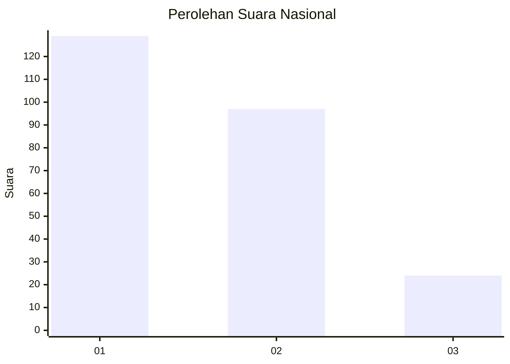
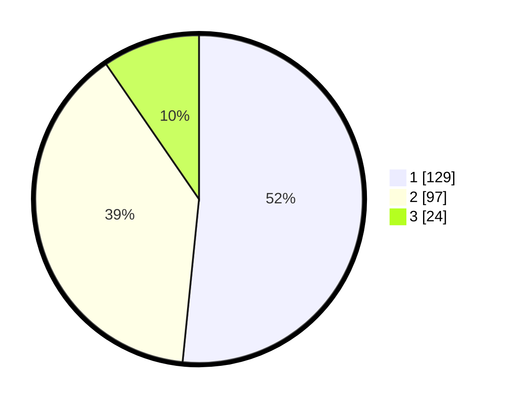

# Hasil

## Grafik

## Tabel

| No. | Nama Paslon    | Suara | Suara (raw) | Persentase |
|:--- |:-------------- | -----:| -----------:| ----------:|
| 1   | ANIES MUHAIMIN | 129   | [129][p-1]  | 51,60      |
| 2   | PRABOWO GIBRAN | 97    | [97][p-2]   | 38,80      |
| 3   | GANJAR MAHFUD  | 24    | [24][p-3]   | 9,60       |

[p-1]: https://github.com/gigit-pemilu/pemilu-2024/blob/main/pilpres/hitung-suara/sub/31-dki-jakarta/sub/75-jakarta-timur/sub/03-jatinegara/sub/1001-kampung-melayu/sub/004-tps/sub/paslon-1.txt
[p-2]: https://github.com/gigit-pemilu/pemilu-2024/blob/main/pilpres/hitung-suara/sub/31-dki-jakarta/sub/75-jakarta-timur/sub/03-jatinegara/sub/1001-kampung-melayu/sub/004-tps/sub/paslon-2.txt
[p-3]: https://github.com/gigit-pemilu/pemilu-2024/blob/main/pilpres/hitung-suara/sub/31-dki-jakarta/sub/75-jakarta-timur/sub/03-jatinegara/sub/1001-kampung-melayu/sub/004-tps/sub/paslon-3.txt

## Foto C Plano

https://sirekap-obj-formc.kpu.go.id/fbe0/pemilu/ppwp/31/75/03/10/01/3175031001004-20240214-202438--65c29c7c-7401-4a9a-98d3-f3b3617740bf.jpg

https://sirekap-obj-formc.kpu.go.id/fbe0/pemilu/ppwp/31/75/03/10/01/3175031001004-20240214-202519--8bdafac6-abd5-478f-82de-f46b147d902c.jpg

https://sirekap-obj-formc.kpu.go.id/fbe0/pemilu/ppwp/31/75/03/10/01/3175031001004-20240214-202603--09cfefc3-f921-46c5-bbc6-e5d7eb20389c.jpg

## Metadata

| Key        | Value               |
| ---------- | ------------------- |
| Time Stamp | 2024-02-15 20:00:44 |

