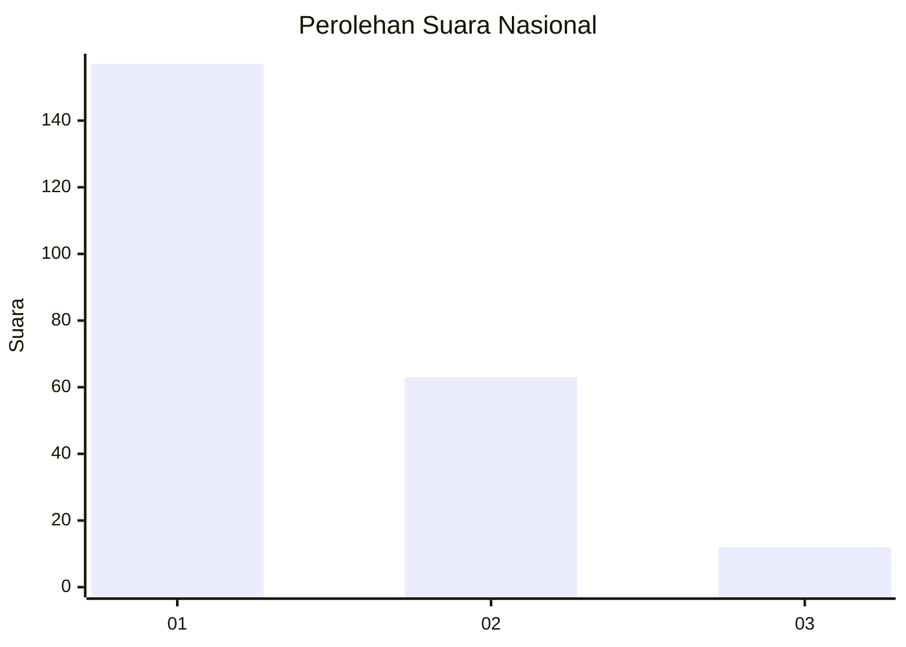
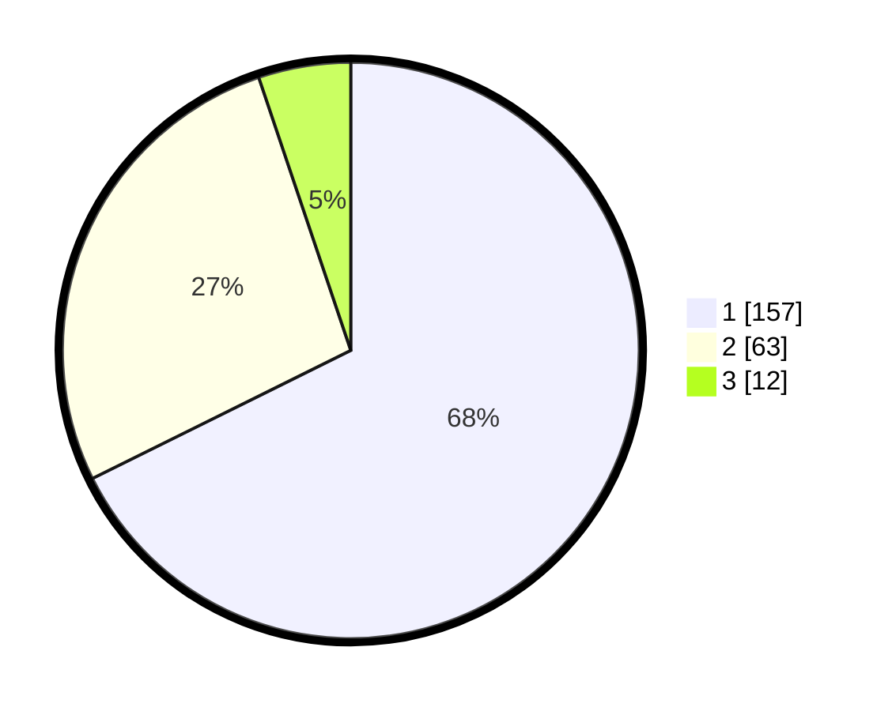

# Hasil

## Grafik

## Tabel

| No.    | Nama Paslon    | Suara | Suara (raw) | Persentase |
|:------ |:-------------- | -----:| -----------:| ----------:|
| 100025 | ANIES MUHAIMIN | 157   | [157][p-1]  | 67,67      |
| 100026 | PRABOWO GIBRAN | 63    | [63][p-2]   | 27,16      |
| 100027 | GANJAR MAHFUD  | 12    | [12][p-3]   | 5,17       |

[p-1]: https://github.com/gigit-pemilu/pemilu-2024/blob/main/pilpres/hitung-suara/sub/31-dki-jakarta/sub/75-jakarta-timur/sub/03-jatinegara/sub/1001-kampung-melayu/sub/006-tps/sub/paslon-1.txt
[p-2]: https://github.com/gigit-pemilu/pemilu-2024/blob/main/pilpres/hitung-suara/sub/31-dki-jakarta/sub/75-jakarta-timur/sub/03-jatinegara/sub/1001-kampung-melayu/sub/006-tps/sub/paslon-2.txt
[p-3]: https://github.com/gigit-pemilu/pemilu-2024/blob/main/pilpres/hitung-suara/sub/31-dki-jakarta/sub/75-jakarta-timur/sub/03-jatinegara/sub/1001-kampung-melayu/sub/006-tps/sub/paslon-3.txt

## Foto C Plano

https://sirekap-obj-formc.kpu.go.id/9962/pemilu/ppwp/31/75/03/10/01/3175031001006-20240214-224321--1c576302-d7f0-4ba1-a7ca-639bdafd7b0f.jpg

https://sirekap-obj-formc.kpu.go.id/9962/pemilu/ppwp/31/75/03/10/01/3175031001006-20240214-225159--5f801229-1c2e-43c9-a7e5-58aaae5e0f89.jpg

https://sirekap-obj-formc.kpu.go.id/9962/pemilu/ppwp/31/75/03/10/01/3175031001006-20240214-225324--771cf849-5958-49c3-8fa1-0ac05e53d273.jpg

## Metadata

| Key        | Value               |
| ---------- | ------------------- |
| Time Stamp | 2024-02-15 20:00:44 |

