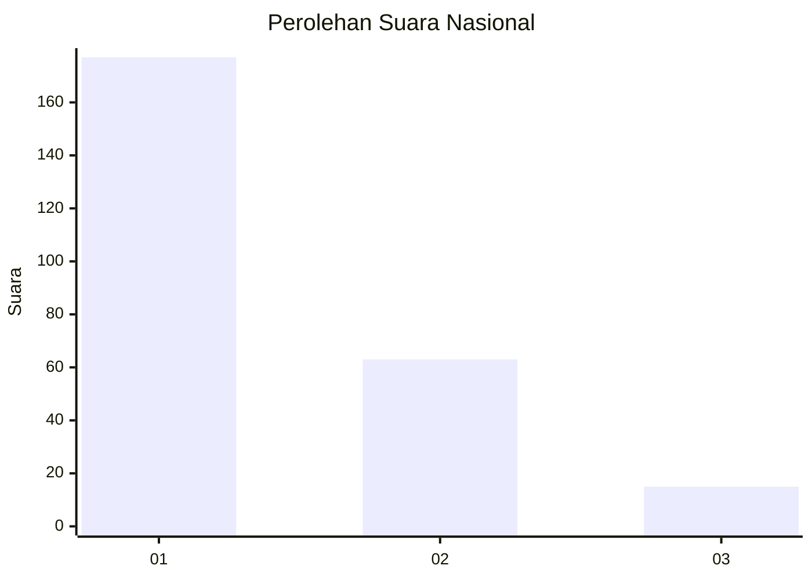
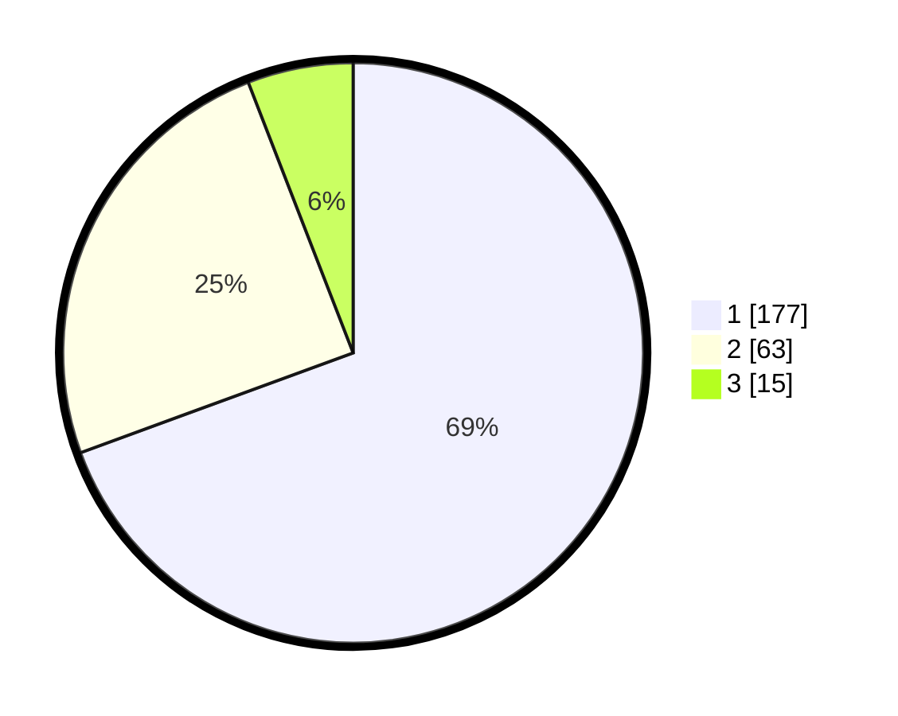

# Hasil

## Grafik

## Tabel

| No. | Nama Paslon    | Suara | Suara (raw) | Persentase |
|:--- |:-------------- | -----:| -----------:| ----------:|
| 1   | ANIES MUHAIMIN | 177   | [177][p-1]  | 69,41      |
| 2   | PRABOWO GIBRAN | 63    | [63][p-2]   | 24,71      |
| 3   | GANJAR MAHFUD  | 15    | [15][p-3]   | 5,88       |

[p-1]: https://github.com/gigit-pemilu/pemilu-2024/blob/main/pilpres/hitung-suara/sub/31-dki-jakarta/sub/75-jakarta-timur/sub/03-jatinegara/sub/1001-kampung-melayu/sub/013-tps/sub/paslon-1.txt
[p-2]: https://github.com/gigit-pemilu/pemilu-2024/blob/main/pilpres/hitung-suara/sub/31-dki-jakarta/sub/75-jakarta-timur/sub/03-jatinegara/sub/1001-kampung-melayu/sub/013-tps/sub/paslon-2.txt
[p-3]: https://github.com/gigit-pemilu/pemilu-2024/blob/main/pilpres/hitung-suara/sub/31-dki-jakarta/sub/75-jakarta-timur/sub/03-jatinegara/sub/1001-kampung-melayu/sub/013-tps/sub/paslon-3.txt

## Foto C Plano

https://sirekap-obj-formc.kpu.go.id/49a4/pemilu/ppwp/31/75/03/10/01/3175031001013-20240214-212001--9dfc80c1-c945-4008-ac11-7b4b04cf7075.jpg

https://sirekap-obj-formc.kpu.go.id/49a4/pemilu/ppwp/31/75/03/10/01/3175031001013-20240214-205057--4a732d41-bc7a-403d-844d-4158ca280a58.jpg

https://sirekap-obj-formc.kpu.go.id/49a4/pemilu/ppwp/31/75/03/10/01/3175031001013-20240214-205226--35de93ef-3b97-44de-9d3b-5e6d85f069dd.jpg

## Metadata

| Key        | Value               |
| ---------- | ------------------- |
| Time Stamp | 2024-02-15 20:30:46 |

