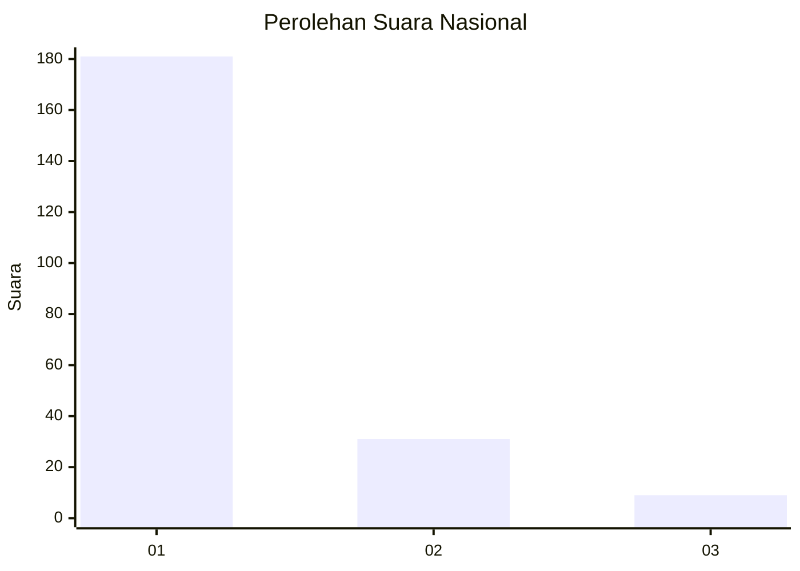
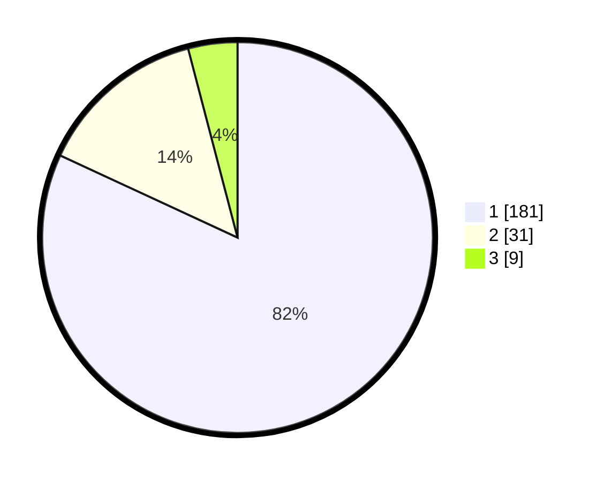

# Hasil

## Grafik

## Tabel

| No. | Nama Paslon    | Suara | Suara (raw) | Persentase |
|:--- |:-------------- | -----:| -----------:| ----------:|
| 1   | ANIES MUHAIMIN | 181   | [181][p-1]  | 81,90      |
| 2   | PRABOWO GIBRAN | 31    | [31][p-2]   | 14,03      |
| 3   | GANJAR MAHFUD  | 9     | [9][p-3]    | 4,07       |

[p-1]: https://github.com/gigit-pemilu/pemilu-2024/blob/main/pilpres/hitung-suara/sub/31-dki-jakarta/sub/75-jakarta-timur/sub/03-jatinegara/sub/1001-kampung-melayu/sub/027-tps/sub/paslon-1.txt
[p-2]: https://github.com/gigit-pemilu/pemilu-2024/blob/main/pilpres/hitung-suara/sub/31-dki-jakarta/sub/75-jakarta-timur/sub/03-jatinegara/sub/1001-kampung-melayu/sub/027-tps/sub/paslon-2.txt
[p-3]: https://github.com/gigit-pemilu/pemilu-2024/blob/main/pilpres/hitung-suara/sub/31-dki-jakarta/sub/75-jakarta-timur/sub/03-jatinegara/sub/1001-kampung-melayu/sub/027-tps/sub/paslon-3.txt

## Foto C Plano

https://sirekap-obj-formc.kpu.go.id/97ee/pemilu/ppwp/31/75/03/10/01/3175031001027-20240214-194407--236e1e43-6441-43b8-9b3e-77e99188d425.jpg

https://sirekap-obj-formc.kpu.go.id/97ee/pemilu/ppwp/31/75/03/10/01/3175031001027-20240214-194438--9d4ecf92-ccf4-404e-97bf-ab6c6fcd47c2.jpg

https://sirekap-obj-formc.kpu.go.id/97ee/pemilu/ppwp/31/75/03/10/01/3175031001027-20240214-194448--4bd1e87b-4b72-4be2-a2bf-f94acf8c9482.jpg

## Metadata

| Key        | Value               |
| ---------- | ------------------- |
| Time Stamp | 2024-02-15 21:01:18 |

