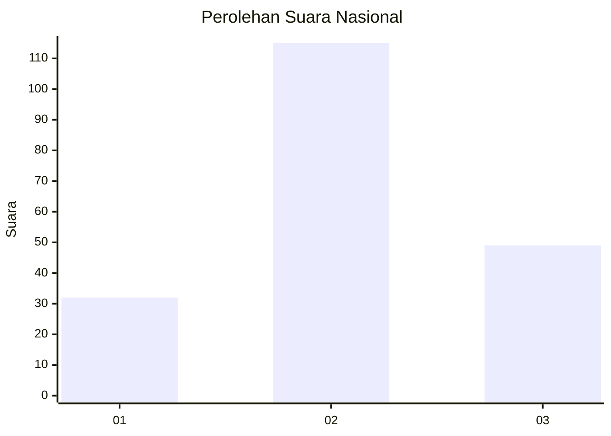
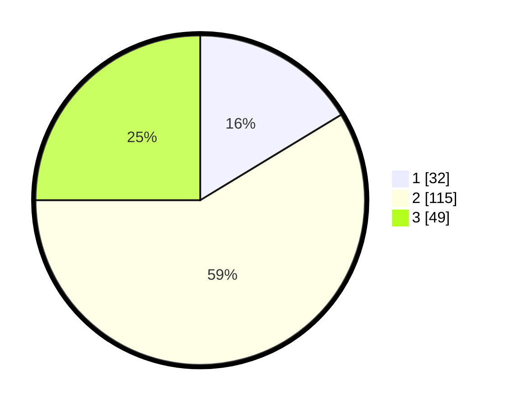

# Hasil

## Grafik

## Tabel

| No.    | Nama Paslon    | Suara | Suara (raw) | Persentase |
|:------ |:-------------- | -----:| -----------:| ----------:|
| 100025 | ANIES MUHAIMIN | 32    | [32][p-1]   | 16,33      |
| 100026 | PRABOWO GIBRAN | 115   | [115][p-2]  | 58,67      |
| 100027 | GANJAR MAHFUD  | 49    | [49][p-3]   | 25,00      |

[p-1]: https://github.com/gigit-pemilu/pemilu-2024/blob/main/pilpres/hitung-suara/sub/31-dki-jakarta/sub/75-jakarta-timur/sub/03-jatinegara/sub/1001-kampung-melayu/sub/036-tps/sub/paslon-1.txt
[p-2]: https://github.com/gigit-pemilu/pemilu-2024/blob/main/pilpres/hitung-suara/sub/31-dki-jakarta/sub/75-jakarta-timur/sub/03-jatinegara/sub/1001-kampung-melayu/sub/036-tps/sub/paslon-2.txt
[p-3]: https://github.com/gigit-pemilu/pemilu-2024/blob/main/pilpres/hitung-suara/sub/31-dki-jakarta/sub/75-jakarta-timur/sub/03-jatinegara/sub/1001-kampung-melayu/sub/036-tps/sub/paslon-3.txt

## Foto C Plano

https://sirekap-obj-formc.kpu.go.id/fc49/pemilu/ppwp/31/75/03/10/01/3175031001036-20240214-185548--083b5709-b67c-480f-8ff5-ad6a60485703.jpg

https://sirekap-obj-formc.kpu.go.id/fc49/pemilu/ppwp/31/75/03/10/01/3175031001036-20240214-185311--57e0a1ec-da07-45a1-a891-74542e9c80e2.jpg

https://sirekap-obj-formc.kpu.go.id/fc49/pemilu/ppwp/31/75/03/10/01/3175031001036-20240214-185203--8e33636c-7060-430a-9a12-f1140a447c36.jpg

## Metadata

| Key        | Value               |
| ---------- | ------------------- |
| Time Stamp | 2024-02-15 21:30:27 |

