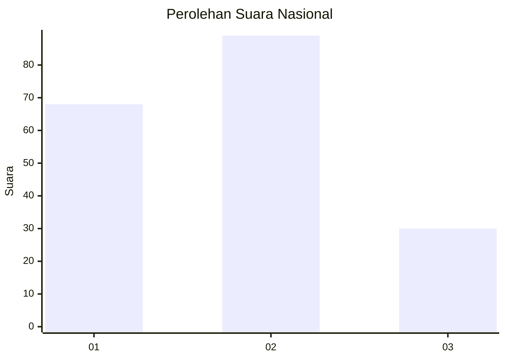
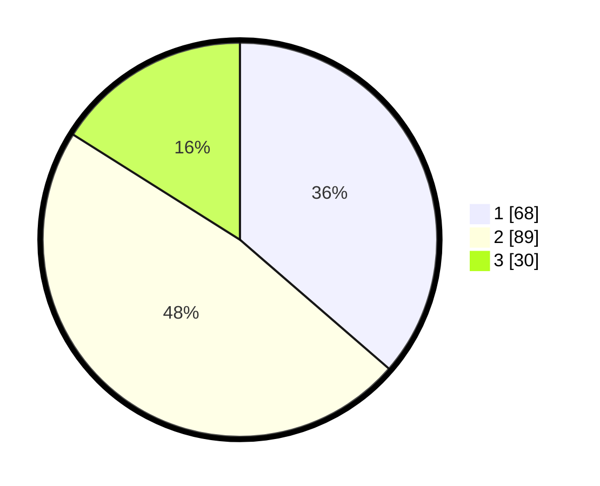

# Hasil

## Grafik

## Tabel

| No.    | Nama Paslon    | Suara | Suara (raw) | Persentase |
|:------ |:-------------- | -----:| -----------:| ----------:|
| 100025 | ANIES MUHAIMIN | 68    | [68][p-1]   | 36,36      |
| 100026 | PRABOWO GIBRAN | 89    | [89][p-2]   | 47,59      |
| 100027 | GANJAR MAHFUD  | 30    | [30][p-3]   | 16,04      |

[p-1]: https://github.com/gigit-pemilu/pemilu-2024/blob/main/pilpres/hitung-suara/sub/31-dki-jakarta/sub/75-jakarta-timur/sub/03-jatinegara/sub/1001-kampung-melayu/sub/038-tps/sub/paslon-1.txt
[p-2]: https://github.com/gigit-pemilu/pemilu-2024/blob/main/pilpres/hitung-suara/sub/31-dki-jakarta/sub/75-jakarta-timur/sub/03-jatinegara/sub/1001-kampung-melayu/sub/038-tps/sub/paslon-2.txt
[p-3]: https://github.com/gigit-pemilu/pemilu-2024/blob/main/pilpres/hitung-suara/sub/31-dki-jakarta/sub/75-jakarta-timur/sub/03-jatinegara/sub/1001-kampung-melayu/sub/038-tps/sub/paslon-3.txt

## Foto C Plano

https://sirekap-obj-formc.kpu.go.id/197f/pemilu/ppwp/31/75/03/10/01/3175031001038-20240214-234821--43086718-6c60-474f-a836-8d6685b3e3b2.jpg

https://sirekap-obj-formc.kpu.go.id/197f/pemilu/ppwp/31/75/03/10/01/3175031001038-20240214-234929--0754481f-6675-4a18-9c95-1c4c71b09d88.jpg

https://sirekap-obj-formc.kpu.go.id/197f/pemilu/ppwp/31/75/03/10/01/3175031001038-20240214-235022--3a3ed6d9-8164-4874-8313-1285e68345d6.jpg

## Metadata

| Key        | Value               |
| ---------- | ------------------- |
| Time Stamp | 2024-02-15 21:01:18 |

