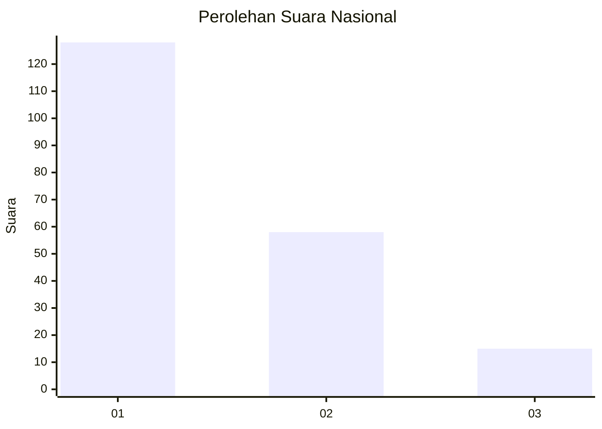
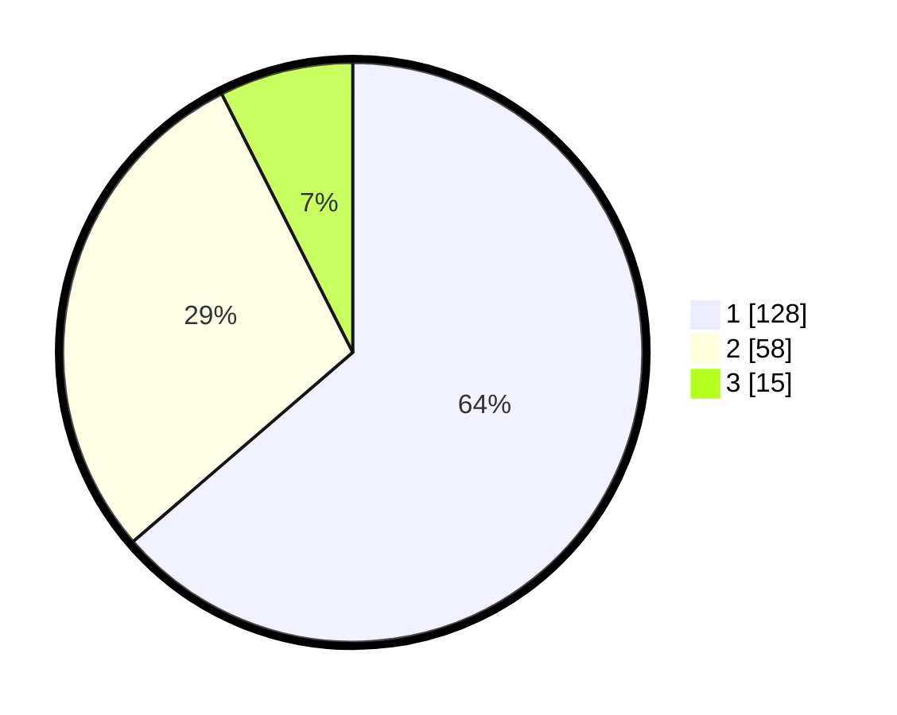

# Hasil

## Grafik

## Tabel

| No.    | Nama Paslon    | Suara | Suara (raw) | Persentase |
|:------ |:-------------- | -----:| -----------:| ----------:|
| 100025 | ANIES MUHAIMIN | 128   | [128][p-1]  | 63,68      |
| 100026 | PRABOWO GIBRAN | 58    | [58][p-2]   | 28,86      |
| 100027 | GANJAR MAHFUD  | 15    | [15][p-3]   | 7,46       |

[p-1]: https://github.com/gigit-pemilu/pemilu-2024/blob/main/pilpres/hitung-suara/sub/31-dki-jakarta/sub/75-jakarta-timur/sub/03-jatinegara/sub/1001-kampung-melayu/sub/061-tps/sub/paslon-1.txt
[p-2]: https://github.com/gigit-pemilu/pemilu-2024/blob/main/pilpres/hitung-suara/sub/31-dki-jakarta/sub/75-jakarta-timur/sub/03-jatinegara/sub/1001-kampung-melayu/sub/061-tps/sub/paslon-2.txt
[p-3]: https://github.com/gigit-pemilu/pemilu-2024/blob/main/pilpres/hitung-suara/sub/31-dki-jakarta/sub/75-jakarta-timur/sub/03-jatinegara/sub/1001-kampung-melayu/sub/061-tps/sub/paslon-3.txt

## Foto C Plano

https://sirekap-obj-formc.kpu.go.id/1b4e/pemilu/ppwp/31/75/03/10/01/3175031001061-20240219-152938--07ab01e6-ad31-47ed-9a16-b0b3262acd0b.jpg

https://sirekap-obj-formc.kpu.go.id/1b4e/pemilu/ppwp/31/75/03/10/01/3175031001061-20240219-151847--d3f0f328-ae55-46d6-92a0-74ea5dfe943f.jpg

https://sirekap-obj-formc.kpu.go.id/1b4e/pemilu/ppwp/31/75/03/10/01/3175031001061-20240219-152135--c49af252-0cea-49b9-ba74-8c0f126167a2.jpg

## Metadata

| Key        | Value               |
| ---------- | ------------------- |
| Time Stamp | 2024-02-25 12:00:00 |

