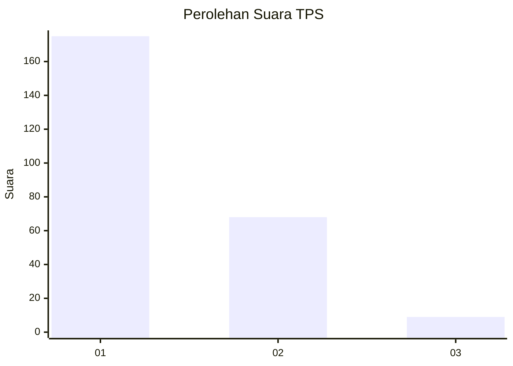
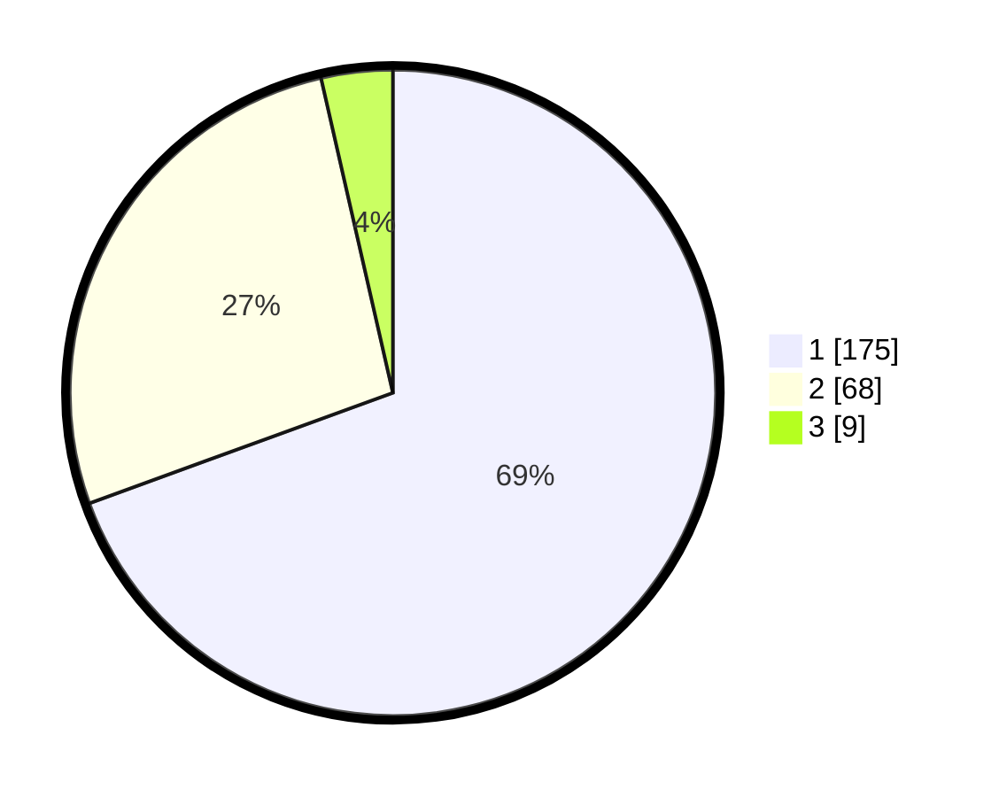

# Hasil

## Grafik

## Tabel

| No. | Nama Paslon    | Suara | Suara (raw) | Persentase |
|:--- |:-------------- | -----:| -----------:| ----------:|
| 1   | ANIES MUHAIMIN | 175   | [175][p-1]  | 69,44      |
| 2   | PRABOWO GIBRAN | 68    | [68][p-2]   | 26,98      |
| 3   | GANJAR MAHFUD  | 9     | [9][p-3]    | 3,57       |

[p-1]: https://github.com/gigit-pemilu/pemilu-2024-31-dki-jakarta/blob/main/pilpres/hitung-suara/sub/31-dki-jakarta/sub/75-jakarta-timur/sub/03-jatinegara/sub/1001-kampung-melayu/sub/077-tps/sub/paslon-1.txt
[p-2]: https://github.com/gigit-pemilu/pemilu-2024-31-dki-jakarta/blob/main/pilpres/hitung-suara/sub/31-dki-jakarta/sub/75-jakarta-timur/sub/03-jatinegara/sub/1001-kampung-melayu/sub/077-tps/sub/paslon-2.txt
[p-3]: https://github.com/gigit-pemilu/pemilu-2024-31-dki-jakarta/blob/main/pilpres/hitung-suara/sub/31-dki-jakarta/sub/75-jakarta-timur/sub/03-jatinegara/sub/1001-kampung-melayu/sub/077-tps/sub/paslon-3.txt

## Foto C Plano

https://sirekap-obj-formc.kpu.go.id/a306/pemilu/ppwp/31/75/03/10/01/3175031001077-20240214-162218--5c09485e-c457-49e6-852b-d0cef1836a59.jpg

https://sirekap-obj-formc.kpu.go.id/a306/pemilu/ppwp/31/75/03/10/01/3175031001077-20240214-162224--d0608ec3-5b79-4dd2-a043-467b0f79222a.jpg

https://sirekap-obj-formc.kpu.go.id/a306/pemilu/ppwp/31/75/03/10/01/3175031001077-20240214-162229--26be615c-76d3-463f-bbf7-b3b11697bc46.jpg

## Metadata

| Key        | Value               |
| ---------- | ------------------- |
| Time Stamp | 2024-02-15 22:30:27 |

