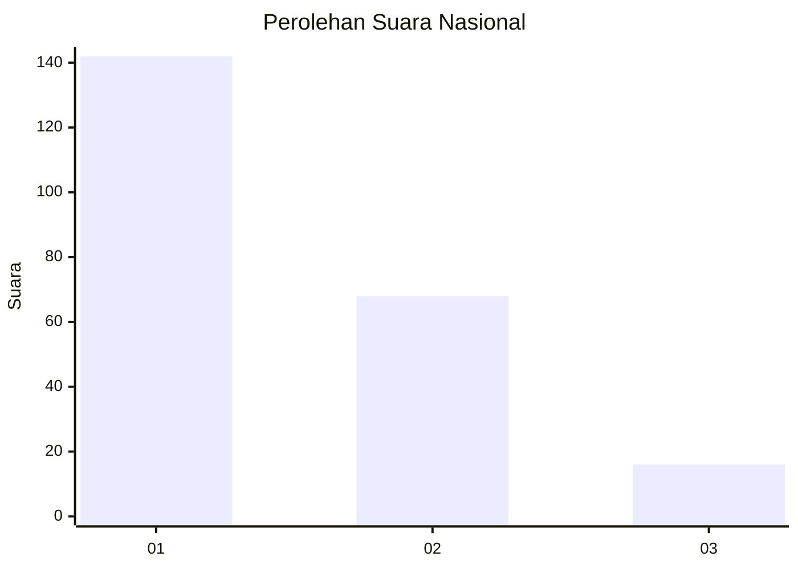
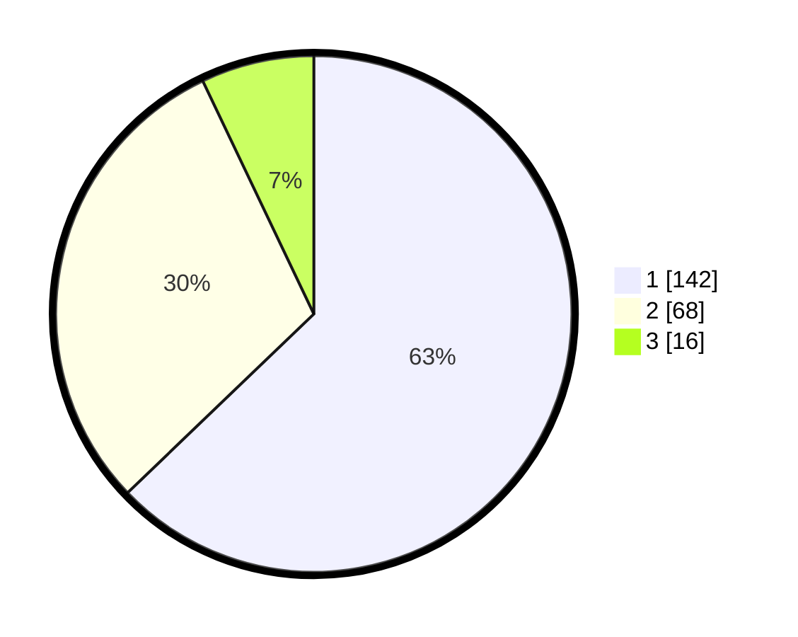

# Hasil

## Grafik

## Tabel

| No.    | Nama Paslon    | Suara | Suara (raw) | Persentase |
|:------ |:-------------- | -----:| -----------:| ----------:|
| 100025 | ANIES MUHAIMIN | 142   | [142][p-1]  | 62,83      |
| 100026 | PRABOWO GIBRAN | 68    | [68][p-2]   | 30,09      |
| 100027 | GANJAR MAHFUD  | 16    | [16][p-3]   | 7,08       |

[p-1]: https://github.com/gigit-pemilu/pemilu-2024/blob/main/pilpres/hitung-suara/sub/31-dki-jakarta/sub/75-jakarta-timur/sub/03-jatinegara/sub/1001-kampung-melayu/sub/081-tps/sub/paslon-1.txt
[p-2]: https://github.com/gigit-pemilu/pemilu-2024/blob/main/pilpres/hitung-suara/sub/31-dki-jakarta/sub/75-jakarta-timur/sub/03-jatinegara/sub/1001-kampung-melayu/sub/081-tps/sub/paslon-2.txt
[p-3]: https://github.com/gigit-pemilu/pemilu-2024/blob/main/pilpres/hitung-suara/sub/31-dki-jakarta/sub/75-jakarta-timur/sub/03-jatinegara/sub/1001-kampung-melayu/sub/081-tps/sub/paslon-3.txt

## Foto C Plano

https://sirekap-obj-formc.kpu.go.id/1a29/pemilu/ppwp/31/75/03/10/01/3175031001081-20240214-214333--6240f675-cb05-4ac3-83ab-0af1ae48dcef.jpg

https://sirekap-obj-formc.kpu.go.id/1a29/pemilu/ppwp/31/75/03/10/01/3175031001081-20240214-214232--2d5ef804-ccb9-4e5d-9c93-5a686e7eb6ba.jpg

https://sirekap-obj-formc.kpu.go.id/1a29/pemilu/ppwp/31/75/03/10/01/3175031001081-20240214-214300--4c620d4c-8862-4cd7-8257-8f190873c413.jpg

## Metadata

| Key        | Value               |
| ---------- | ------------------- |
| Time Stamp | 2024-02-15 23:29:50 |

