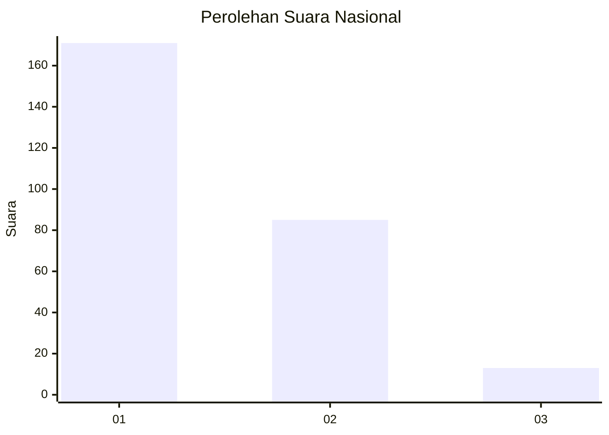
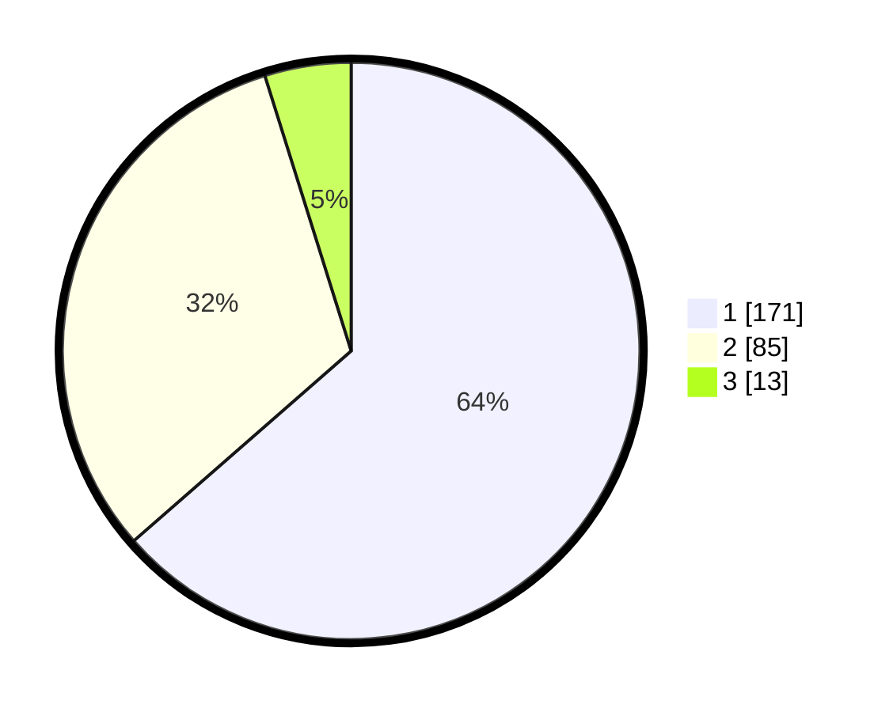

# Hasil

## Grafik

## Tabel

| No. | Nama Paslon    | Suara | Suara (raw) | Persentase |
|:--- |:-------------- | -----:| -----------:| ----------:|
| 1   | ANIES MUHAIMIN | 171   | [171][p-1]  | 63,57      |
| 2   | PRABOWO GIBRAN | 85    | [85][p-2]   | 31,60      |
| 3   | GANJAR MAHFUD  | 13    | [13][p-3]   | 4,83       |

[p-1]: https://github.com/gigit-pemilu/pemilu-2024/blob/main/pilpres/hitung-suara/sub/31-dki-jakarta/sub/75-jakarta-timur/sub/03-jatinegara/sub/1001-kampung-melayu/sub/083-tps/sub/paslon-1.txt
[p-2]: https://github.com/gigit-pemilu/pemilu-2024/blob/main/pilpres/hitung-suara/sub/31-dki-jakarta/sub/75-jakarta-timur/sub/03-jatinegara/sub/1001-kampung-melayu/sub/083-tps/sub/paslon-2.txt
[p-3]: https://github.com/gigit-pemilu/pemilu-2024/blob/main/pilpres/hitung-suara/sub/31-dki-jakarta/sub/75-jakarta-timur/sub/03-jatinegara/sub/1001-kampung-melayu/sub/083-tps/sub/paslon-3.txt

## Foto C Plano

https://sirekap-obj-formc.kpu.go.id/2e6c/pemilu/ppwp/31/75/03/10/01/3175031001083-20240214-205315--199f864f-fe6a-41e9-9efe-aef9f3d432a3.jpg

https://sirekap-obj-formc.kpu.go.id/2e6c/pemilu/ppwp/31/75/03/10/01/3175031001083-20240214-203017--195cf45e-6ced-4372-b187-81d95473ac12.jpg

https://sirekap-obj-formc.kpu.go.id/2e6c/pemilu/ppwp/31/75/03/10/01/3175031001083-20240214-205150--55bc2549-d0d8-4270-94d4-852feabe11ab.jpg

## Metadata

| Key        | Value               |
| ---------- | ------------------- |
| Time Stamp | 2024-02-15 22:30:27 |

