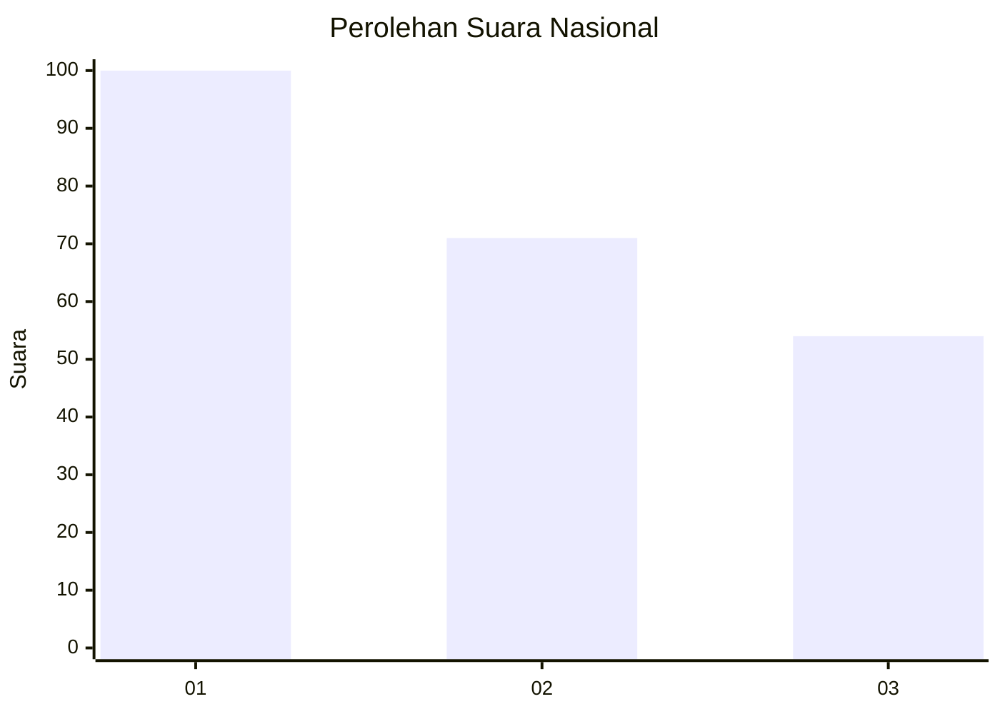
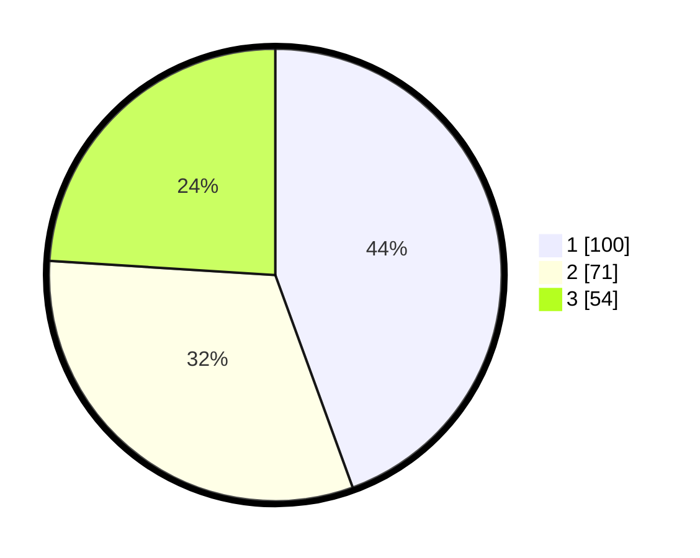

# Hasil

## Grafik

## Tabel

| No.    | Nama Paslon    | Suara | Suara (raw) | Persentase |
|:------ |:-------------- | -----:| -----------:| ----------:|
| 100025 | ANIES MUHAIMIN | 100   | [100][p-1]  | 44,44      |
| 100026 | PRABOWO GIBRAN | 71    | [71][p-2]   | 31,56      |
| 100027 | GANJAR MAHFUD  | 54    | [54][p-3]   | 24,00      |

[p-1]: https://github.com/gigit-pemilu/pemilu-2024/blob/main/pilpres/hitung-suara/sub/31-dki-jakarta/sub/75-jakarta-timur/sub/03-jatinegara/sub/1002-bidara-cina/sub/010-tps/sub/paslon-1.txt
[p-2]: https://github.com/gigit-pemilu/pemilu-2024/blob/main/pilpres/hitung-suara/sub/31-dki-jakarta/sub/75-jakarta-timur/sub/03-jatinegara/sub/1002-bidara-cina/sub/010-tps/sub/paslon-2.txt
[p-3]: https://github.com/gigit-pemilu/pemilu-2024/blob/main/pilpres/hitung-suara/sub/31-dki-jakarta/sub/75-jakarta-timur/sub/03-jatinegara/sub/1002-bidara-cina/sub/010-tps/sub/paslon-3.txt

## Foto C Plano

https://sirekap-obj-formc.kpu.go.id/bbc9/pemilu/ppwp/31/75/03/10/02/3175031002010-20240214-234350--a886fa89-b9ec-45c6-b56b-e80394b58e54.jpg

https://sirekap-obj-formc.kpu.go.id/bbc9/pemilu/ppwp/31/75/03/10/02/3175031002010-20240214-234443--3e12e841-2440-483e-86c8-ceac89df4c00.jpg

https://sirekap-obj-formc.kpu.go.id/bbc9/pemilu/ppwp/31/75/03/10/02/3175031002010-20240214-234538--b4889dcb-73a5-4afd-8b31-a9752a5ce0aa.jpg

## Metadata

| Key        | Value               |
| ---------- | ------------------- |
| Time Stamp | 2024-02-15 22:40:13 |

